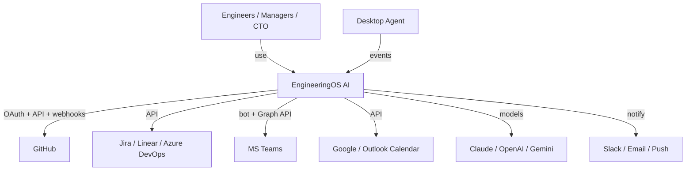

# 03 — System Architecture

Covers the platform shape that every feature plan plugs into. Read
[00 — Vision](./00-vision-and-scope.md) and [01 — PRD](./01-product-requirements.md) first.

---

## 1. Architectural drivers

| Driver | Consequence |
|--------|-------------|
| Execution is a stream of **events** (`NFR-EXPLAIN`) | Event-first core; metrics/timeline are **projections** of an append-only event log |
| **Multi-tenant** isolation (`NFR-ISO`) | Mandatory `organizationId` scoping at the data layer; one shared DB with row-level tenant scoping for MVP |
| **Explainability** (`NFR-EXPLAIN`) | Store inputs + reasoning with every derived metric & recommendation |
| **Extensibility** (`FR-ENT-05`) | Integrations & agents implement stable **ports** (interfaces); no core rewrite to add a source |
| **Runs on one VM** (`NFR-COST`) | Modular monolith API + worker, Dockerized; scale out later without redesign |
| **TypeScript everywhere** | Nx monorepo, shared types between FE/BE — the biggest reason for this stack |

## 2. Style: modular monolith → services when needed

We deliberately start as a **modular monolith** (one NestJS app composed of well-bounded modules) plus
a **worker** process, not microservices. Nx module boundaries (see §7) keep the modules decoupled so
any of them can be extracted into its own deployable later **without code changes to callers** —
because callers depend on interfaces in shared libs, not on concrete modules.

```
                          ┌─────────────────────────────────────────┐
   Browser (React SPA) ── │  API (NestJS)   REST + WebSocket + SSE   │
                          │  ├ auth  ├ org  ├ rbac  ├ github  ...     │
                          └───────┬─────────────────────┬────────────┘
   Desktop Agent (Rust) ─────────►│ ingest              │ read models
   GitHub/Jira/Teams webhooks ───►│                     │
                                  ▼                     ▼
                          ┌───────────────┐     ┌───────────────┐
                          │ Event bus     │     │ PostgreSQL    │
                          │ Redis Streams │◄────┤ (Sequelize)   │
                          │ (Kafka later) │     └───────────────┘
                          └──────┬────────┘            ▲
                                 ▼                      │ projections
                          ┌───────────────┐            │
                          │ Worker(s)     │────────────┘
                          │ BullMQ jobs:  │     ┌───────────────┐
                          │ projections,  │────►│ Qdrant (RAG)  │
                          │ AI agents,    │     └───────────────┘
                          │ integrations, │     ┌───────────────┐
                          │ notifications │────►│ S3 storage    │
                          └───────────────┘     └───────────────┘
```

## 3. C4 — Level 1 (System Context)



## 4. C4 — Level 2 (Containers)

| Container | Tech | Responsibility |
|-----------|------|----------------|
| **web** | React 19 + Vite | SPA: dashboards, timeline, copilot, admin |
| **api** | NestJS | REST + WS/SSE, auth, RBAC, ingest endpoints, read APIs |
| **worker** | NestJS (headless) + BullMQ | projections, integration sync, AI agents, notifications, reports |
| **postgres** | PostgreSQL 16 | source of truth: events + projections + config |
| **redis** | Redis 7 | cache, rate limits, BullMQ, Redis Streams event bus |
| **qdrant** | Qdrant | per-tenant vector store for RAG |
| **storage** | GCS / MinIO (S3 API) | uploaded docs, report exports, agent artifacts |
| **agent** | Rust binary | on employee devices; local buffer + sync |

> MVP runs `web`, `api`, `worker`, `postgres`, `redis`, `qdrant`, `minio` as **Docker Compose services
> on one GCP VM** (see [deployment](./deployment/00-gcp-vm-deployment.md)). `web` is built to static
> files served by the API/Caddy, so it isn't a long-running container in production.

## 5. Event-first core

The **Event** is the atomic unit (schema in [04 — Data Model](./04-data-model.md)).

Flow:

1. **Ingest** — a source (agent sync endpoint, GitHub webhook, Jira poll) produces raw payloads. An
   **adapter** (port `SourceAdapter`) normalizes them into canonical `Event`s, deduped idempotently
   (`FR-EVT-02`).
2. **Persist & publish** — events are appended to `events` (Postgres) and published to the bus
   (Redis Streams) in the same unit of work (transactional outbox pattern).
3. **Project** — worker consumers build **read models**: per-person timeline, PR metrics, sprint
   metrics, DORA, AI-usage rollups. Projections are idempotent and rebuildable from the log
   (`NFR-EXPLAIN` — we can always answer "why is this number what it is").
4. **React** — AI agents and the recommendations engine subscribe to relevant events/metrics and emit
   insights (also stored, with their evidence).
5. **Push** — changes to read models fan out to the UI over WebSocket/SSE (`FR-EVT-04`, `NFR-LATENCY`).

Why event-sourced-ish (and not full CQRS/ES ceremony): we keep an **append-only event log + derived
projections**, but use plain Sequelize models for projections and config. This gives explainability and
replay without the operational weight of a full event-sourcing framework — appropriate for a one-VM
start.

## 6. Monorepo layout (Nx)

```
engineeringos/
├─ apps/
│  ├─ api/                    # NestJS HTTP+WS app (composition root)
│  ├─ worker/                 # NestJS headless app (BullMQ processors)
│  ├─ web/                    # React + Vite SPA
│  └─ desktop-agent/          # Rust workspace (built outside Nx JS graph; see plan 04)
├─ libs/
│  ├─ shared/                 # cross-cutting, framework-agnostic (NO Nest/React imports)
│  │  ├─ constants/           # @eos/shared-constants
│  │  ├─ enums/               # @eos/shared-enums
│  │  ├─ types/               # @eos/shared-types (domain types, DTO contracts)
│  │  ├─ utils/               # @eos/shared-utils (pure helpers)
│  │  └─ contracts/           # @eos/contracts (API request/response + WS event schemas, zod)
│  ├─ backend/                # server-only libs (may import Nest)
│  │  ├─ core/                # @eos/backend-core (config, logging, base classes, tenant ctx)
│  │  ├─ database/            # @eos/database (Sequelize models, migrations, repositories)
│  │  ├─ events/              # @eos/events (event bus port + Redis Streams adapter)
│  │  ├─ auth/                # @eos/auth
│  │  ├─ rbac/                # @eos/rbac (guards, permission catalog)
│  │  ├─ ai/                  # @eos/ai (LangGraph agents, model router, RAG)
│  │  └─ integrations/        # @eos/integrations (github, jira, teams, calendar adapters)
│  └─ frontend/               # browser-only libs (may import React)
│     ├─ ui/                  # @eos/ui (shadcn/ui components, design system)
│     ├─ data/                # @eos/frontend-data (TanStack Query hooks, API client)
│     └─ feature-*/           # @eos/feature-dashboard, feature-timeline, ... (route-level)
└─ docs/                      # you are here
```

Package naming: all libs are published internally under the **`@eos/*`** scope (path-mapped in
`tsconfig.base.json`; no npm publish). This gives clean imports: `import { EventType } from
'@eos/shared-enums'`.

## 7. Dependency rules — preventing circular dependencies

> Circular deps are the #1 cause of "works locally, breaks in Docker/prod" build failures. We prevent
> them **structurally** and **enforce them in CI**. Details + the ESLint config live in
> [10 — Shared Packages & Boundaries](./10-shared-packages-and-boundaries.md); the rules:

**The dependency graph is a DAG, layered top-to-bottom (arrows may only point downward):**

```
apps/*            (may depend on any lib; nothing depends on apps)
   │
frontend/feature-*    backend feature modules (inside apps/api,worker)
   │                       │
frontend/data, ui     backend/{auth,rbac,ai,integrations}
   │                       │
   └──────────┬────────────┘
              ▼
      backend/{core,database,events}     (server infra)
              │
              ▼
      shared/{contracts,types,enums,constants,utils}   (leaf — depends on nothing internal)
```

Hard rules (enforced by Nx **module boundary tags** + `@nx/enforce-module-boundaries` ESLint rule):

- `shared/*` is a **leaf**: it MUST NOT import from `backend/*`, `frontend/*`, or `apps/*`. It has no
  Nest/React/DB dependencies — pure TypeScript.
- `frontend/*` MUST NOT import `backend/*` and vice-versa. They meet only through `shared/contracts`.
- Within a layer, siblings **do not** import each other (e.g., `backend/auth` ↛ `backend/rbac`
  directly). Shared needs go **down** into `backend/core` or a `shared/*` lib.
- Apps are **composition roots**: only apps wire concrete implementations to ports. Feature modules
  depend on **interfaces** (`shared/contracts`, ports in `backend/core`), never on each other.

Tags (in each project's `project.json`):

```jsonc
// examples
{ "tags": ["scope:shared",   "type:util"] }      // libs/shared/utils
{ "tags": ["scope:backend",  "type:infra"] }     // libs/backend/database
{ "tags": ["scope:backend",  "type:feature"] }   // libs/backend/github
{ "tags": ["scope:frontend", "type:ui"] }        // libs/frontend/ui
{ "tags": ["scope:app"] }                          // apps/api
```

Boundary constraints (`.eslintrc` at root) forbid, e.g., `scope:shared → scope:backend`,
`scope:frontend ↔ scope:backend`, and `type:feature → type:feature`. `nx graph` visualizes the DAG;
`nx lint` fails the build (and CI) on any violation — so a cycle can never reach `main` or a deploy.

## 8. How a new integration/agent plugs in (extensibility)

- A new **source** implements the `SourceAdapter` port (normalize raw → `Event[]`) and registers its
  webhook/poller. Nothing downstream changes — projections consume canonical events.
- A new **AI agent** implements the `Agent` port (input: scoped context/query → output: insight +
  evidence) and is registered in the agent registry. The orchestrator (LangGraph) and Copilot discover
  it by capability. See [07 — AI Architecture](./07-ai-architecture.md) and
  [plan 13](./plans/13-ai-agents.md).
- A new **notification channel** implements the `NotificationChannel` port.
- A new **projection** subscribes to event types and writes its own read model.

This is the “extensible by contract” principle (doc 00 §8) made concrete.

## 9. Cross-cutting concerns

| Concern | Approach |
|---------|----------|
| **Tenant context** | Resolved from JWT into a request-scoped `TenantContext`; the Sequelize layer auto-injects `organizationId` scope (doc 04 §5) |
| **Config** | Typed config module (`@eos/backend-core`), validated at boot with zod; fail fast on missing secrets |
| **Errors** | Canonical error shape (doc 05 §6); never leak internals; correlation id on every request |
| **Idempotency** | Ingest keyed by `(source, externalId, contentHash)`; job handlers idempotent |
| **Observability** | Structured JSON logs, OpenTelemetry traces, Prometheus metrics, Sentry (doc: [deployment/03](./deployment/03-observability.md)) |
| **Feature flags** | Per-org flags table gate rollout of new integrations/agents |
| **Rate limiting** | Redis token-bucket per IP + per org + per external API (respect provider limits) |

## 10. Technology decisions (summary)

Full reasoning in [`./adr/`](./adr/README.md). Summary table lives in the
[docs index](./README.md#tech-stack-at-a-glance). Key ones:

- **NestJS** for the modular/DDD-friendly structure and first-class DI (enables the ports/adapters style).
- **Sequelize** per the brief; the repository layer wraps it so models don't leak into feature code
  and a future ORM swap is contained (ADR-0004).
- **Redis Streams** as the MVP event bus (one less container than Kafka); the `EventBus` port lets us
  switch to **Kafka** at scale with no caller changes (ADR-0005).
- **LangGraph.js** for stateful multi-agent orchestration in-language (ADR-0006).
- **Qdrant** for RAG vectors — simple to self-host on the VM (ADR-0007).

---

_Next: [04 — Data Model & Multi-Tenancy](./04-data-model.md)_
