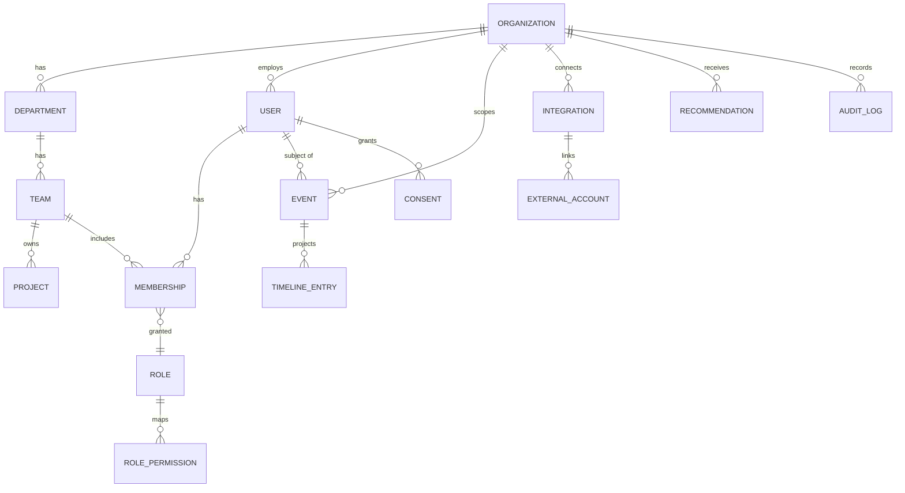

# 04 — Data Model & Multi-Tenancy

Covers `FR-ORG-*`, `FR-EVT-01/02`, `NFR-ISO`. Implemented by `@eos/database` (Sequelize). This is the
canonical reference for entities; feature plans add their own tables but MUST follow the conventions here.

---

## 1. Multi-tenancy strategy

**Shared database, shared schema, row-level tenant scoping** — the right trade-off for a one-VM MVP
that must still scale (`NFR-COST`, `NFR-SCALE`).

- Every tenant-owned table has a non-null **`organization_id`** FK, indexed, and (where it's the natural
  access path) as the **leading column of composite indexes**.
- Isolation is enforced in code by a **mandatory Sequelize scope** injected from the request's
  `TenantContext` (§5) — application code cannot construct a query without it.
- Defense in depth: PostgreSQL **Row-Level Security (RLS)** policies on the most sensitive tables, using
  a `SET app.current_org` session variable, so even a missed scope can't cross tenants (`NFR-ISO`).
- **Escape hatch to isolation-per-tenant later:** because access always goes through the repository
  layer, a large customer can be moved to a dedicated schema/DB without feature-code changes.

Non-tenant (global) tables: `organizations`, `oauth_provider_config` (platform-level), `plans`,
`feature_flags_catalog`. Everything else is tenant-scoped.

## 2. Core entity map



## 3. Organization hierarchy (`FR-ORG-02`)

| Table | Key columns | Notes |
|-------|-------------|-------|
| `organizations` | `id`, `name`, `slug` (unique), `plan_id`, `settings` (jsonb), `created_at` | tenant root |
| `departments` | `id`, `organization_id`, `name`, `parent_department_id?` | optional nesting |
| `teams` | `id`, `organization_id`, `department_id`, `name`, `lead_user_id?` | |
| `projects` | `id`, `organization_id`, `team_id`, `name`, `key`, `repo_refs` (jsonb) | links to GitHub repos / Jira keys |
| `users` | `id`, `organization_id`, `email` (unique per org), `name`, `avatar_url`, `status`, `password_hash?` | an employee/person |
| `memberships` | `id`, `organization_id`, `user_id`, `team_id?`, `role_id`, `scope` | a user↔team link carrying a role; user may have several (`FR-ORG-04`) |

A user with an org-wide role (CTO/Owner) has a membership with `team_id = null` and org scope.

## 4. RBAC tables (`FR-RBAC-*`)

| Table | Purpose |
|-------|---------|
| `roles` | `id`, `organization_id?` (null = system default template), `name`, `is_system` |
| `permissions` | catalog (global): `key` (`pr:read`), `resource`, `action`, `default_scope`, `hr_forbidden` |
| `role_permissions` | `role_id`, `permission_key`, `scope` |

Permission catalog is code-defined and seeded; roles reference it. See
[02 — Personas & RBAC](./02-personas-and-rbac.md) for the matrix.

## 5. The canonical `Event` (`FR-EVT-01`)

The heart of the system. Every source normalizes to this shape.

```ts
// @eos/shared-types — the contract; DB table mirrors it
interface DomainEvent {
  id: string;                 // uuid v7 (time-ordered)
  organizationId: string;     // tenant scope — always present
  subjectUserId: string | null; // the person this event concerns (null = system/repo-level)
  type: EventType;            // enum, e.g. 'github.pr.opened', 'agent.focus.started'
  source: EventSource;        // enum: 'github' | 'jira' | 'teams' | 'agent' | 'calendar' | 'ai_tool'
  occurredAt: string;         // ISO 8601 UTC — when it happened at the source
  ingestedAt: string;         // when we received it
  externalId: string | null;  // id at the source (for dedup)
  contentHash: string;        // sha256 of normalized payload (idempotency, FR-EVT-02)
  payload: Record<string, unknown>; // typed per EventType (discriminated union in TS)
  correlationId: string | null;     // links related events (e.g., a PR lifecycle)
  sensitivity: Sensitivity;   // P0..P4 (doc 06)
}
```

**Table `events`** (append-only):
- PK `id`; **unique** `(organization_id, source, external_id, content_hash)` → idempotent ingest.
- Indexes: `(organization_id, subject_user_id, occurred_at)`, `(organization_id, type, occurred_at)`.
- **Partitioned by month** on `occurred_at` (native Postgres partitioning) so retention (`FR-ENT-02`)
  is a partition drop and old data stays cheap.
- `payload` is `jsonb`; strongly-typed in the app via a discriminated union keyed on `type`.

`EventType` and `EventSource` live in **`@eos/shared-enums`** so FE, API, and worker share one source
of truth (no magic strings — see the shared-packages doc).

## 6. Projections (read models)

Built by worker consumers; **rebuildable from `events`** (that's the explainability guarantee).

| Read model | Built from | Serves |
|-----------|-----------|--------|
| `timeline_entries` | all events for a user/day | Daily Timeline (`FR-TL-*`) |
| `pr_metrics` | `github.pr.*`, `github.review.*` | review/merge wait, stale, DORA inputs |
| `dora_metrics` | deploys, PRs, incidents | DORA (`FR-GH-04`) |
| `sprint_metrics` | `jira.*` | velocity, burndown, estimation accuracy |
| `focus_metrics` | `calendar.*`, `agent.focus.*` | focus vs meeting balance |
| `ai_usage_rollups` | `ai_tool.*` | adoption analytics (`FR-AIU-*`) |
| `reviewer_load` | review events | overload detection |

Each projection row carries `derived_from` (event ids or a query descriptor) so the UI can answer
**"why is this number what it is"** (`NFR-EXPLAIN`).

## 7. AI & knowledge tables

| Table | Purpose |
|-------|---------|
| `recommendations` | `id`, `org_id`, `scope`, `type`, `title`, `body`, `impact`, `status` (open/acted/dismissed/snoozed), **`evidence` (jsonb: event ids + reasoning)**, `created_by_agent` |
| `agent_runs` | audit of every agent invocation: inputs (scoped), model, tokens, cost, output ref, latency |
| `documents` | RAG sources: `id`, `org_id`, `title`, `source` (pdf/notion/…), `audience` (RBAC), `storage_key`, `status` |
| `document_chunks` | `id`, `document_id`, `ordinal`, `text`, `qdrant_point_id`, `token_count` |
| `copilot_messages` | conversation history for Manager Copilot, with cited evidence |

Vector embeddings live in **Qdrant**, one collection per tenant (or a shared collection with a
mandatory `organization_id` payload filter) — never crossing tenants.

## 8. Integration & consent tables

| Table | Purpose |
|-------|---------|
| `integrations` | `id`, `org_id`, `provider`, `status`, `config` (jsonb), `installed_by` |
| `external_accounts` | maps an `external_account` (e.g., GitHub login) to an internal `user_id` |
| `oauth_tokens` | encrypted (P4) provider tokens, per user/integration, with refresh |
| `consents` | `id`, `org_id`, `user_id`, `signal_type`, `granted`, `granted_at`, `revoked_at`, `policy_version` |
| `device_agents` | registered desktop agents: `id`, `user_id`, `platform`, `token_hash`, `last_seen`, `revoked` |
| `audit_logs` | `id`, `org_id`, `actor_user_id`, `action`, `resource`, `resource_id`, `metadata`, `at` — append-only |
| `notifications` | outbound notification records + delivery status |
| `feature_flags` | per-org flag overrides |

**Consent is checked at collection time** (`NFR-CONSENT`): an ingest for `signal_type` X from user U is
dropped if there is no active `consents` row granting it. Revocation flips `revoked_at` and collection
stops within 1 minute.

## 9. Sequelize conventions

Enforced so models stay clean and the ORM doesn't leak (ADR-0004).

- **snake_case** columns in DB, **camelCase** in TS (`underscored: true`, `field` mappings).
- Every tenant model uses the shared **`TenantModel`** base (adds `organizationId`, `createdAt`,
  `updatedAt`, default tenant scope, and paranoid soft-delete where retention needs it).
- **Migrations are the only way** the schema changes — never `sequelize.sync()` in any environment
  above local scratch. Migrations live in `libs/backend/database/migrations`, run in CI and on deploy.
- **Repository pattern:** feature modules depend on `XRepository` interfaces (in `@eos/backend-core` or
  the feature's port), not on Sequelize models directly. Keeps models out of business logic and makes
  the code testable with in-memory fakes.
- **No cross-module model imports** — a module never imports another module's Sequelize model; it goes
  through that module's repository/service interface. (Prevents hidden coupling → circular deps.)
- UUID **v7** PKs (time-sortable, index-friendly). `jsonb` for flexible payloads/settings; promote a
  field to a real column once it's queried/filtered often.
- Money/durations stored as integers (cents, seconds); timestamps `timestamptz`, always UTC (`NFR-I18N`).

### Model skeleton (illustrative — kept small on purpose)

```ts
// libs/backend/database/src/models/team.model.ts
@Table({ tableName: 'teams', underscored: true })
export class Team extends TenantModel<Team> {
  @Column({ allowNull: false }) name!: string;
  @ForeignKey(() => Department) @Column departmentId!: string;
  @Column leadUserId!: string | null;
}
```

Business logic never news-up or queries a model directly — it calls `teamRepository.findForTenant(...)`,
which applies the tenant scope. This is what makes `NFR-ISO` a property of the codebase, not a habit.

## 10. Indexing & performance notes

- Lead every hot composite index with `organization_id`.
- Time-series reads (timeline, metrics) hit partitioned `events` by `(org, subject, occurred_at)`.
- Heavy rollups are precomputed by projections; the API reads projections, not raw events, on the hot path.
- Use `EXPLAIN`-verified indexes for the dashboard queries listed in [plan 16](./plans/16-dashboards.md).

## 11. Retention & deletion (`FR-ENT-02`, `FR-ENT-07`)

- Retention policy per `signal_type` → old `events` partitions dropped on schedule.
- Right-to-erasure: a purge job removes a user's events/projections/PII and tombstones references,
  recorded in `audit_logs`. Documented in [plan 19](./plans/19-enterprise-platform.md).

---

_Next: [05 — API & Realtime Design](./05-api-and-realtime.md)_
