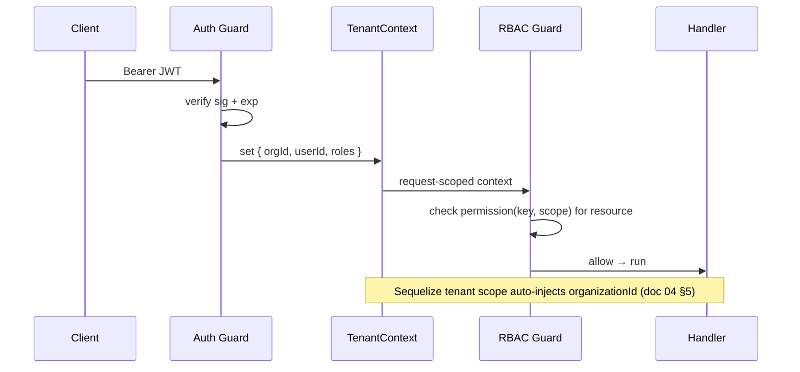
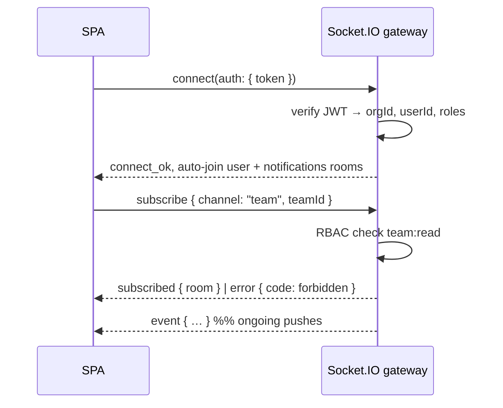
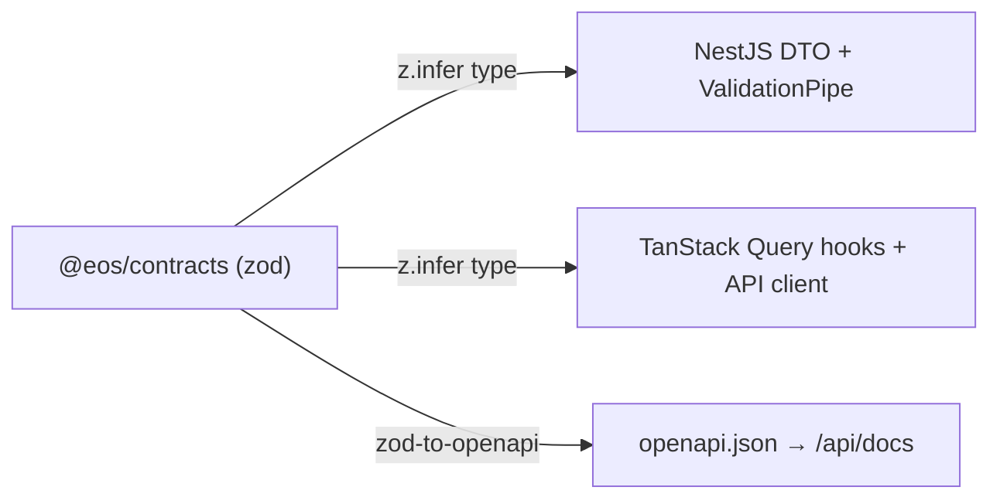

# 05 — API & Realtime Design

Covers the on-the-wire contract for `FR-EVT-04`, `FR-ENT-04`, `FR-RBAC-03`, and `NFR-LATENCY`. This is
the authoritative reference for how clients (React SPA, desktop agent, external integrators) talk to the
**api** container. Contracts described here are code, not prose: every request/response/event shape is a
**zod** schema in **`@eos/contracts`** (`libs/shared/contracts`), and the types are shared by frontend and
backend so the wire format cannot drift (§10). Read [03 — System Architecture](./03-system-architecture.md)
and [04 — Data Model](./04-data-model.md) first.

---

## 1. API surface at a glance

| Surface | Transport | Base path | Auth | Primary consumer |
|---------|-----------|-----------|------|------------------|
| **App API** | REST/JSON | `/api/v1` | Bearer access JWT | React SPA |
| **Realtime** | WebSocket (Socket.IO) | `/realtime` | JWT handshake | React SPA |
| **Server push (fallback)** | SSE | `/api/v1/stream/*` | Bearer access JWT | React SPA |
| **Ingest — agent** | REST/JSON | `/api/v1/ingest/agent` | Device token | Rust desktop agent |
| **Ingest — webhooks** | REST/JSON | `/api/v1/webhooks/{provider}` | HMAC signature | GitHub / Jira / Teams |
| **Public API** | REST/JSON | `/api/v1` | API key (`Authorization: ApiKey …`) | Customer integrations (`FR-ENT-04`) |
| **Outbound webhooks** | REST/JSON (we call out) | customer URL | HMAC signature (we sign) | Customer endpoints |
| **OpenAPI / docs** | JSON + HTML | `/api/v1/openapi.json`, `/api/docs` | public (schema) | Everyone |

The app API and public API share the same routes and versioning; they differ only in **credential type**
and **rate-limit tier** (§4, §9). Everything is JSON over HTTPS; `Content-Type: application/json` is
REQUIRED on writes.

---

## 2. REST conventions

### 2.1 Versioning

- The API version lives in the **path**: `/api/v1`. Clients MUST send it explicitly.
- `v1` is stable; breaking changes ship as `v2` and run in parallel for a deprecation window. Additive,
  backward-compatible changes (new optional fields, new endpoints) MUST NOT bump the version.
- Every response carries an `X-API-Version` header; deprecated endpoints add `Deprecation` and `Sunset`
  headers (RFC 8594).

### 2.2 Resource naming

- Resources are **plural nouns**, kebab-cased, nested only one level deep:
  `GET /api/v1/teams/{teamId}/pull-requests`.
- Deeper relationships are expressed by **filters**, not by deep nesting:
  `GET /api/v1/pull-requests?teamId=…` rather than `/orgs/x/depts/y/teams/z/pull-requests`.
- Verbs are HTTP methods. Where a genuine action does not map to CRUD, use a **sub-resource command** with
  `POST`: `POST /api/v1/recommendations/{id}/dismiss`. Actions MUST be idempotent or key-guarded (§2.6).
- `organizationId` is **never** a path or query parameter — tenant is derived from the credential
  (`NFR-ISO`, §3.3). A client cannot select a tenant on the wire.

| Method | Semantics | Success | Idempotent |
|--------|-----------|---------|------------|
| `GET` | read collection/item | 200 | yes |
| `POST` | create / command | 201 (create), 200 (command) | only with `Idempotency-Key` |
| `PATCH` | partial update | 200 | yes (last-writer) |
| `PUT` | full replace | 200 | yes |
| `DELETE` | remove / soft-delete | 204 | yes |

### 2.3 Pagination — cursor-based

Offset pagination is FORBIDDEN on collections over event-derived data (it skips/duplicates rows as the
stream mutates). All collections MUST use **opaque forward cursors**.

- Request: `?limit=50&cursor=<opaque>`. `limit` MUST default to 50 and be capped at 200.
- The cursor is a base64url-encoded, signed tuple of `(sortKey, tiebreakId)` — opaque to clients, who MUST
  treat it as a blob and not construct or parse it.
- Response returns `page.nextCursor` (null when exhausted). Reverse paging uses `before=<cursor>`.

```jsonc
"page": { "nextCursor": "eyJrIjoiMjAyNi0wNy0wNC4uLiJ9", "hasMore": true, "limit": 50 }
```

### 2.4 Filtering & sorting

- Filtering uses flat query params: `?status=open&authorId=…&createdAfter=2026-06-01`. Whitelisted per
  resource in its zod query schema; unknown params MUST be rejected `400` (fail-closed, not ignored).
- Range filters use `…After` / `…Before` suffixes on timestamp fields (ISO 8601 UTC).
- Sorting: `?sort=-createdAt,title` (comma list, `-` prefix = descending). Only whitelisted fields; the
  final sort key MUST include a unique tiebreaker so cursors are stable.

### 2.5 Field selection & expansion

- `?fields=id,title,status` trims the response (sparse fieldsets).
- `?expand=author,reviewers` inlines related resources instead of returning ids. Expansion depth is capped
  at 1 to protect the DB.

### 2.6 Idempotency keys for writes

All non-`GET` requests that create resources or trigger side effects (including ingest and command
endpoints) MUST accept an **`Idempotency-Key`** header (client-generated UUID).

- The server stores `(organizationId, idempotencyKey) → (requestHash, responseSnapshot)` in Redis with a
  24h TTL.
- A **replay** with the same key and same body returns the **original** response (same status, same body,
  header `Idempotent-Replay: true`) without re-executing.
- A replay with the same key but a **different** body returns `409 idempotency_key_reused`.
- The desktop agent and webhook retries rely on this to make at-least-once delivery safe (§7, `FR-EVT-02`).

---

## 3. Envelope, errors, and auth on the wire

### 3.1 Response envelope

Every JSON response uses one canonical envelope. `data` holds the resource(s); `meta` holds cross-cutting
context; `page` appears only on collections.

```jsonc
// success — single resource
{ "data": { "id": "pr_01J…", "title": "Fix retry backoff", "status": "open" },
  "meta": { "correlationId": "01J8Z…", "apiVersion": "v1" } }
```

```jsonc
// success — collection
{ "data": [ /* items */ ],
  "page": { "nextCursor": "eyJ…", "hasMore": true, "limit": 50 },
  "meta": { "correlationId": "01J8Z…", "apiVersion": "v1" } }
```

### 3.2 Canonical error object

Errors return the same envelope with a single `error` object. `code` is a **stable, machine-readable**
string (never localize or reword — clients branch on it); `message` is human-readable; `correlationId`
matches the server log line (§11).

```jsonc
{ "error": {
    "code": "validation_error",
    "message": "Request body failed validation.",
    "correlationId": "01J8Z9F3K7QNM",
    "details": [
      { "path": "reviewers[1].id", "rule": "uuid", "message": "must be a UUID" }
    ]
  } }
```

| HTTP | `code` (examples) | When |
|------|-------------------|------|
| `400` | `validation_error`, `malformed_json` | zod parse failure on body/query/params |
| `401` | `unauthenticated`, `token_expired` | missing/invalid/expired credential |
| `403` | `forbidden`, `consent_required` | authenticated but RBAC/consent denies (`FR-RBAC-03`, `NFR-CONSENT`) |
| `404` | `not_found` | resource absent **or** outside tenant scope (we never reveal cross-tenant existence) |
| `409` | `conflict`, `idempotency_key_reused` | version/idempotency conflict |
| `422` | `unprocessable` | syntactically valid but semantically rejected |
| `429` | `rate_limited` | over budget; includes `Retry-After` (§9) |
| `5xx` | `internal_error`, `upstream_unavailable` | server/dependency fault; internals never leaked |

- **Validation errors** (`400`) MUST enumerate every failing field in `details` (path + rule), produced
  directly from the zod issue list — no partial reporting.
- A `404` is returned for both "does not exist" and "exists in another tenant"; the two MUST be
  indistinguishable to the caller (`NFR-ISO`).

### 3.3 Authentication & authorization

Full identity design is in [02 — Personas & RBAC](./02-personas-and-rbac.md) and
[06 — Security, Privacy & Consent](./06-security-privacy-consent.md); the wire contract:

- **Access token:** short-lived (~15 min) **JWT** in `Authorization: Bearer <jwt>`. Claims include `sub`
  (userId), `org` (organizationId), `roles`, `sid` (session id), `exp`. The token is the **only** source of
  tenant identity — no header or param can override it.
- **Refresh flow:** the rotating refresh token is an httpOnly, `Secure`, `SameSite=Strict` cookie.
  `POST /api/v1/auth/refresh` rotates it (old token invalidated) and returns a new access JWT
  (`FR-AUTH-03`). Refresh-token reuse is treated as theft → the session family is revoked.
- **Enforcement order per request** (a global pipeline, applied to REST and WS alike):



- **RBAC** is enforced **server-side on every route and every WS event** (`FR-RBAC-03`) via a guard that
  checks the required permission key (e.g. `pr:read`) against the caller's roles and the resource's scope
  (org / team / self). Scope-limited views (`FR-RBAC-04`) narrow the query, they do not just hide fields.
- Authorization failures return `403 forbidden`; missing/expired credentials return `401`.

---

## 4. Public API & API keys (`FR-ENT-04`)

- Customers mint scoped **API keys** in org settings. Format: `eos_live_<random>` / `eos_test_<random>`;
  only a hash is stored (the plaintext is shown once).
- Sent as `Authorization: ApiKey eos_live_…`. A key carries an org, a **permission scope subset**, and an
  optional IP allowlist. Keys MUST NOT exceed the permissions of the role that created them.
- API-key calls hit the **same** `/api/v1` routes and RBAC checks as JWT calls; only the credential and the
  rate-limit tier differ (§9). Keys are revocable and every use is audited (`FR-ENT-01`).

---

## 5. Realtime — WebSocket (Socket.IO)

The primary live channel (`FR-EVT-04`). Projections that change (timeline, PR metrics, recommendations,
notifications) fan out to subscribed clients within **≤ 2s p95** of ingestion (`NFR-LATENCY`).

### 5.1 Channel / room model

Rooms are the RBAC boundary — a socket only receives what it is authorized to see. Room names are
**server-assigned** on subscribe; clients never name arbitrary rooms.

| Room pattern | Scope | Who may join |
|--------------|-------|--------------|
| `org:{orgId}:user:{userId}` | one person's own stream | that user (auto-joined) |
| `org:{orgId}:team:{teamId}` | a team's aggregate stream | members with `team:read` on that team |
| `org:{orgId}:notifications:{userId}` | personal notifications | that user |
| `org:{orgId}:copilot:{sessionId}` | a Copilot conversation | the session owner |

Every room is prefixed by `org:{orgId}` — cross-tenant fan-out is structurally impossible because the
server derives `orgId` from the handshake token, not from the room name the client requests (`NFR-ISO`).

### 5.2 Auth handshake

- The client connects to `/realtime` and passes the **access JWT** in the Socket.IO `auth` payload
  (not the query string, to keep it out of logs). The server verifies it in the connection middleware
  **before** any event is accepted; failure disconnects with `4401`.
- On JWT expiry the server emits `token.expiring` ~60s ahead; the client refreshes (§3.3) and calls
  `session.reauth` with the new token. A socket whose token expires without re-auth is disconnected `4401`.



### 5.3 Event message schema

Every server→client message shares one envelope (a discriminated union on `type`, validated by a zod
schema in `@eos/contracts`, mirroring the `DomainEvent`/projection shapes in
[04 — Data Model](./04-data-model.md)):

```jsonc
{ "type": "pr.metrics.updated",
  "room": "org_01J…:team_01K…",
  "seq": 4821,                       // per-room monotonic sequence (gap detection)
  "occurredAt": "2026-07-04T10:15:03.221Z",
  "correlationId": "01J8Z…",
  "data": { "pullRequestId": "pr_01J…", "reviewWaitSeconds": 5400, "stale": true } }
```

- `seq` is a **per-room monotonic** counter; a client detecting a gap MUST resync via REST (§5.5) rather
  than trust a partial stream.
- Client→server messages are limited to a small verb set: `subscribe`, `unsubscribe`, `session.reauth`,
  `ping`. All are RBAC-checked; unknown verbs are dropped and rate-counted.

### 5.4 Subscription lifecycle

1. Connect + handshake → auto-join `user` and `notifications` rooms.
2. `subscribe { channel, id }` → RBAC check → join room, ack with current `seq` high-water mark.
3. Server pushes `event` messages as projections change.
4. `unsubscribe` or disconnect → leave rooms; server cleans up.

### 5.5 Reconnection & backpressure

- **Reconnect:** Socket.IO auto-reconnects with jittered backoff. On reconnect the client re-subscribes and
  passes its last-seen `seq` per room; if the gap exceeds the server's short **replay buffer** (Redis,
  ~last N events/room), the server responds `resync_required` and the client refetches the affected
  projection over REST. WS is a *change signal*, not a durable log — the REST read model is always the
  source of truth.
- **Backpressure:** the gateway monitors each socket's send buffer. A slow consumer is **coalesced**
  (only the latest projection state per key is kept) and, past a threshold, dropped with `resync_required`
  rather than allowed to balloon server memory. Clients MUST tolerate coalesced (not per-event) updates.

### 5.6 WebSocket vs SSE — when to use which

| Use **WebSocket** when | Use **SSE** when |
|------------------------|------------------|
| Bidirectional (subscribe/unsubscribe, Copilot streaming input) | One-way server→client only |
| Many multiplexed rooms per connection | A single resource stream (e.g. one Copilot answer) |
| The main dashboard/timeline live feed | Environments/proxies that block WS; simple fallback |

SSE endpoints (`/api/v1/stream/{resource}`) use the same access JWT and the same event envelope, and are
the **degradation path** when WS is unavailable. Copilot token streaming MAY use SSE for its simplicity;
the live dashboard uses WS. Neither is a durable queue — both resync via REST on reconnect.

---

## 6. Ingest endpoints

### 6.1 Desktop agent sync (`FR-AGENT-04`, `FR-EVT-02`)

- `POST /api/v1/ingest/agent` accepts a **batch** of raw signals from one device.
- Auth: device-scoped token (`device_agents` in [04 §8](./04-data-model.md)), revocable server-side
  (`FR-AGENT-05`); the token resolves to `(orgId, userId, deviceId)`.
- Each batch carries an `Idempotency-Key`; each item carries a client `contentHash`. The server dedups on
  `(organizationId, source, externalId, contentHash)` so offline buffer + retry is safe (`FR-EVT-02`).
- **Consent is enforced at ingest** (`NFR-CONSENT`): items whose `signalType` lacks an active consent row
  are dropped and reported back per-item — they are never persisted.

```jsonc
// request
{ "deviceId": "dev_01J…",
  "events": [
    { "clientId": "c-1", "type": "agent.focus.started", "occurredAt": "…Z", "contentHash": "…",
      "signalType": "focus_time", "payload": { "app": "vscode" } }
  ] }
// response — per-item outcome (partial success is normal)
{ "data": { "accepted": ["c-1"], "duplicate": [], "rejected": [
      { "clientId": "c-2", "reason": "consent_required", "signalType": "browser_domains" } ] } }
```

### 6.2 Inbound webhooks (GitHub / Jira / Teams) (`FR-GH-06`)

- `POST /api/v1/webhooks/{provider}` receives provider events in real time.
- **Signature verification is mandatory** before any parsing: GitHub `X-Hub-Signature-256` (HMAC-SHA256
  over the raw body with the app secret), Jira/Teams per their schemes. A bad or missing signature returns
  `401` and is dropped. The raw body MUST be read for HMAC **before** JSON parsing.
- Handlers are **thin**: verify → enqueue a normalization job (BullMQ) → return `202 Accepted` fast.
  Heavy work happens in the worker so we never block the provider or hit its delivery timeout.
- Delivery is at-least-once from providers; idempotent normalization (`contentHash`) makes redelivery
  harmless. Provider `X-GitHub-Delivery` (etc.) is stored for reconciliation and replay.

---

## 7. Outbound webhooks (`FR-ENT-04`)

- Customers register endpoints + subscribe to event types. We `POST` a signed JSON envelope on those
  events.
- **We sign** each request: `X-EOS-Signature: t=<ts>,v1=<hmac>` where the HMAC-SHA256 is over
  `"{ts}.{rawBody}"` with the endpoint's secret; receivers MUST verify and MUST reject stale timestamps to
  block replay.
- Delivery uses exponential backoff retries; each attempt carries the same `Idempotency-Key` so receivers
  can dedup. Deliveries and their statuses are logged and viewable in-app.

---

## 8. Contract-first workflow (no FE/BE drift)

The single most important rule: **the wire contract is one zod schema, imported by both sides.**



- A schema in `@eos/contracts` is the **source of truth**. The request/response/event **TypeScript types**
  are `z.infer`'d from it — FE and BE import the *same* type, so a shape change breaks compilation on both
  sides at build time, not in production.
- The backend validates every inbound body/query/param through a zod **ValidationPipe**; failures produce
  the canonical `400 validation_error` (§3.2) directly from zod issues.
- The frontend's `@eos/frontend-data` client parses responses against the same schemas in dev, catching
  contract violations immediately.
- Because `@eos/contracts` lives in `shared/*` (a DAG leaf, [03 §7](./03-system-architecture.md)), neither
  frontend nor backend can smuggle server/browser code into the contract — it stays pure.

### 8.1 Worked example

```
GET /api/v1/pull-requests?teamId=team_01K…&status=open&sort=-createdAt&limit=2
Authorization: Bearer <jwt>
```
```jsonc
200 OK   X-API-Version: v1
{ "data": [
    { "id": "pr_01J…", "title": "Fix retry backoff", "status": "open",
      "reviewWaitSeconds": 5400, "stale": true, "authorId": "usr_01H…" }
  ],
  "page": { "nextCursor": "eyJ…", "hasMore": true, "limit": 2 },
  "meta": { "correlationId": "01J8Z9F3K7Q", "apiVersion": "v1" } }
```

Corresponding WS push when that PR's metric later changes:

```jsonc
{ "type": "pr.metrics.updated", "room": "org_01J…:team_01K…", "seq": 4822,
  "occurredAt": "2026-07-04T10:16:40.5Z", "correlationId": "01J8ZA…",
  "data": { "pullRequestId": "pr_01J…", "reviewWaitSeconds": 7200, "stale": true } }
```

---

## 9. Rate limiting

Token-bucket in Redis (see [03 §9](./03-system-architecture.md)), enforced at three layers; the **tightest**
applicable bucket wins.

| Dimension | Purpose |
|-----------|---------|
| **Per IP** | blunt abuse / unauthenticated flood protection |
| **Per org** | fair-share across tenants; public-API quota by plan |
| **Per API key** | per-integration quota, independent of org total |
| **Per external provider** | *outbound* — respect GitHub/Jira/calendar limits (`FR-GH-06`) |

- Over-limit returns `429 rate_limited` with `Retry-After` and `X-RateLimit-{Limit,Remaining,Reset}`
  headers. Clients (and the agent) MUST honor `Retry-After` with backoff.
- Ingest and webhook endpoints have their own generous buckets so a burst of legitimate events is not
  throttled alongside interactive API traffic.

---

## 10. OpenAPI / Swagger

- `openapi.json` is **generated from the zod contracts** (`@anatine/zod-openapi` / `nestjs-zod`), so the
  published spec can never disagree with what the server validates (§8). It is served at
  `/api/v1/openapi.json` with human docs at `/api/docs`.
- The spec documents auth schemes (Bearer, ApiKey), the standard envelope, the canonical error object, and
  every resource. CI fails if a route lacks a contract or the generated spec drifts from the committed one.

---

## 11. API observability (`NFR-OBS`)

- **Correlation id:** every request gets a `correlationId` (uuid v7) — honored from an inbound
  `X-Correlation-Id` if present, else generated. It is returned in `meta.correlationId` and every error,
  propagated onto the enqueued job, and stamped on every log line and downstream event's `correlationId`
  ([04 §5](./04-data-model.md)) so a UI number, an API call, a worker job, and a projection can all be
  traced to one id.
- **Structured logging:** one JSON log line per request — `{ correlationId, orgId, userId, method, route,
  status, durationMs }`. Bodies and P3/P4 fields are never logged (`NFR-PRIVACY`, doc 06). WS emits an
  analogous line per subscribe/emit.
- **Tracing/metrics:** OpenTelemetry spans wrap request → job → projection; Prometheus tracks request rate,
  error rate, p95 latency (against `NFR-LATENCY`), and per-room WS fan-out lag. Sentry captures 5xx with the
  `correlationId` attached so a support ticket maps straight to a trace.

---

_Next: [06 — Security, Privacy & Consent](./06-security-privacy-consent.md)_
