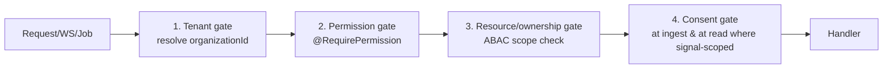

# 06 — Security, Privacy & Consent

Status: Draft v1 · Owner: Platform / Security Eng · Traceability: `NFR-SEC`, `NFR-ISO`,
`NFR-CONSENT`, `NFR-PRIVACY`, `FR-AUTH-*`, `FR-RBAC-*`, `FR-AGENT-*`, `FR-ENT-01/02/03/07/08`.

This document is the security and privacy contract for EngineeringOS. It is where the anti-goals of
[00 — Vision & Scope §4](./00-vision-and-scope.md) become mechanisms. The product collects sensitive
workforce signals; therefore **trust, consent, and data-minimization are engineered features, not
compliance chores**. Where a control is a hard boundary, it is stated with RFC-2119 keywords and, where
useful, a schema or query snippet.

Two rules govern everything below and are worth stating up front:

1. **The more restrictive of RBAC and consent always wins** ([02 §3](./02-personas-and-rbac.md#3-privacy-interaction)).
   RBAC decides *who may see what exists*; consent decides *whether a signal is collected at all*.
2. **There is no privileged read path.** WebSockets, background workers, report generation, and AI
   agents pass the *same* tenant + permission + consent gates as a synchronous API call.

---

## 1. Data classification (P0–P4)

Every `events` row, projection, and stored field carries a **`sensitivity`** value
([04 §5](./04-data-model.md#5-the-canonical-event-fr-evt-01)). Classification drives encryption, access
scope, retention default, and whether a value may appear in aggregate/HR views. Classification is
assigned at ingest by the source adapter and MUST NOT be downgraded by any downstream process.

| Level | Meaning | EngineeringOS examples | At rest | Access default |
|---|---|---|---|---|
| **P0** | Public / non-sensitive | Public repo names, OSS commit SHAs, plan tiers, feature-flag catalog | Standard | Any authenticated tenant member |
| **P1** | Internal operational | Team/project names, sprint metadata, PR titles, DORA rollups, aggregate metrics | Standard (volume/disk encryption) | Tenant-scoped, RBAC by resource |
| **P2** | Personal work signals | A person's timeline entries, commit/review activity, focus vs meeting balance, ticket assignments | Standard + row-level tenant scope + RLS | `own` + RBAC scope (`team`/`dept`), individual drilldown **audited** |
| **P3** | Sensitive personal | Browser **domains**, app/IDE usage, idle/active windows, AI-tool usage counts, calendar-derived focus data, email addresses | **Field-level encryption** + RLS + consent-gated | `own` by default; manager access only where policy + consent permit; **audited** |
| **P4** | Secrets & credentials | OAuth provider tokens, refresh tokens, device-agent secrets, webhook signing keys, field-encryption keys, **opt-in prompt content** | **Field-level encryption**, KMS-wrapped DEK, restricted columns | Service-role only; **never** returned to any UI; access audited |

Rules:

- **P3 and P4 MUST be field-encrypted at rest** (`NFR-PRIVACY`) using authenticated encryption
  (AES-256-GCM) with a per-tenant data-encryption key (DEK). Volume encryption alone is insufficient
  for these levels.
- **P4 MUST NOT be transported to any frontend**, ever. Tokens are read only by the service that uses
  them and are redacted from logs, traces, and error payloads.
- Aggregate and HR views MAY read **P0–P2 only** and only in pseudonymized/aggregated form (see §5).
  P3 never enters an HR-scoped query result.
- The classification of a field is code-declared next to the column and enforced by a serializer that
  strips or masks any field above the caller's clearance.

```ts
// illustrative: classification is declared, not remembered
@Encrypted(Sensitivity.P4) @Column oauthAccessToken!: string;   // field-level, KMS-wrapped DEK
@Classify(Sensitivity.P3) @Column browserDomain!: string;       // consent-gated + audited
```

---

## 2. Authentication (`FR-AUTH-*`)

### 2.1 Passwords

- Passwords MUST be hashed with **argon2id** (`FR-AUTH-01`), parameters tuned to ~150–350 ms on
  production hardware (target `memory ≥ 19 MiB`, `iterations ≥ 2`, `parallelism = 1`, per OWASP). A
  per-hash salt is generated by the KDF; a server-side **pepper** from the secret manager (§6) is
  applied so a bare DB leak is not offline-crackable.
- Password inputs are validated with zod (§8) and screened against a breached-password list. The
  `password_hash` column is `P4`-adjacent: nullable (OAuth-only users have none) and never serialized.
- Reset and email-verification links use **single-use, signed, short-TTL tokens** (`FR-AUTH-06`),
  stored hashed, invalidated on use.

### 2.2 Tokens: access + refresh with rotation & reuse detection

- The system issues **short-lived access JWTs** (~10 min) and **rotating refresh tokens** (`FR-AUTH-03`).
- Access JWTs are signed (EdDSA/RS256) and carry the minimum claims: `sub`, `organizationId`, `sid`
  (session id), `roles`/scope hints, `exp`. The **server is the authority**; claims are advisory and
  every request re-resolves tenant + permissions (§3).
- Refresh tokens are **opaque, stored hashed**, and delivered in an `HttpOnly`, `Secure`, `SameSite=Strict`
  cookie. Each refresh is a member of a **rotation family**; using one **rotates** it (issue new, mark
  old `used`).
- **Reuse detection:** presenting an already-used (rotated) refresh token means the token was
  replayed/stolen. The system MUST revoke the **entire family**, force re-authentication, and emit an
  audit + security event.

```mermaid
sequenceDiagram
  participant C as Client
  participant A as Auth Service
  C->>A: POST /refresh (RT_n)
  A->>A: hash(RT_n) found & unused?
  alt valid
    A-->>C: new AT + RT_{n+1}; mark RT_n used
  else reused/rotated
    A->>A: revoke whole family + audit(security.rt_reuse)
    A-->>C: 401 — re-authenticate
  end
```

### 2.3 MFA (TOTP)

- Users MUST be able to enable **TOTP MFA** (`FR-AUTH-04`); org admins MAY enforce it org-wide.
- TOTP secrets are stored as **P4** (field-encrypted). Enrollment issues one-time **recovery codes**,
  stored hashed. MFA is verified after the password/OAuth factor and before session issuance.

### 2.4 Sessions & revocation

- Every login creates a **session** (`sid`) bound to device/user-agent/IP metadata (`FR-AUTH-05`).
- Users MUST be able to **list and revoke** active sessions per device; revoking a session invalidates
  its refresh family immediately. Because access JWTs are short-lived, a revoked session loses access
  within one access-token TTL; sensitive endpoints MAY additionally check a `sid` denylist in Redis for
  instant cutoff.

### 2.5 OAuth account linking safety (`FR-AUTH-02`, `FR-AUTH-07`)

- Google/Microsoft/GitHub sign-in is supported. Linking an OAuth identity to an existing account MUST
  bind on a **provider-verified email** (`email_verified = true`); an unverified provider email MUST NOT
  auto-link.
- If the OAuth email matches an existing local account, linking requires the user to be **authenticated
  on that account first** (or to complete an emailed confirmation). This closes the classic
  "pre-register the victim's email, then have them OAuth in" takeover.
- OAuth provider tokens are stored in `oauth_tokens` as **P4** (encrypted), scoped per user+integration.

---

## 3. Authorization: tenant isolation + RBAC (`NFR-ISO`, `FR-RBAC-*`)

Authorization is layered; a request must clear **all** gates. This mirrors
[02 §2.3](./02-personas-and-rbac.md#23-enforcement-server-side-always) and adds the consent gate.



### 3.1 Tenant isolation (`NFR-ISO`)

- `organizationId` is resolved from the **auth context**, never from client input. Every tenant query
  goes through the repository layer's **mandatory Sequelize tenant scope**
  ([04 §1](./04-data-model.md#1-multi-tenancy-strategy)); code cannot construct an unscoped query.
- **Defense in depth:** PostgreSQL **RLS** on the most sensitive tables (`events`, `consents`,
  `oauth_tokens`, `audit_logs`) keyed on a `SET app.current_org` session variable, so a missed
  application scope still cannot cross tenants.
- **Qdrant** uses one collection per tenant or a mandatory `organizationId` payload filter — vectors
  never cross tenants. Redis keys are tenant-prefixed.
- Isolation is **tested**: a cross-tenant read attempt is a CI fixture that MUST fail closed.

### 3.2 RBAC & the "more restrictive wins" rule

- Permissions are `resource:action[:scope]` verbs; effective permissions = `role ∪ membership`
  ([02 §2](./02-personas-and-rbac.md#2-rbac-model)). Guards enforce the verb + minimum scope; an ABAC
  policy confirms the target resource is within the caller's `own`/`team`/`dept` scope.
- **HR is aggregate-only by construction** — `hrForbidden` permissions cannot be granted to HR, enforced
  in the RBAC config UI and re-checked server-side.
- **Composition rule (authoritative):** for any signal-bearing read, the result is the **intersection**
  of what RBAC allows and what consent + org policy permit. A manager with `timeline:read:team` still
  sees nothing for a signal type the subject has not consented to, or that org policy disabled. Pseudocode:

```ts
function mayReturn(signal, viewer, subject): boolean {
  return rbac.permits(viewer, signal.resource, signal.scope)   // who may see what exists
      && consent.active(subject, signal.signalType)            // was it lawfully collected
      && policy.enabled(subject.orgId, signal.signalType);     // org-level switch
  // all three MUST be true — the most restrictive wins
}
```

- **Individual drilldown is always audited** (`FR-ENT-01`), even for Owner/CTO.

---

## 4. Consent model (`NFR-CONSENT`, `FR-AGENT-*`, `FR-ENT-03`)

Consent is the mechanism that makes "no covert collection" real. It is **opt-in per signal type**,
**revocable**, **versioned**, and **checked at ingest**.

### 4.1 Data model & semantics

Backed by the `consents` table ([04 §8](./04-data-model.md#8-integration--consent-tables)):
`(org_id, user_id, signal_type, granted, granted_at, revoked_at, policy_version)`.

- **Default deny.** No `consents` row granting `signal_type` X ⇒ collection of X is dropped. No
  collector MAY run without a recorded consent (`NFR-CONSENT`).
- **Opt-in per signal type.** Consent is granular: `git_activity`, `browser_domains`, `app_usage`,
  `focus_time`, `calendar`, `ai_usage`, `ai_prompt_content`, etc. Granting one does not grant others.
- **Revocable, collection stops ≤ 1 min.** Revocation sets `revoked_at`. The ingest fast-path consults
  a **Redis consent cache** (per `user_id + signal_type`) invalidated on write, so the effective stop is
  well under the one-minute `NFR-CONSENT` ceiling; the desktop agent also polls its consent manifest and
  ceases the relevant collector locally.
- **Checked at ingest time.** The event pipeline drops any event whose `subjectUserId` lacks an active
  consent for that `signal_type` — *before* persistence, not at read time.

```ts
// ingest guard (FR-EVT + NFR-CONSENT) — runs before persistence
if (event.subjectUserId && !await consent.active(event.subjectUserId, signalTypeOf(event))) {
  metrics.inc('ingest.dropped.no_consent', { signalType });
  return DROP;   // never written; not queued; not projected
}
```

### 4.2 Policy versioning

- Each grant records the **`policy_version`** it was made under. When the org's privacy policy or the set
  of collected signals **materially changes**, the platform bumps the version and **re-solicits consent**;
  collection under the new terms requires a fresh grant. Historical grants remain in the record for
  lawful-basis evidence (§7).

### 4.3 The employee "see exactly what's collected about me" view

Directly satisfies [00 §4](./00-vision-and-scope.md#4-what-we-are-not-building-anti-goals) and
`FR-AGENT-06`. Every employee has a self-service panel that shows, per signal type:

- whether it is **consented / paused / disabled by policy**,
- **what fields** are collected and at what granularity (e.g., "browser: *domain only*, not full URLs"),
- **recent samples** of their own collected events,
- one-click **revoke / pause**, and the current **policy version**.

### 4.4 Desktop agent (`FR-AGENT-02/03/06`)

- The Rust agent is **opt-in, visible, and pausable** at any time; pausing halts collection immediately
  and is reflected server-side.
- **It MUST NEVER capture screens, screenshots, or keystrokes** (`FR-AGENT-03`) — a hard product
  boundary, not a setting. The binary has no such capability compiled in.
- The agent collects only signal types the employee has consented to and exposes a **local preview** of
  exactly what it will send **before it leaves the device** (`FR-AGENT-06`).
- It authenticates with a **device-scoped token** (`device_agents.token_hash`, only the hash stored) and
  supports **remote revocation** (`FR-AGENT-05`). Offline buffering re-checks consent on flush.

---

## 5. Privacy engineering (`NFR-PRIVACY`)

- **Data minimization is the default.** We collect the least-granular signal that answers the question.
  Browser analytics are **domain-level** (`github.com`, `stackoverflow.com`) by default, **never full
  URLs**, and finer tracking is possible only if the org explicitly enables it *and* re-consents
  (`FR-BR-01`). Calendar integration derives *focus vs meeting balance*, not meeting contents.
- **Prompt-content logging is OFF by default** (`FR-AIU-02`, [00 §4](./00-vision-and-scope.md#4-what-we-are-not-building-anti-goals)).
  Enabling it requires **all** of: an org-level policy toggle, an **audit record**, an **employee
  notice**, a distinct `ai_prompt_content` consent, and restricted (P4) access. AI-usage analytics
  otherwise operate on **counts and durations**, not content.
- **PII handling.** Emails and any personal identifiers are classified P3, minimized, and excluded from
  aggregate outputs. PII is redacted from logs, traces, and error reports by a structured-logging
  filter.
- **Pseudonymization in aggregate / HR views.** Any aggregate or HR-scoped read replaces identities with
  stable pseudonyms and enforces a **minimum cohort size (k-anonymity, k ≥ 5)**; if a group is too small
  to anonymize, the value is suppressed rather than shown. HR **never** sees an individual timeline
  ([02 §1.5](./02-personas-and-rbac.md#15-hr)).
- **Team-over-individual by default.** Rollups and alerts frame *flow and blockers*, not people; there is
  no individual productivity score or ranking, by design.

---

## 6. Secrets management (`NFR-SEC`)

- **No secrets in the repository.** `.env` is **gitignored**; only **`.env.example`** with placeholder
  keys is committed. CI fails on any tracked `.env` or high-entropy string (secret scanning, §8).
- **Runtime secrets live in a manager**, not env files baked into images — **GCP Secret Manager** (or a
  self-hosted equivalent), injected at boot with least-privilege service-account access. Even on the
  single-VM MVP, Docker Compose reads secrets from the manager, not from committed files.
- **Field-encryption keys (envelope encryption).** Each tenant has a **DEK** used for P3/P4 field
  encryption; the DEK is **wrapped by a KEK** held in Cloud KMS. The plaintext DEK exists only in memory,
  cached briefly; the KEK never leaves KMS. A DB compromise yields only ciphertext + wrapped keys.
- **Key rotation.** KEKs rotate on a schedule (KMS-managed); DEK rotation re-wraps without re-encrypting
  data eagerly (lazy re-encryption on write, or a background re-encrypt job). JWT signing keys and
  webhook signing secrets rotate with an overlap window (accept N and N-1 during rotation). Rotation
  events are audited.

---

## 7. Audit logging (`FR-ENT-01`)

The `audit_logs` table ([04 §8](./04-data-model.md#8-integration--consent-tables)) is
`(org_id, actor_user_id, action, resource, resource_id, metadata, at)` and is **append-only**.

- **What is audited:** all **sensitive reads** (any P2+ individual drilldown, e.g.
  `timeline:read:team`), all **writes to sensitive resources**, **admin/config actions** (RBAC changes,
  retention/consent policy changes, integration connect/disconnect), **auth security events** (refresh
  reuse, MFA changes, session revoke), **secret/key rotation**, and **any AI action** taken on the org's
  behalf (`FR-ENT-08`).
- **Individual drilldown is always audited** — even for Owner/CTO — so that "who looked at whom" is
  itself reviewable ([02 §2.2](./02-personas-and-rbac.md#22-default-role--permission-matrix-excerpt)).
- **Append-only.** No `UPDATE`/`DELETE` grants on the table for the app role; integrity is protected by
  a **hash chain** (each row includes a hash of the prior row) so tampering is detectable. Retention of
  audit logs is long and separate from signal retention.
- **Who can read:** only `audit:read` holders (Owner, CTO). Reading the audit log is itself a benign
  logged action but does not expose the underlying P3/P4 payloads — only the fact and metadata of access.

---

## 8. Application security baseline (`NFR-SEC`)

Target: **OWASP ASVS L2**.

| Control | Mechanism |
|---|---|
| **Input validation** | **zod** schemas at every API/WS boundary and worker input; reject-by-default, strict types, length/enum bounds. DTOs are parsed, not trusted. |
| **Output encoding** | React auto-escaping; no `dangerouslySetInnerHTML` without sanitization; JSON responses only, `Content-Type` enforced. |
| **AuthZ everywhere** | Guards on every REST route, WS subscription, and background job (§3). No unauthenticated data endpoints. |
| **CSRF** | Refresh cookie is `SameSite=Strict` + `HttpOnly`; state-changing routes require the bearer access token (not ambient cookie auth), neutralizing CSRF. |
| **CORS** | Strict allowlist of tenant/app origins; no wildcard with credentials. |
| **Rate limiting** | Per-IP + per-user + per-tenant limits (Redis token bucket) on auth, API, and AI endpoints; stricter on login/refresh/password-reset; AI spend also capped per org (`NFR-COST`). |
| **Security headers** | HSTS, `Content-Security-Policy` (nonce-based), `X-Content-Type-Options: nosniff`, `Referrer-Policy`, `X-Frame-Options: DENY`. |
| **Dependency scanning** | SCA + `npm audit`/OSV and container image scanning **in CI**; secret scanning (gitleaks) as a required check; fail on high-severity. |
| **Webhook verification** | Inbound provider webhooks (GitHub, etc.) verified by **HMAC signature + timestamp** with a constant-time compare; outbound webhooks (`FR-ENT-04`) are **signed** so consumers can verify us. Replays rejected via nonce/timestamp window. |
| **SQL/ORM safety** | Parameterized queries via Sequelize; no string-built SQL on tenant paths. |
| **Least privilege** | Distinct DB roles for app vs migration; service accounts scoped per service. |

---

## 9. Compliance posture

### 9.1 GDPR

- **Lawful basis via consent.** Collection of personal work signals rests on the recorded, revocable,
  versioned consent of §4; grants are retained as evidence of lawful basis.
- **Right to erasure (`FR-ENT-07`).** A purge job removes a user's events, projections, and PII, drops
  their vectors from Qdrant, tombstones references, and records the erasure in `audit_logs`
  ([04 §11](./04-data-model.md#11-retention--deletion-fr-ent-02-fr-ent-07)).
- **Data export / portability.** A user (or admin on their behalf) can export their data in a
  machine-readable format (`FR-ENT-07`).
- **Data-subject access** is the everyday case, not a special process: the §4.3 self-view already shows
  each employee exactly what is held about them.

### 9.2 SOC 2 readiness checklist

- [ ] RBAC + tenant isolation enforced and tested (`NFR-ISO`, §3).
- [ ] Encryption in transit (TLS 1.2+) and at rest; P3/P4 field-encrypted (§1, §6).
- [ ] Centralized, append-only audit logging with restricted read (§7).
- [ ] Secrets in a manager, rotated on schedule; no secrets in repo (§6).
- [ ] MFA available and admin-enforceable; session revocation (§2).
- [ ] Change management: migrations-only schema changes, PR review, CI gates (§8).
- [ ] Vulnerability management: SCA + image scanning in CI, patch SLA.
- [ ] Backup + restore tested; documented incident-response + breach-notification runbook.
- [ ] Access reviews (least privilege) on service accounts and human admins.
- [ ] Vendor/subprocessor register (LLM providers, GCP) maintained.

### 9.3 Data residency & retention

- **Residency.** MVP runs single-region on GCP; the storage abstraction (S3-compatible + managed-DB
  option, `NFR-PORT`) keeps a per-region deployment open for customers who require it. No hard cloud
  lock-in.
- **Retention (`FR-ENT-02`).** Configurable **per signal type**; because `events` is **month-partitioned**
  ([04 §5](./04-data-model.md#5-the-canonical-event-fr-evt-01)), expiry is a cheap partition drop.
  Audit-log retention is set independently and longer.

---

## 10. Threat model (STRIDE, multi-tenant + sensitive workforce data)

Scoped to the highest-value threats for this product. Each maps to a mitigation above.

| STRIDE | Threat | Mitigation |
|---|---|---|
| **Spoofing** | Stolen credentials / OAuth takeover via unverified email | argon2id + pepper, MFA (TOTP), OAuth binds to verified email + authenticated linking (§2.5) |
| **Spoofing** | Forged inbound webhook injecting events | HMAC signature + timestamp/nonce, constant-time compare (§8) |
| **Tampering** | Modifying another tenant's data | Mandatory tenant scope + Postgres RLS; no client-supplied `organizationId` (§3.1) |
| **Tampering** | Editing audit history to hide access | Append-only table, no UPDATE/DELETE grant, hash-chained rows (§7) |
| **Repudiation** | "I never looked at that person's timeline" | Every individual drilldown audited with actor + resource, even Owner/CTO (§7) |
| **Info disclosure** | **Cross-tenant leak** (the cardinal SaaS risk) | Repository-enforced scope + RLS + tenant-partitioned Qdrant/Redis; CI cross-tenant test fails closed (§3.1) |
| **Info disclosure** | Secrets/tokens leaking via logs, DB dump, or errors | P4 field encryption, envelope keys in KMS, redaction filter, tokens never sent to UI (§1, §6) |
| **Info disclosure** | Re-identification in aggregate/HR views | Pseudonymization + k-anonymity (k≥5) suppression; HR barred from individual scope (§5) |
| **Info disclosure** | Covert/over-collection (surveillance drift) | Default-deny consent, ingest-time check, domain-not-URL default, no screenshots/keystrokes, employee self-view (§4, §5) |
| **DoS** | Auth brute-force, ingest/AI flooding | Layered rate limits, per-tenant AI spend caps, backpressure on the pipeline (§8) |
| **Elevation** | Privilege escalation past RBAC / consent | All gates server-side incl. WS + jobs; "most restrictive of RBAC ∩ consent" (§3.2); HR-forbidden perms unassignable |
| **Elevation** | Refresh-token theft → persistent access | Rotation + reuse detection revokes the family; short-lived access tokens; session revocation (§2.2, §2.4) |

Residual risks and their owners are tracked in the security backlog; anything touching P3/P4 requires a
threat-model review before ship.

---

_Next: [07 — AI Architecture](./07-ai-architecture.md)_
