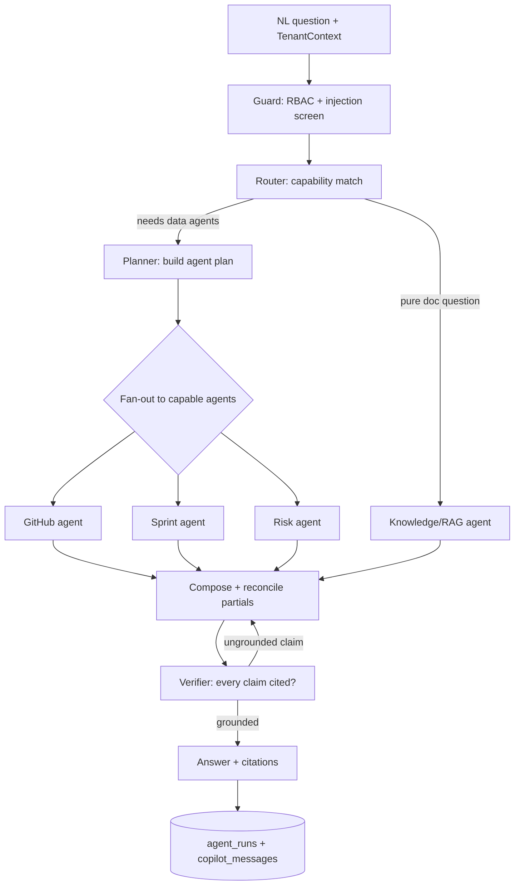
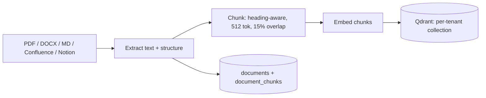

# 07 — AI Architecture

The AI layer is the product's differentiator: a fleet of specialized agents that explain engineering
execution with **cited evidence** and produce **explainable recommendations**. This document is the
canonical reference for how those agents are built, orchestrated, grounded, routed across models, and
evaluated. It implements `FR-AI-*`, `FR-RAG-*`, `FR-REC-*`, `FR-ENT-05/08`, and the platform-wide
`NFR-EXPLAIN` / `NFR-COST` requirements.

Read [03 — System Architecture](./03-system-architecture.md) (the Agent port, event-first core, worker)
and [04 — Data Model](./04-data-model.md) (`recommendations`, `agent_runs`, `documents`,
`document_chunks`) first. Feature-plan detail lives in [13 — AI Agents](./plans/13-ai-agents.md) and
[14 — RAG](./plans/14-rag-knowledge.md).

---

## 1. Principles (non-negotiable)

1. **Grounded or silent.** Every conclusion an agent emits MUST be traceable to org data — event ids,
   projection rows, or cited document chunks. An agent that cannot ground a claim MUST NOT make it
   (`NFR-EXPLAIN`, `FR-AI-02`).
2. **Agents never bypass tenant scope or RBAC.** Agents read data only through the same scoped
   repositories/services the API uses. There is no privileged data path. `organizationId` scoping and
   permission checks apply identically (`NFR-ISO`, `FR-RBAC-03`).
3. **Untrusted content is data, not instructions.** PR bodies, ticket text, docs, and standup posts are
   treated as *evidence to reason over*, never as commands (§8).
4. **Explainable by construction.** The "why" is stored **with** the output at write time, not
   reconstructed later. If it isn't in `recommendations.evidence` / `agent_runs`, it didn't happen.
5. **Cheap by default, capable when it counts.** Model choice is a function of task difficulty and
   budget, not habit (§7).
6. **Extensible by contract.** New agents implement the `Agent` port and self-register; the orchestrator
   discovers them by capability with zero core changes (`FR-ENT-05`).

---

## 2. Agent fleet

Every agent runs over **scoped org data** and returns an **insight plus its evidence**. Agents are
stateless workers invoked on the BullMQ worker (`apps/worker`) or synchronously by the Copilot.

| Agent | Purpose | Inputs (scoped) | Output (insight + evidence) |
|-------|---------|-----------------|-----------------------------|
| **Activity** (`FR-AI-01`) | Explain what a person/team actually did across sources | `timeline_entries`, `events` for subject+window | Narrative of execution flow + linked event ids |
| **GitHub** (`FR-GH-03/05`) | PR/review bottlenecks, DORA, code-ownership risk | `pr_metrics`, `dora_metrics`, `reviewer_load`, `github.*` events | "PR #482 idle 74h, reviewer overloaded" + PR/review event ids |
| **Sprint** (`FR-SPR-02`) | Sprint health, completion probability, estimation accuracy | `sprint_metrics`, `jira.*` events | "Completion probability 63%, 4 blocked stories" + ticket ids |
| **Review** (`FR-GH-03`) | Reviewer load balancing & review latency | `reviewer_load`, review events | "3 reviewers carry 80% of load" + review event ids |
| **Risk** (`FR-REC-01`) | Cross-source risk correlation (blocked work, stale PRs, meeting overload) | multiple projections + `focus_metrics` | Ranked risks with contributing signals + evidence set |
| **AI-Usage** (`FR-AIU-03`) | AI-tool adoption & estimated assistance %, methodology disclosed | `ai_usage_rollups`, `ai_tool.*` events | Adoption/assistance readout + rollup provenance |
| **Knowledge** (`FR-RAG-02`) | Answer questions from the org's docs with citations | Qdrant retrieval over `documents`/`document_chunks` | Answer + document/chunk citations |
| **Meeting** (`FR-CAL-02`) | Meeting load vs focus balance | `focus_metrics`, `calendar.*` events | "Team lost 11 focus-hours to meetings" + calendar event ids |
| **Recommendation** (`FR-REC-*`) | Turn agent findings into ranked, de-duplicated, actionable recs | outputs of other agents + projections | `recommendations` rows with impact + evidence + reasoning |
| **Manager Copilot** (`FR-AI-03`) | NL Q&A over the org's data; routes to the right agent(s) | user question + `TenantContext` + RBAC scope | Data-grounded answer + citations, stored in `copilot_messages` |

The **Manager Copilot** is the orchestrator's front door: it decodes a natural-language management
question, selects capable agents, composes their partial results, and returns a single grounded answer
with citations. It is not a monolith — it delegates to the fleet above.

---

## 3. The Agent port (stable contract)

Every agent implements one interface. The orchestrator and Copilot depend on this contract, never on a
concrete agent — the same ports/adapters discipline the rest of the platform uses (doc 03 §8).

```ts
// @eos/ai — the stable contract every agent implements
export interface AgentContext {
  organizationId: string;        // tenant scope — always present (NFR-ISO)
  actor: RbacPrincipal;          // whose permissions bound this run (FR-RBAC-03)
  scope: QueryScope;             // team/project/user window the actor may see
  query?: string;                // NL question (Copilot path) or null (scheduled path)
  budget: BudgetHandle;          // remaining org token/cost budget (NFR-COST)
}

export interface Evidence {
  eventIds?: string[];           // canonical event ids backing the claim
  citations?: DocCitation[];     // { documentId, chunkId, quote } for RAG
  projections?: string[];        // read-model rows consulted (derived_from)
  reasoning: string;             // the chain that links evidence → conclusion
}

export interface AgentInsight {
  summary: string;               // the conclusion, in plain language
  confidence: number;            // 0..1, calibrated (§9)
  evidence: Evidence;            // MUST be non-empty — grounded or silent (§1)
}

export interface Agent {
  readonly capability: AgentCapability;   // e.g. 'sprint.health', 'github.bottlenecks'
  readonly describe: CapabilityCard;      // NL description for capability routing (§4)
  run(ctx: AgentContext): Promise<AgentInsight>;
}
```

**Registration & extensibility (`FR-ENT-05`).** An agent is a NestJS provider tagged with
`@RegisterAgent()`; on boot the `AgentRegistry` collects every provider implementing `Agent` and indexes
it by `capability` and by its `CapabilityCard` (embedded once for semantic routing). Adding an agent —
core or plugin-SDK — is a new provider plus a registry entry. No orchestrator, Copilot, or API change.
This is the "extensible by contract" principle (doc 00 §8) made concrete for the AI layer.

Agents fetch data exclusively via injected repositories/services (e.g. `PrMetricsRepository`,
`KnowledgeRetriever`) that carry `AgentContext.organizationId` and enforce RBAC. **An agent cannot
construct an unscoped query** — the same guarantee doc 04 §5 gives the rest of the codebase.

---

## 4. Orchestration with LangGraph.js

We use **LangGraph.js** for stateful, multi-step orchestration in-language (ADR-0006). A Copilot request
is a graph traversal over a shared, typed state object.

### 4.1 State model

```ts
interface CopilotState {
  ctx: AgentContext;               // immutable scope/actor/budget
  plan: CapabilityCall[];          // agents chosen by the router
  partials: AgentInsight[];        // results as they complete
  citations: Evidence[];           // accumulated for the final answer
  answer?: string;                 // composed, grounded response
  spend: TokenLedger;              // running token/cost for agent_runs
}
```

### 4.2 Graph



### 4.3 How routing works

The **Router** node matches the question to capabilities. It first tries a cheap classifier
(`claude-haiku-4-5-20251001`) that maps the NL question onto one or more `CapabilityCard`s; ambiguous or
multi-part questions escalate to `claude-sonnet-5` for a structured plan. Routing is by **capability**,
not by hard-coded agent names — a newly registered agent becomes routable the moment its card is indexed.

The **Planner** turns the chosen capabilities into an ordered/parallel `plan`. Independent agents (GitHub
bottlenecks, sprint health, meeting load) fan out concurrently; dependent steps (Risk agent consuming the
others' findings) are sequenced as graph edges.

### 4.4 Tool-calling stays inside the tenant boundary

Agents fetch data via **tool calls that resolve to scoped repository methods** — never raw SQL, never a
cross-tenant path. A tool definition SHOULD be prescriptive about *when* to call it, which materially
improves should-call rate on current Claude models:

```ts
// A Copilot tool is a thin, typed wrapper over a scoped service call.
const prBottlenecksTool = {
  name: 'get_pr_bottlenecks',
  description:
    'Call this when the user asks about slow PRs, stuck reviews, or review load. ' +
    'Returns PRs exceeding the wait threshold for the CURRENT tenant/team scope only.',
  input_schema: {
    type: 'object',
    properties: { teamId: { type: 'string' }, sinceDays: { type: 'integer' } },
    required: ['teamId'],
    additionalProperties: false,
  },
  strict: true,
} as const;
// handler: (input, ctx) => prMetricsRepo.findBottlenecks({ ...input, organizationId: ctx.organizationId })
```

Because the handler injects `ctx.organizationId` and re-checks `ctx.actor` permissions, **the model can
request data but can never widen scope.** RBAC and tenant isolation are properties of the tool layer, not
of prompt wording.

### 4.5 Composing partial results

The **Compose** node reconciles partials: it merges overlapping findings, drops duplicates, and orders by
impact. Each partial keeps its own `Evidence`, so citations survive composition. If one agent fails or
returns low confidence, the graph degrades gracefully — the answer is composed from the partials that did
ground, with an explicit note of what could not be determined (never a fabricated fill-in).

---

## 5. RAG pipeline (`FR-RAG-*`)

The Knowledge agent and Copilot answer document questions **with citations** over per-tenant vectors in
Qdrant (ADR-0007).

### 5.1 Ingest → chunk → embed → store



- **Sources (`FR-RAG-01`).** PDF, DOCX, Markdown, Confluence, and Notion are normalized by a
  `DocumentSource` adapter into plain text + structural metadata (headings, page, author, audience).
  Adding a source is another adapter — same extensibility contract as event sources.
- **Chunking.** Structure-aware: split on headings first, then pack to a target of **~512 tokens** with
  **~15% overlap** so a citation lands on a coherent passage. Each chunk row (`document_chunks`) stores
  `ordinal`, `text`, `token_count`, and its `qdrant_point_id`.
- **Embedding model.** Routine, high-volume extraction ⇒ a cheap, fast embedding model
  (Gemini / OpenAI `text-embedding-3-large` class), chosen per the cost policy (§7). Embedding choice is
  isolated behind an `Embedder` port so the model can change without a re-architecture — only a re-index.
- **Per-tenant isolation (`NFR-ISO`).** One Qdrant collection per tenant (or a shared collection with a
  **mandatory `organizationId` payload filter**). Retrieval MUST always carry the tenant filter; there is
  no unfiltered search path.

### 5.2 Retrieve → answer with citations

- **RBAC/audience filter (`FR-RAG-03`).** Retrieval applies a Qdrant payload filter for
  `organizationId` **and** the document `audience` the actor is permitted to see. A doc's audience limits
  who can retrieve it — enforced in the query, not in the prompt.
- **Hybrid search.** Dense vector search is combined with a sparse/keyword (BM25-style) pass and the two
  result sets are fused (reciprocal-rank fusion) before a lightweight rerank. This recovers exact-term
  matches (error codes, config keys, ticket IDs) that pure embeddings miss.
- **Answer + citations.** The generation step is instructed to answer **only** from retrieved chunks and
  to cite each claim. Citation format surfaced to the UI and stored in `copilot_messages`:

  ```
  [doc:{documentId}#chunk:{ordinal}] "verbatim quote"  → deep-links to the source passage
  ```

  If retrieval returns nothing above the relevance floor, the agent says so — it does not answer from the
  model's parametric memory (§8 grounding).

---

## 6. Explainability by construction (`NFR-EXPLAIN`)

Explainability is a **write-time invariant**, not a reporting feature.

- **Recommendations.** Every `recommendations` row stores `evidence` (jsonb) = the event ids/projection
  rows **and** the reasoning chain, plus `created_by_agent`. A recommendation with empty evidence is a
  bug the write path rejects.
- **Agent runs.** Every agent invocation writes an `agent_runs` row: scoped inputs, model used, token
  counts, cost, latency, and a reference to the output/evidence. This is both the audit trail and the
  cost ledger (§7).
- **Copilot messages.** Each answer persists to `copilot_messages` with its cited evidence, so a manager
  can reopen "why did it say that?" for any past turn.
- **UI "why".** Every recommendation and Copilot answer renders a **Why** affordance that expands the
  stored evidence: the cited events deep-link into the [Daily Timeline](./plans/12-daily-timeline.md)
  (`FR-TL-03`), and cited chunks deep-link into the source document. Nothing is recomputed — the UI reads
  what the agent stored.

The guarantee mirrors projections (doc 04 §6): just as every metric row carries `derived_from`, every AI
output carries its evidence. The platform can always answer *"why is this what it is."*

---

## 7. Model routing & cost control (`NFR-COST`)

LLM spend is the dominant variable cost (doc 01 §5). Routing + caching + budget enforcement are
mandatory.

### 7.1 Route by task difficulty

Models are addressed through a `ModelRouter` port; feature code asks for a *task class*, not a model
string, so routing policy changes in one place.

| Task class | Default model | Why |
|------------|---------------|-----|
| Routing/classification, cheap extraction, EOD drafts | `claude-haiku-4-5-20251001` | Fast, cheap, high-volume |
| Standard agent reasoning, planning, sprint/GitHub analysis | `claude-sonnet-5` | Near-Opus quality at Sonnet cost |
| Hard multi-step reasoning, cross-source Risk correlation, ambiguous Copilot questions | `claude-opus-4-8` | Most capable Claude for hard reasoning |
| Embeddings (RAG) | cheap embedding model (Gemini/OpenAI) | Bulk, latency-sensitive, non-reasoning |

Default to the **most capable Claude for hard reasoning** and the **cheapest/fastest for routine
extraction**. OpenAI and Gemini remain routable behind the same port for embeddings and cost/latency
fallback. Use adaptive thinking (`thinking: { type: 'adaptive' }`) with an appropriate `effort` on the
Claude reasoning paths; keep routine calls at low effort.

### 7.2 Prompt caching

Agent system prompts, tool definitions, and stable per-tenant context (e.g. the org's config or a
retrieved doc set) are marked with `cache_control` so repeated agent runs pay cache-read rates
(~0.1×) rather than full input. Keep the cached prefix byte-stable — **no timestamps, UUIDs, or
per-request IDs ahead of the last breakpoint** — or the cache silently misses. Verify with
`usage.cache_read_input_tokens`.

### 7.3 Budget cap + enforcement

- Each org has a **monthly AI budget** in `settings`. The `BudgetHandle` in `AgentContext` carries the
  remaining allowance.
- **Accounting.** After each model call the actual `input`/`output`/cache token counts and computed cost
  are written to `agent_runs`; a per-org rolling aggregate lives in Redis for fast pre-flight checks.
- **Enforcement / degradation.** Before an expensive call the router checks the budget:
  - **Comfortable** → route normally.
  - **Near cap** → down-route (Opus→Sonnet→Haiku), reduce `effort`, tighten retrieval `k`, prefer cached
    results.
  - **Exhausted** → serve only cached/precomputed insights and queue fresh generation for the next
    period; the UI shows a clear "AI budget reached" state. The platform **degrades, never silently
    overspends.**
- **Batching.** Non-interactive work (nightly recommendation sweeps, bulk embedding, report generation)
  goes through batched/queued jobs on the worker to smooth spend and respect provider rate limits.

---

## 8. Guardrails & safety

- **Grounding / no ungrounded claims.** Agents answer from retrieved evidence only. The **Verifier** node
  (§4.2) fails any final answer whose claims aren't backed by an `Evidence` entry and loops back to
  Compose; unrecoverable ungrounded content is dropped, not shipped.
- **Hallucination mitigation via citation-required.** Because every claim MUST carry a citation to be
  emitted, an unsupported assertion has no path to the user. "I don't have evidence for that" is an
  acceptable — and required — answer.
- **Prompt-injection defense.** Content ingested from PRs, tickets, docs, and standup posts is
  **untrusted data**, not instructions. It is wrapped as clearly-delimited evidence blocks with an
  explicit instruction that content inside them is data to analyze, never commands to follow. Operator
  instructions ride the trusted **system** channel (on Opus 4.8, mid-conversation `role:"system"`
  messages) — never interpolated from user- or document-supplied text. Tool handlers re-authorize scope
  server-side regardless of anything the model was told (§4.4), so even a successful injection cannot
  widen data access.
- **PII redaction.** Where org policy requires it, a redaction pass strips PII from content before it is
  sent to a model provider (`NFR-PRIVACY`, doc 06). Prompt-content logging is **off by default** and
  gated by org policy (`FR-AIU-02`).
- **Human-approval gate (`FR-ENT-08`, `FR-AI-04`).** Any agent action that reaches **outward** — posting
  an EOD to Teams, sending a notification, writing to an external system — is **proposed, not executed**.
  It is queued for human approval; only an explicit approving action triggers the outward call. Read-only
  insight generation needs no gate; anything with an external side effect does.

---

## 9. Evaluation

We measure agent quality continuously and feed real usage back into prompts, routing, and eval sets.

| Metric | What it measures | Source |
|--------|------------------|--------|
| **Recommendation usefulness rate** | % of recs marked useful or acted on | `recommendations.status` (act/dismiss/snooze) — target ≥ 50% (doc 00 §7) |
| **Groundedness** | % of claims backed by valid, resolvable evidence | Verifier + offline audit of `agent_runs` |
| **Citation precision** | % of citations that actually support their claim | Offline eval + LLM-judge on sampled answers |
| **Retrieval quality** | recall@k / MRR of RAG retrieval | Labeled question→chunk sets |
| **Routing efficiency** | cost & latency per resolved question vs quality | `agent_runs` token/cost + outcome |

- **Offline eval sets.** Curated, per-capability question/answer and question/chunk fixtures run in CI on
  prompt or routing changes; an **LLM-as-judge** (a capable Claude model) scores groundedness and
  citation precision, with human spot-checks calibrating the judge.
- **Feedback loop.** Dismiss/act/snooze on recommendations (`FR-REC-03`) and thumbs on Copilot answers
  are captured as labels. Dismissed recommendations feed the de-dup/ranking model and surface prompt or
  retrieval regressions; acted-on ones become positive examples. The loop closes on the lagging
  engineering outcomes the product exists to move — PR review-wait, stale-PR age, sprint predictability
  (doc 00 §7).

---

_Next: [08 — Coding Standards](./08-coding-standards.md)_
