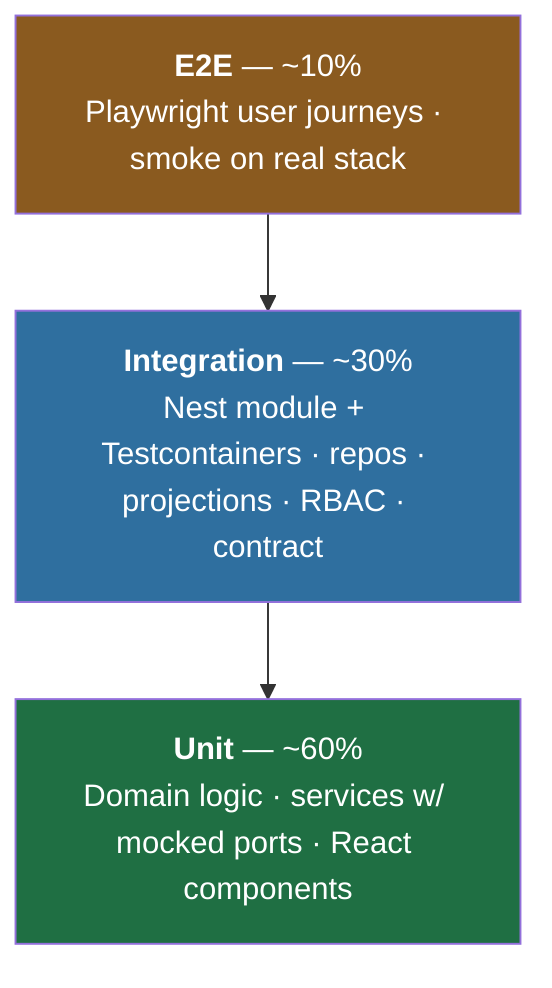

# 09 — Testing Strategy

How we keep **EngineeringOS AI** correct while shipping fast on one VM. This is the contract every
feature plan tests against. Read [03 — System Architecture](./03-system-architecture.md) (ports/adapters,
worker, event pipeline) and [04 — Data Model](./04-data-model.md) (repositories, tenant scoping) first.

RFC-2119 keywords (**MUST**, **SHOULD**, **MAY**) carry their usual normative weight here.

---

## 1. Goals & principles

| Principle | What it means here |
|-----------|--------------------|
| **Test behavior, not implementation** | Assert on outputs, persisted state, and emitted events — not private methods. |
| **The pyramid, not the ice-cream cone** | Many fast unit tests; a solid middle of integration tests against **real** infra; a thin, high-value e2e layer. |
| **Ports make mocking honest** | Because features depend on interfaces (repositories, `EventBus`, `Agent`, model client), unit tests inject fakes with zero framework weight. |
| **Real infra where it counts** | Data-layer, tenant-isolation, and idempotency guarantees are only proven against a real Postgres/Redis/Qdrant — we use **Testcontainers**, never SQLite stand-ins. |
| **Deterministic always** | No wall-clock, no network, no `Math.random`, no real LLM in the assertion path. See [08 — Coding Standards](./08-coding-standards.md). |
| **`NFR-ISO` is a tested property** | Every tenant-scoped repository **MUST** ship a cross-tenant negative test. Isolation is enforced by tests, not by hoping. |

---

## 2. The test pyramid



| Level | Target share | Speed | Runs against | What lives here |
|-------|-------------|-------|--------------|-----------------|
| **Unit** | ~60% | ms | mocks/fakes only | pure domain logic, services with mocked repos/ports, React components, adapters' pure `normalize()` |
| **Integration** | ~30% | 100ms–seconds | Testcontainers (PG/Redis/Qdrant) | repositories, Nest module wiring, event ingest, projection rebuild, RBAC guards, external-API contract tests |
| **E2E** | ~10% | seconds+ | full stack, seeded org | critical user journeys through the real web app + API |

> These are **proportions of test count**, not a budget cap. If a guarantee (isolation, idempotency)
> can only be proven at the integration level, it belongs there regardless of the ratio.

---

## 3. Tooling

| Concern | Tool | Notes |
|---------|------|-------|
| Unit test runner | **Vitest** | Fast, Vite-native (shared config with `web`), ESM-first, Jest-compatible API. |
| Test targets / graph | **Nx** `test`, `test-e2e` | `nx affected` runs only impacted projects (§9). |
| API integration | **Supertest** | HTTP assertions against a booted Nest app instance. |
| Real infra for integration | **Testcontainers** | Ephemeral Postgres 16, Redis 7, Qdrant per suite/worker. |
| Web e2e | **Playwright** | Cross-browser journeys, trace-on-failure, network stubbing. |
| Contract/HTTP mocking | **nock** + recorded fixtures | For GitHub/Jira/Teams — we never hit real providers in CI. |
| React components | **@testing-library/react** + `@testing-library/user-event` | Query by role/text; no shallow rendering. |
| Desktop agent | **`cargo test`** | Rust unit + integration tests in the `desktop-agent` workspace (§7). |
| Coverage | Vitest **v8** provider | Gates in CI (§8, §9). |

Nx config sketch:

```jsonc
// libs/backend/database/project.json
{
  "targets": {
    "test":     { "executor": "@nx/vite:test" },                 // unit
    "test-int": { "executor": "@nx/vite:test",
                  "options": { "config": "vitest.integration.ts" } } // Testcontainers
  }
}
```

Every project exposes `test`; projects with a data or module surface also expose `test-int`. Only
`apps/web` (and a tiny API smoke suite) own `test-e2e`.

---

## 4. Unit tests

Fast, isolated, no I/O. This is where the bulk of logic lives, and ports make it cheap.

**What belongs here**

- Pure domain logic: metric calculators (review-wait, DORA, focus), scoring, event `normalize()` in
  each `SourceAdapter`, reducers used by projections.
- Services with **mocked repositories/ports** — the classic ports/adapters win.
- React components and hooks with Testing Library.

**Service with a mocked repository:**

```ts
// review-wait.service.spec.ts
it('flags a PR whose review wait exceeds the SLA', async () => {
  const prRepo = { findOpenForOrg: vi.fn().mockResolvedValue([stalePr]) }; // fake port
  const svc = new ReviewWaitService(prRepo, clock('2026-07-04T00:00:00Z')); // injected clock
  const result = await svc.stalePrs('org_1');
  expect(result).toEqual([{ prId: stalePr.id, waitedHours: 52 }]);
});
```

Note the injected `clock` — no `Date.now()`. Note the fake repo is a plain object, not a Nest test
module: unit tests **MUST NOT** boot Nest or touch a database.

**React component:**

```tsx
it('renders the empty state when a timeline has no entries', () => {
  render(<Timeline entries={[]} />);
  expect(screen.getByText(/no activity yet/i)).toBeVisible();
});
```

**Coverage expectations**

| Code area | Line/branch target |
|-----------|--------------------|
| `libs/shared/*`, domain logic in `libs/backend/ai`, metric calculators | **≥ 90%** |
| `libs/backend/*` services, `libs/frontend/feature-*` logic | **≥ 80%** |
| Glue/composition (Nest module wiring, `main.ts`, DI providers) | pragmatic — covered transitively by integration/e2e |

Coverage is a floor, not a target to game. A green line with no assertion is worse than no test.

---

## 5. Integration tests

The middle of the pyramid, and the part that proves our hardest guarantees. These **MUST** run against
real infra via Testcontainers, with **real migrations** applied — never `sequelize.sync()`.

**Shared harness** (spin container once per worker, migrate, hand out isolated tenants):

```ts
export async function bootTestDb() {
  const pg = await new PostgreSqlContainer('postgres:16').start();
  const sequelize = makeSequelize(pg.getConnectionUri());
  await runMigrations(sequelize);        // the same migrations CI/prod run
  return { sequelize, stop: () => pg.stop() };
}
```

### 5.1 Tenant isolation (`NFR-ISO`) — mandatory pattern

Every tenant-scoped repository **MUST** carry a test proving a cross-tenant read returns nothing. This
is the single most important test in the suite.

```ts
describe('EventRepository tenant isolation (NFR-ISO)', () => {
  it('never returns another org’s rows', async () => {
    const orgA = await factory.org(), orgB = await factory.org();
    await factory.event({ organizationId: orgA.id });

    const repo = new EventRepository(sequelize);
    const asB = repo.forTenant(orgB.id);       // scope injected from TenantContext

    expect(await asB.findAll()).toHaveLength(0);          // positive absence
    expect(await asB.findById(/* orgA event id */)).toBeNull(); // no id-based leak
  });
});
```

A repository without this test **MUST NOT** merge. A generic helper (`assertTenantScoped(repo)`) sweeps
every registered repository so new tables can't silently skip it.

### 5.2 Event ingest idempotency (`FR-EVT-02`)

```ts
it('ingesting the same event twice writes one row', async () => {
  const payload = githubPrOpenedFixture();
  await ingest.handle(payload);
  await ingest.handle(payload);              // replayed webhook / at-least-once bus
  const rows = await eventRepo.forTenant(org.id).byExternalId(payload.externalId);
  expect(rows).toHaveLength(1);              // unique (org, source, external_id, content_hash)
});
```

### 5.3 Projection correctness — rebuild from events (`NFR-EXPLAIN`)

Projections are read models that **MUST** be reproducible from the log. The test rebuilds and asserts
the derived numbers plus the `derived_from` evidence.

```ts
it('rebuilds pr_metrics deterministically from the event log', async () => {
  await seedEvents(prLifecycleFixture);      // opened → reviewed → merged
  await projectionRunner.rebuild('pr_metrics', org.id);
  const m = await prMetricsRepo.forTenant(org.id).forPr(prId);
  expect(m.reviewWaitSeconds).toBe(3600);
  expect(m.derivedFrom).toContain(reviewEventId);   // explainability holds
});
```

### 5.4 RBAC guard tests (`FR-RBAC-*`)

Positive **and** negative. HR-forbidden permissions and org-wide vs team scope get explicit cases.

```ts
it('denies pr:read to a role lacking the permission', async () => {
  await request(app.getHttpServer())
    .get('/orgs/org_1/prs')
    .set('Authorization', bearer(userWithoutPrRead))
    .expect(403);
});
```

### 5.5 Nest module tests (Supertest)

Boot a real module with real repositories against Testcontainers Postgres; assert HTTP behavior,
persisted state, and emitted bus events together.

---

## 6. E2E tests

Thin, high-signal, on the **real stack** (web + API + worker + infra via Docker Compose or Testcontainers),
against a **seeded test org**. External providers are always faked.

**Journeys we guarantee:**

| Journey | Asserts |
|---------|---------|
| Login → land on dashboard | auth, tenant resolution, first paint |
| Connect GitHub (**mocked OAuth**) → sync → see timeline | ingest → projection → realtime push (`FR-EVT-04`) |
| Open dashboard → drill into a metric’s “why” | projection + evidence surfaced (`NFR-EXPLAIN`) |
| Ask Manager Copilot a question → get a grounded, cited answer | AI layer with a **stubbed model** (§7) |

```ts
// apps/web/e2e/copilot.e2e.spec.ts
test('copilot answers with cited evidence', async ({ page }) => {
  await loginAs(page, seededManager);
  await page.getByRole('button', { name: /ask copilot/i }).click();
  await page.getByRole('textbox').fill('Who is overloaded on reviews?');
  await page.getByRole('button', { name: /send/i }).click();
  await expect(page.getByTestId('answer')).toContainText(/review load/i);
  await expect(page.getByTestId('evidence-list')).toContainText('PR #');
});
```

**Contract tests for external integrations.** We record real provider responses once, sanitize them into
fixtures, and replay via **nock**. CI **MUST NOT** reach GitHub/Jira/Teams. A scheduled (non-blocking)
job re-verifies fixtures against live APIs so drift is caught without making PRs flaky.

```ts
nock('https://api.github.com').get(/\/pulls/).reply(200, githubPullsFixture);
const events = await githubAdapter.sync(integration);   // adapter → canonical Event[]
expect(events.map(e => e.type)).toContain('github.pr.opened');
```

---

## 7. Testing the AI layer

LLMs are non-deterministic; our tests **MUST NOT** be. We split into two disciplines. See
[07 — AI Architecture](./07-ai-architecture.md).

### 7.1 Deterministic orchestration tests (in CI, blocking)

Inject a **stubbed model client** (the `ModelClient` port) with scripted responses/tool-calls. Assert on
**structure** — which tools were called, what evidence was attached, control flow through the LangGraph —
**never on exact wording**.

```ts
it('copilot calls the reviewer-load tool and attaches evidence', async () => {
  const model = scriptModel([
    { toolCall: { name: 'get_reviewer_load', args: { orgId: 'org_1' } } },
    { text: 'Alice is carrying the most reviews.' },
  ]);
  const out = await copilot.run({ orgId: 'org_1', q: 'who is overloaded?' }, { model });
  expect(out.toolCalls.map(t => t.name)).toEqual(['get_reviewer_load']);
  expect(out.evidence).not.toHaveLength(0);   // grounded, not hallucinated
});
```

Rules: **MUST** mock the model in the assertion path; **MUST** assert on tool-calls / evidence shape /
groundedness invariants; **MUST NOT** assert on prose. This kills LLM flakiness at the source.

### 7.2 Golden / eval sets (out-of-band, non-blocking)

Quality of real model output is measured by **evals**, not unit tests. A curated golden set exercises
groundedness (every claim maps to cited evidence) and recommendation quality against scored rubrics,
run on a schedule/nightly and reported as a trend. Regressions **SHOULD** block a model/prompt change,
not an unrelated PR. Detailed rubric and dataset governance live in [07 — AI Architecture](./07-ai-architecture.md).

---

## 8. Test data & fixtures

| Rule | Detail |
|------|--------|
| **Factories/builders, not raw inserts** | `factory.org()`, `factory.event({...})` produce valid entities with sane defaults and overridable fields. No hand-rolled fixtures duplicated across files. |
| **Per-test tenant** | Each test creates its own org(s); tests **MUST NOT** share a tenant. This makes isolation bugs surface as data leaks. |
| **No shared mutable state** | No module-level seed data mutated across tests. Fresh state or explicit reset per test. |
| **DB reset strategy** | Prefer **transaction-per-test with rollback** for repository/module tests (fast, total isolation). Where a test crosses transactions (e.g. worker + outbox), fall back to **truncate** of touched tables in `afterEach`. |
| **Determinism** | Injected `clock`, seeded ids (uuid v7 factory with fixed seed), fixed sample payloads. See [08 — Coding Standards](./08-coding-standards.md). |

```ts
export const factory = {
  org: (o = {}) => Organization.create({ name: 'Acme', slug: uniqueSlug(), ...o }),
  event: (o = {}) => Event.create({ organizationId: o.organizationId ?? undefined,
                                    type: 'github.pr.opened', source: 'github', ...o }),
};
```

---

## 9. Multi-tenancy & security test requirements

These are **mandatory gates**, not aspirations:

1. **Every tenant-scoped repository MUST have a cross-tenant negative test** (§5.1). The shared
   `assertTenantScoped()` sweep enumerates repositories and fails CI if one is unregistered.
2. **Every RBAC-guarded route MUST have an authz negative test** (denied role → 403) alongside the
   positive one.
3. **Qdrant queries MUST be proven org-filtered** — a test issues a search as org B and asserts no org A
   chunks return (mirrors §5.1 for the vector store).
4. **Consent enforcement** (`NFR-CONSENT`): an ingest for a `signal_type` with no active consent row
   **MUST** be dropped — covered by an integration test.
5. **No secret/token leakage**: serializer tests assert `oauth_tokens` and `password_hash` never appear
   in API responses.

---

## 10. CI integration

Full pipeline in [deployment/02 — CI/CD](./deployment/02-cicd.md). Testing-relevant contract:

| Stage | Command | Gate |
|-------|---------|------|
| Lint + boundaries | `nx affected -t lint` | fails on any module-boundary violation (cycle guard, doc 03 §7) |
| Unit | `nx affected -t test --coverage` | coverage floors (§4) enforced per project |
| Integration | `nx affected -t test-int` | Testcontainers; **migrations applied**; isolation/idempotency suites |
| E2E (smoke) | `nx run web:test-e2e` | on PRs to `main` and pre-deploy; full stack |
| Contract re-verify | scheduled | non-blocking; opens an issue on provider drift |

- **`nx affected`** runs only projects impacted by the diff (via the Nx graph) — the monorepo stays fast.
- **Parallelization**: `--parallel` across projects; Testcontainers get a container per worker (unique
  ports/databases) so integration suites don't collide.
- **Coverage gates** are per-project floors (§4); a drop below the floor fails the build.
- **Flaky-test policy**: a test that fails intermittently is **quarantined within one business day**
  (tagged, excluded from the blocking gate, tracked in an issue) and **MUST** be fixed or deleted within
  a week. Retries **MUST NOT** be used to paper over a flaky test in the main suite. A quarantined test
  is a bug, not a shrug.

---

## 11. Conventions

| Convention | Rule |
|-----------|------|
| **File naming** | Unit/integration: `*.spec.ts` (co-located, or `*.int.spec.ts` for Testcontainers suites). E2E: `*.e2e.spec.ts` under `apps/web/e2e`. |
| **Structure** | **AAA** — Arrange, Act, Assert, with blank lines separating the phases. |
| **One theme per test** | Each test proves **one** behavior; multiple `expect`s are fine if they assert the same theme. Name the test after the behavior (`it('denies …')`), not the method. |
| **No logic in tests** | No `if`/`for`/`try` branching in a test body. Use `it.each` for parameterized cases, not loops. A test with logic needs its own test. |
| **Deterministic** | No real network, clock, randomness, or LLM in the assertion path (§7, [08 — Coding Standards](./08-coding-standards.md)). |
| **No snapshot-everything** | Snapshots only for stable, reviewed structures; never as a substitute for meaningful assertions. |

**AAA example:**

```ts
it('marks a PR stale after the SLA window', () => {
  const svc = new ReviewWaitService(prRepo, clock('2026-07-04T00:00:00Z')); // Arrange

  const result = svc.classify(prOpenedFiftyTwoHoursAgo);                     // Act

  expect(result).toBe('stale');                                             // Assert
});
```

---

_Next: [10 — Shared Packages & Boundaries](./10-shared-packages-and-boundaries.md)_
