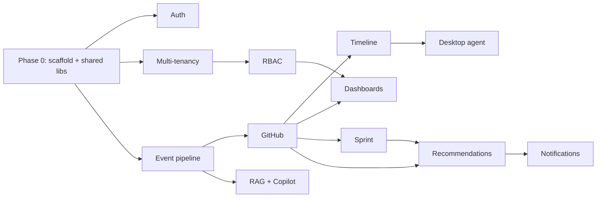

# Plan 00 — Roadmap & Phasing

> How we sequence EngineeringOS AI from empty repo to enterprise product. The organizing idea:
> **prove the core thesis end-to-end early** (correlated timeline + one high-value AI insight), then
> widen sources and depth. Each phase ships something usable and demoable.

| | |
|---|---|
| **Status** | Draft v1 |
| **Owner** | Platform Eng + Product |
| **Related** | [00 — Vision](../00-vision-and-scope.md), [01 — PRD §7](../01-product-requirements.md#7-release-phasing) |

---

## 1. Sequencing principles

1. **Vertical slices, not horizontal layers.** Each phase delivers a working path from source → event →
   projection → dashboard/insight, not "all of the backend then all of the frontend."
2. **Highest signal, lowest friction first.** GitHub before the desktop agent: it's API-driven, needs no
   install, and carries the richest delivery signal.
3. **Foundations are load-bearing.** Auth, multi-tenancy, RBAC, and the event pipeline are Phase 1
   because everything else assumes them. Build them once, correctly (isolation + consent from day one).
4. **AI rides on real data.** The Copilot/recommendations only ship once there are real events to reason
   over — otherwise we'd be demoing hallucinations.
5. **Boring infra first.** Single-VM Docker Compose from Phase 1; defer Kubernetes until scale demands it.

## 2. Phases

### Phase 0 — Scaffolding (foundation, ~1 sprint)

Repo + guardrails so all later work stays clean.

- Nx monorepo, `apps/{api,worker,web}`, `libs/{shared,backend,frontend}/*` with **tags + module
  boundaries** enforced ([10](../10-shared-packages-and-boundaries.md)); `@eos/*` path mappings.
- Shared libs seeded: `@eos/shared-enums`, `-constants`, `-types`, `@eos/contracts`.
- `@eos/database` with Sequelize, migration runner, `TenantModel` base.
- Docker Compose (postgres/redis/qdrant/minio) for local dev; CI (`nx affected` lint/test/build).
- Config + logging + error envelope in `@eos/backend-core`.
- **Exit:** `nx run-many` green; a hello-world request flows web→api→db with tenant context; `nx lint`
  proves zero boundary violations.

### Phase 1 — Foundations & first signal (MVP core)

Deliver a real, isolated tenant with GitHub-driven timeline + dashboards.

- **Auth** ([01](./01-authentication.md)): email + Google/GitHub OAuth, JWT + refresh, sessions. (MS OAuth + MFA can trail within the phase.)
- **Multi-tenancy** ([02](./02-multi-tenancy.md)) + **RBAC** ([03](./03-rbac.md)): org hierarchy, isolation, default roles, guards on every path.
- **Event pipeline** ([05](./05-event-pipeline.md)): canonical events, idempotent ingest, outbox → Redis Streams, projections, WS fan-out.
- **GitHub integration** ([06](./06-github-integration.md)): GitHub App, webhooks + backfill, PR/review events, `pr_metrics` + basic DORA.
- **Daily Timeline** ([12](./12-daily-timeline.md)) from GitHub events; **Employee + Manager dashboards** ([16](./16-dashboards.md)) with the [design system](../11-ui-ux-design-system.md) (light/dark, responsive).
- **Deploy**: single GCP VM via SSH + Compose ([deployment/00](../deployment/00-gcp-vm-deployment.md)); CI/CD to GHCR ([deployment/02](../deployment/02-cicd.md)).
- **Exit / demo:** connect a GitHub org → see a live per-person timeline and a manager PR queue with review-wait metrics, all tenant-isolated, in production on the VM.

### Phase 2 — Insight (the "why")

Turn data into explainable guidance.

- **Sprint/Jira** ([07](./07-sprint-integration.md)): sprints, velocity, burndown, estimation accuracy; PR↔ticket linking.
- **Bottleneck detection + full DORA** ([06](./06-github-integration.md)): stale/large PR, overloaded reviewer, missing reviewers — each explainable.
- **RAG knowledge base** ([14](./14-rag-knowledge.md)) + **Manager Copilot & agent fleet** ([13](./13-ai-agents.md)): NL Q&A over the org's own data, with citations.
- **Recommendations engine** ([15](./15-recommendations.md)): ranked, deduped, evidence-backed.
- **Notifications** ([17](./17-notifications.md)): Slack/Email/Teams for the highest-value triggers.
- **Exit / demo:** ask the Copilot "why is the sprint at risk?" and get a cited answer; receive a ranked recommendation that a manager acts on.

### Phase 3 — Reach (more sources, richer picture)

- **Desktop agent** ([04](./04-desktop-agent.md)) — Rust, opt-in, focus/app/IDE/git signals (no screenshots).
- **Teams SOD/EOD** ([08](./08-teams-integration.md)); **Calendar** ([09](./09-calendar-integration.md)); **IDE/Browser** ([10](./10-ide-browser-analytics.md)); **AI-usage analytics** ([11](./11-ai-usage-analytics.md)).
- **CTO dashboard** ([16](./16-dashboards.md)); full **report suite** ([18](./18-reports.md)); remaining agents (Risk/Meeting/AI-Usage).
- **Exit / demo:** a full correlated day (login→SOD→coding→AI→PR→review→meeting→AI-drafted EOD) with focus-vs-meeting balance and AI-adoption analytics.

### Phase 4 — Enterprise & platform

- Depth on **audit / retention / consent** UX, **data export + erasure**, SSO/SCIM.
- **Webhooks + public API + plugin SDK + workflow automation** ([19](./19-enterprise-platform.md)).
- Hardening: HA option (move off single VM), performance, SOC2-readiness ([06](../06-security-privacy-consent.md)).

## 3. MVP cut line

**In MVP (Phases 0–2):** auth, tenancy, RBAC, event pipeline, GitHub, Jira, timeline, Employee+Manager
dashboards, Copilot+RAG, recommendations, notifications, single-VM deploy.

**Deferred (Phase 3+):** desktop agent, Teams/calendar/IDE/browser/AI-usage analytics, CTO dashboard,
full reports, webhooks/plugin-SDK/public-API, SSO/SCIM.

Rationale: Phases 0–2 already prove the thesis (correlated, explainable delivery insight) with zero
desktop install — the fastest path to a credible demo and design validation.

## 4. Cross-cutting, every phase (never deferred)

- **Tenant isolation** tests, **consent gating**, **audit logging**, **explainability** (evidence stored
  with every metric/recommendation), and **unit/integration/e2e tests** ([09](../09-testing-strategy.md)).
- **No circular deps**: `nx lint` + `madge --circular` gate every PR ([10](../10-shared-packages-and-boundaries.md)).
- **Secrets discipline**: `.env` never committed; only `.env.example` placeholders ([06](../06-security-privacy-consent.md)).

## 5. Rough dependency order (build sequence)

## 6. Risks to the schedule

| Risk | Mitigation |
|------|------------|
| External API rate limits (GitHub/Jira) slow backfill | webhooks-first + incremental backfill with cursors |
| AI cost overruns during dev | model routing + prompt caching + per-org budget cap from day one ([07](../07-ai-architecture.md)) |
| Scope creep from the large brief | strict MVP cut line (§3); every plan lists explicit out-of-scope |
| Multi-tenant isolation bug | mandatory isolation tests in CI; RLS defense-in-depth ([04](../04-data-model.md)) |
| Single-VM resource limits | capacity signals + documented scale-off path ([deployment/03](../deployment/03-observability.md)) |

---

_Feature plans: see the [index](../README.md#2-feature-plans-plans). Template: [`_TEMPLATE.md`](./_TEMPLATE.md)._
