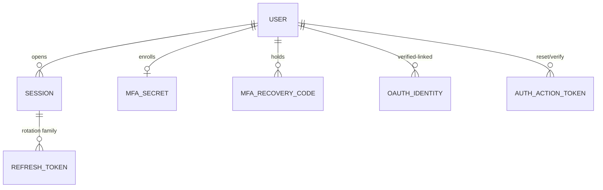

# Plan 01 — Authentication & Identity

> Establishes **who a caller is** for every other module. Delivers email/password and social sign-in,
> short-lived access JWTs with rotating refresh tokens (theft-detecting), TOTP MFA, device/session
> management, and self-service password reset + email verification — all under `/api/v1/auth`, with
> OAuth linking hardened against account takeover. Every downstream plan trusts the identity this
> module mints; nothing here trusts client-supplied identity.

| | |
|---|---|
| **Status** | Draft v1 |
| **Phase** | Phase 1 — Foundations (see [Roadmap](./00-roadmap-and-phasing.md)) |
| **Owner** | Platform / Security Eng |
| **Satisfies** | `FR-AUTH-01`, `FR-AUTH-02`, `FR-AUTH-03`, `FR-AUTH-04`, `FR-AUTH-05`, `FR-AUTH-06`, `FR-AUTH-07` |
| **Depends on** | [02 — Multi-Tenancy](./02-multi-tenancy.md) (org + user tables, `TenantContext`), [03 — RBAC](./03-rbac.md) (roles claim), [05 — Event Pipeline](./05-event-pipeline.md) (emits `auth.*` security events) |
| **Nx projects** | `libs/backend/auth` (`@eos/auth`, `scope:backend`/`type:feature`) · consumes `@eos/backend-core`, `@eos/database`, `@eos/events`, `@eos/contracts`, `@eos/shared-enums`; wired only in `apps/api` |

---

## 1. Goal & scope

- **In scope:** local credentials (argon2id); Google/Microsoft/GitHub OIDC sign-in; access-JWT +
  rotating-refresh issuance with reuse detection; TOTP MFA + recovery codes; session listing and
  per-device revocation; password reset + email verification via signed single-use tokens; safe OAuth
  account linking bound to a provider-verified email.
- **Out of scope:** the RBAC permission catalog and guards ([03](./03-rbac.md)); SSO/SAML + SCIM
  provisioning (Phase 4, `FR-ENT`); the org/user hierarchy tables themselves ([02](./02-multi-tenancy.md)).
- **Anti-goals:** no long-lived bearer tokens, no password recovery that reveals account existence, no
  auto-linking on an unverified email ([Vision §4](../00-vision-and-scope.md#4-what-we-are-not-building-anti-goals)).

## 2. User stories

- `As an Employee, I want to sign in with email + password, so that I can reach my dashboard.` — `FR-AUTH-01`
- `As an Employee, I want to sign in with my company Google/Microsoft/GitHub, so that I skip a password.` — `FR-AUTH-02`
- `As any user, I want my session to survive a refresh but expire quickly if stolen, so that a leaked token is low-value.` — `FR-AUTH-03`
- `As a security-conscious user, I want TOTP MFA, so that a phished password is not enough.` — `FR-AUTH-04`
- `As an Owner/Admin, I want to enforce MFA org-wide, so that every member meets policy.` — `FR-AUTH-04`
- `As a user, I want to see and revoke my active devices, so that I can cut off a lost laptop.` — `FR-AUTH-05`
- `As a user, I want to reset my password and verify my email via a link, so that I can recover access safely.` — `FR-AUTH-06`
- `As a user with a local account, I want OAuth linking to require proof it's my email, so that nobody can pre-register and hijack it.` — `FR-AUTH-07`

## 3. Domain model

Extends [04 — Data Model](../04-data-model.md). `users` and `oauth_tokens` already exist there; this
plan **adds** the tables below. All are tenant-scoped (`organization_id`, `TenantModel` base, [04 §9](../04-data-model.md#9-sequelize-conventions))
**except** where noted, and all carry the sensitivity class from [06 §1](../06-security-privacy-consent.md#1-data-classification-p0p4).

| Table | Key columns | Sensitivity | Notes |
|-------|-------------|-------------|-------|
| `users` (extended) | `id`, `organization_id`, `email`, `email_verified_at?`, `password_hash?`, `status`, `mfa_enabled` | P3 (email), P4 (`password_hash`) | `password_hash` **never serialized**; nullable for OAuth-only users |
| `sessions` | `id` (=`sid`), `organization_id`, `user_id`, `device_label`, `user_agent`, `ip`, `created_at`, `last_seen_at`, `revoked_at?` | P3 | one row per login; the unit of "device" (`FR-AUTH-05`) |
| `refresh_tokens` | `id`, `organization_id`, `session_id`, `family_id`, `token_hash`, `prev_id?`, `used_at?`, `expires_at`, `revoked_at?` | P4 | rotation family; only the **hash** stored (`FR-AUTH-03`) |
| `mfa_secrets` | `id`, `organization_id`, `user_id`, `secret_enc`, `confirmed_at?` | P4 | TOTP seed, field-encrypted; unconfirmed until first valid code (`FR-AUTH-04`) |
| `mfa_recovery_codes` | `id`, `organization_id`, `user_id`, `code_hash`, `used_at?` | P4 | one-time, hashed |
| `oauth_identities` | `id`, `organization_id`, `user_id`, `provider`, `provider_sub`, `email`, `linked_at` | P3 | unique `(provider, provider_sub)`; the verified linkage (`FR-AUTH-07`) |
| `auth_action_tokens` | `id`, `organization_id`, `user_id`, `purpose` (`verify_email`/`reset_password`), `token_hash`, `expires_at`, `used_at?` | P4 | single-use, short-TTL, hashed (`FR-AUTH-06`) |

`oauth_tokens` (provider access/refresh tokens, P4, [04 §8](../04-data-model.md#8-integration--consent-tables))
is written only when we need ongoing provider API access; pure sign-in does not persist provider tokens.
New enums land in `@eos/shared-enums`: `AuthProvider` (`google`|`microsoft`|`github`), `SessionStatus`,
`AuthTokenPurpose`, `MfaMethod`. New `EventType`s: `auth.login.succeeded`, `auth.login.failed`,
`auth.mfa.enabled`, `auth.session.revoked`, `auth.refresh.reuse_detected`.



## 4. Architecture & flow

`@eos/auth` is a NestJS feature lib providing an `AuthModule`. It depends **down** on `@eos/backend-core`
(config, `TenantContext`, logger), `@eos/database` (repositories — never models directly, [04 §9](../04-data-model.md#9-sequelize-conventions)),
and `@eos/events` (emit `auth.*`); it depends on **no sibling** feature lib ([10 §3](../10-shared-packages-and-boundaries.md#3-the-layered-dag)).

**Ports introduced** (interfaces in `@eos/backend-core`, concrete impls wired in `apps/api`):

| Port | Contract | Default adapter |
|------|----------|-----------------|
| `PasswordHasher` | `hash`, `verify`, `needsRehash` | argon2id (`FR-AUTH-01`, [06 §2.1](../06-security-privacy-consent.md#21-passwords)) |
| `TokenIssuer` | `signAccess(claims)`, `verify` | EdDSA JWT, keys from Secret Manager ([06 §6](../06-security-privacy-consent.md#6-secrets-management-nfr-sec)) |
| `OidcProvider` | `authorizeUrl`, `exchangeCode → { sub, email, emailVerified }` | one adapter per provider (openid-client) |
| `TotpService` | `generateSecret`, `verify(code, secret)` | otplib, ±1 step window |
| `MailSender` | `send(template, to, ctx)` | transactional email (verify/reset links) |

```mermaid
sequenceDiagram
  participant C as SPA
  participant A as AuthController
  participant S as AuthService
  participant DB as Repositories
  C->>A: POST /auth/login {email,pwd}
  A->>S: authenticate
  S->>DB: user by (orgSlug,email); verify argon2id + pepper
  alt MFA enabled
    S-->>C: 200 { mfaRequired, mfaToken }
    C->>A: POST /auth/mfa/verify {mfaToken, code}
    S->>DB: TotpService.verify
  end
  S->>DB: create session + refresh family (RT_0)
  S-->>C: 200 { accessJwt } + Set-Cookie: rt (HttpOnly)
  Note over S,DB: emit auth.login.succeeded → event pipeline (05)
```

The **JwtAuthGuard** (in `@eos/auth`, applied globally in `apps/api`) verifies the access JWT, then
populates the request-scoped `TenantContext` (`orgId`, `userId`, `sid`, `roles`) that the Sequelize
tenant scope and RBAC guard consume ([05 §3.3](../05-api-and-realtime.md#33-authentication--authorization),
[06 §3](../06-security-privacy-consent.md#3-authorization-tenant-isolation--rbac-nfr-iso-fr-rbac)). No
route trusts a client-supplied `organizationId`. `nx graph` confirms no cross-boundary/cyclic edges.

## 5. API & realtime surface

All under `/api/v1/auth`; request/response shapes are zod schemas in `@eos/contracts` ([05 §8](../05-api-and-realtime.md#8-contract-first-workflow-no-febe-drift)),
returning the canonical envelope ([05 §3](../05-api-and-realtime.md#3-envelope-errors-and-auth-on-the-wire)).
These routes are **pre-auth** (no RBAC permission) unless marked; session routes require a valid access JWT.

| Method + path | Purpose | Auth / permission | FR |
|---------------|---------|-------------------|-----|
| `POST /auth/register` | create local account, send verify email | public | `FR-AUTH-01/06` |
| `POST /auth/login` | password login → JWT or `mfaRequired` | public | `FR-AUTH-01/04` |
| `POST /auth/mfa/verify` | second factor, exchange `mfaToken` → JWT | short-lived MFA token | `FR-AUTH-04` |
| `POST /auth/refresh` | rotate refresh cookie → new access JWT | refresh cookie | `FR-AUTH-03` |
| `POST /auth/logout` | revoke current session + family | access JWT | `FR-AUTH-05` |
| `GET  /auth/oauth/:provider/start` | begin OIDC (state+PKCE) | public | `FR-AUTH-02` |
| `GET  /auth/oauth/:provider/callback` | exchange code → sign-in / link | public + `state` | `FR-AUTH-02/07` |
| `POST /auth/oauth/:provider/link` | link provider to current account | access JWT | `FR-AUTH-07` |
| `POST /auth/verify-email` | consume email-verify token | signed token | `FR-AUTH-06` |
| `POST /auth/password/forgot` | issue reset token (always 202) | public | `FR-AUTH-06` |
| `POST /auth/password/reset` | consume reset token, set new hash | signed token | `FR-AUTH-06` |
| `POST /auth/mfa/enroll` / `POST /auth/mfa/confirm` / `DELETE /auth/mfa` | manage TOTP + recovery codes | access JWT | `FR-AUTH-04` |
| `GET  /auth/sessions` / `DELETE /auth/sessions/:sid` | list / revoke devices | access JWT | `FR-AUTH-05` |

Conventions honored: refresh token is an `HttpOnly; Secure; SameSite=Strict` cookie, never a body field;
login/refresh/reset carry stricter rate-limit buckets ([05 §9](../05-api-and-realtime.md#9-rate-limiting),
[06 §8](../06-security-privacy-consent.md#8-application-security-baseline-nfr-sec)). **Realtime:** on
session revoke the module pushes `session.revoked` to the user's room and adds `sid` to the Redis denylist
so the WS gateway drops the socket ([05 §5.2](../05-api-and-realtime.md#52-auth-handshake)). No P4 field
(`token_hash`, `secret_enc`, `password_hash`) is ever serialized to any surface ([06 §1](../06-security-privacy-consent.md#1-data-classification-p0p4)).

## 6. AI involvement (if any)

N/A because authentication is a deterministic security boundary — no agent participates. Auth **feeds**
AI indirectly only via audited `auth.*` security events that risk analytics may read (Phase 3+).

## 7. Security, privacy & consent

This module is the concrete implementation of [06 §2](../06-security-privacy-consent.md#2-authentication-fr-auth).

- **Signals & consent:** authentication is service-operational, not a collected "work signal," so
  `NFR-CONSENT` opt-in does not gate it; however login metadata (IP, user-agent) is **P3** and shown
  only to the owning user.
- **Hashing:** argon2id, OWASP params (`memory ≥ 19 MiB`, `iterations ≥ 2`, `parallelism = 1`) + a
  server-side **pepper** from the secret manager; inputs zod-validated and screened against a breached-password list.
- **Tokens:** access JWT ~10 min, EdDSA-signed with rotating signing keys (accept N and N−1 during
  rotation); refresh tokens opaque, hashed, in a rotation family; **reuse of a rotated token revokes the
  whole family + emits `auth.refresh.reuse_detected`** ([06 §2.2](../06-security-privacy-consent.md#22-tokens-access--refresh-with-rotation--reuse-detection)).
- **OAuth takeover defense (`FR-AUTH-07`):** link only on `email_verified = true` from the provider; if
  the email matches an existing local account, require the user to be **authenticated on that account
  first** (or complete an emailed confirmation) before linking.
- **MFA & secrets:** TOTP seeds and recovery codes are **P4** (field-encrypted / hashed); MFA verified
  before session issuance.
- **Audit (`FR-ENT-01`):** login success/failure, MFA enable/disable, session revoke, refresh reuse,
  password reset, and OAuth link are written to `audit_logs` ([06 §7](../06-security-privacy-consent.md#7-audit-logging-fr-ent-01)).
  Enumeration is avoided — `forgot`/`register` return the same response whether or not the email exists;
  `404`/generic messages never reveal account existence.

## 8. Implementation plan (phased tasks)

Ordered, each a small PR in `@eos/auth` (+ `@eos/database` migration, `@eos/contracts` schema) unless noted.

1. **Migrations + repositories** for `sessions`, `refresh_tokens`, `mfa_secrets`, `mfa_recovery_codes`,
   `oauth_identities`, `auth_action_tokens`; extend `users`. *Accept:* migrations run in CI; each repo has a tenant-isolation test (§9).
2. **`PasswordHasher` (argon2id) + register/verify-email** with `MailSender` + `auth_action_tokens`. *Accept:* register→verify happy path + expired/used token rejected.
3. **`TokenIssuer` + login → access JWT + refresh family**; `JwtAuthGuard` populating `TenantContext`. *Accept:* login issues JWT+cookie; guard rejects tampered/expired JWT.
4. **`/auth/refresh` rotation + reuse detection** (family revoke + event). *Accept:* rotation returns a new RT; replaying a used RT 401s and revokes the family (§9).
5. **Sessions API** (`GET`, `DELETE`) + Redis `sid` denylist + `session.revoked` push. *Accept:* revoke cuts a device within one access-TTL.
6. **TOTP MFA** enroll/confirm/verify + recovery codes; org-wide enforce flag read at login. *Accept:* enrolled user must present a code; recovery code is single-use.
7. **OAuth/OIDC** for Google, Microsoft, GitHub via `OidcProvider` (state + PKCE), sign-in + **safe linking** (`FR-AUTH-07`). *Accept:* unverified-email auto-link is refused; verified match requires authenticated linking.
8. **Password reset** (`forgot`/`reset`) with anti-enumeration + rate limits. *Accept:* reset invalidates all sessions of that user.

## 9. Testing (`unit` / `integration` / `e2e`)

Per [09 — Testing Strategy](../09-testing-strategy.md). Deterministic — injected `clock`, stubbed
`MailSender`/`OidcProvider`, no real providers.

- **Unit:** argon2 verify/needs-rehash; TOTP verify window (±1 step, replay rejected); refresh-rotation
  state machine (valid→rotate, used→revoke-family); anti-enumeration response equality; claim builder.
- **Integration (Testcontainers PG/Redis, real migrations):**
  - **Tenant isolation (`NFR-ISO`) — mandatory:** every new repository ships a cross-tenant negative
    test; `assertTenantScoped()` sweep includes them ([09 §5.1](../09-testing-strategy.md#51-tenant-isolation-nfr-iso--mandatory-pattern)).
  - Login → refresh → rotate: second refresh returns a fresh RT and invalidates the first.
  - **Token-reuse (negative, security-critical):** replay a rotated RT → `401`, whole family
    `revoked_at` set, `auth.refresh.reuse_detected` emitted, `audit_logs` row written.
  - **Account-takeover (negative, `FR-AUTH-07`):** OAuth callback with `email_verified=false` matching a
    local account MUST NOT link; verified match without prior authentication MUST require confirmation.
  - MFA gate: password-only login for an MFA-enabled user returns `mfaRequired`, not a JWT.
  - Session revoke: revoked `sid` on the Redis denylist rejects a still-valid access JWT on sensitive routes.
  - **No secret leakage** ([09 §9.5](../09-testing-strategy.md#9-multi-tenancy--security-test-requirements)):
    serializer tests assert `password_hash`, `token_hash`, `secret_enc` never appear in any response.
- **E2E (Playwright, mocked OAuth):** register → verify → login → land on dashboard; enable MFA → re-login
  with code; revoke a device → its session dies.

## 10. Observability

Per [deployment/03 — Observability](../deployment/03-observability.md). One structured log line per auth
request (`{ correlationId, orgId, userId, route, outcome }`) with **no** credentials/tokens/PII ([05 §11](../05-api-and-realtime.md#11-api-observability-nfr-obs)).
Metrics: `auth_login_total{outcome}`, `auth_mfa_challenge_total`, `auth_refresh_rotations_total`,
`auth_refresh_reuse_total`, `auth_oauth_login_total{provider}`, login p95 latency. **Alerts:** any
`auth.refresh.reuse_detected` (possible token theft) and abnormal `login.failed` rate per org (brute-force,
[06 §10](../06-security-privacy-consent.md#10-threat-model-stride-multi-tenant--sensitive-workforce-data)).
Sentry captures 5xx with `correlationId`.

## 11. Acceptance criteria

- [ ] Local login works; passwords stored argon2id + peppered; breached passwords rejected. — `FR-AUTH-01`
- [ ] Google, Microsoft, GitHub OIDC sign-in works end-to-end (state + PKCE). — `FR-AUTH-02`
- [ ] Access JWT ~10 min; refresh rotates on every use; **reuse revokes the family**. — `FR-AUTH-03`
- [ ] TOTP MFA can be enabled by a user and enforced org-wide by an admin; recovery codes are single-use. — `FR-AUTH-04`
- [ ] Users can list active sessions and revoke a device; revocation takes effect ≤ one access-TTL. — `FR-AUTH-05`
- [ ] Password reset + email verification via single-use signed tokens; flows don't reveal account existence. — `FR-AUTH-06`
- [ ] OAuth links only on a provider-verified email and requires proof of ownership for existing accounts. — `FR-AUTH-07`
- [ ] P4 fields never serialized; cross-tenant, token-reuse, and takeover negative tests pass in CI. — `NFR-ISO`, `NFR-SEC`

## 12. Risks & open questions

| Risk / question | Mitigation / decision |
|---|---|
| argon2id params too slow under one-VM load | Benchmark to ~150–350 ms on target hardware; tune memory down before iterations ([06 §2.1](../06-security-privacy-consent.md#21-passwords)). |
| Provider `email_verified` semantics differ (esp. GitHub) | Treat GitHub as verified only via its primary-verified-email API; else force our own email verification before linking. |
| Refresh-cookie UX across SPA subdomains | Fix cookie `Domain`/`Path`; document CORS credentialed-origin allowlist ([06 §8](../06-security-privacy-consent.md#8-application-security-baseline-nfr-sec)). |
| JWT signing-key rotation window | Accept N and N−1 keys during overlap; rotation is audited. |
| **Open:** enforce MFA grace period on org-wide enable? | Proposed: 7-day soft-enforce banner, then hard-block — confirm with product. |

---

_Next: [02 — Multi-Tenancy & Org Hierarchy](./02-multi-tenancy.md)_
