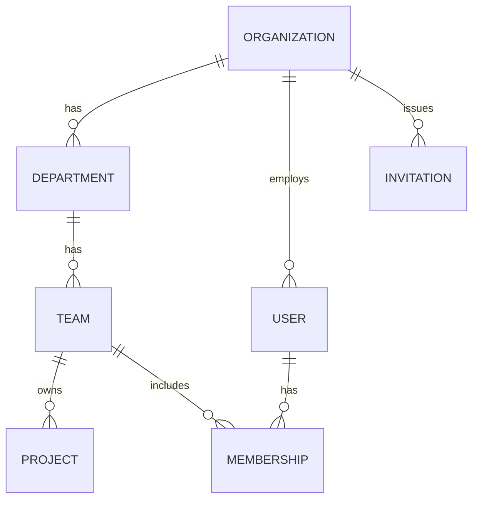

# Plan 02 — Multi-Tenancy & Org Hierarchy

> Makes **tenant isolation a property of the codebase, not a habit**. Delivers the
> `Org → Department → Team → Project → Employee` hierarchy, the shared-DB row-scoping strategy with
> optional Postgres RLS, a `TenantContext` resolved from the JWT, a tenant-scoped repository base every
> feature inherits, and the member lifecycle (invite, deactivate, reassign, multi-team membership). Its
> deliverable is not just tables — it is the guarantee, tested in CI, that **no code path can read
> another tenant's data** (`NFR-ISO`).

| | |
|---|---|
| **Status** | Draft v1 |
| **Phase** | Phase 1 — Foundations (see [Roadmap](./00-roadmap-and-phasing.md)) |
| **Owner** | Platform Eng |
| **Satisfies** | `FR-ORG-01`, `FR-ORG-02`, `FR-ORG-03`, `FR-ORG-04`, `FR-ORG-05`; `NFR-ISO` |
| **Depends on** | [01 — Authentication](./01-authentication.md) (JWT carries `org`/`sub`/`sid`), [03 — RBAC](./03-rbac.md) (membership → role), [05 — Event Pipeline](./05-event-pipeline.md) (org lifecycle events) |
| **Nx projects** | `@eos/backend-core` (`TenantContext`, repository **ports**, `type:infra`) · `@eos/database` (`TenantModel`, repositories, RLS migrations, `type:infra`) · `libs/backend/org` (`@eos/org`, `scope:backend`/`type:feature`, hierarchy + invitations) wired only in `apps/api` |

---

## 1. Goal & scope

- **In scope:** the org hierarchy tables and their APIs; the mandatory tenant-scoping mechanism
  (Sequelize scope + `TenantModel`) and the repository base; `TenantContext` resolution and propagation
  to REST/WS/jobs; optional RLS on the most sensitive tables; invitations, deactivation, reassignment,
  and multi-team membership; the CI cross-tenant isolation harness.
- **Out of scope:** the RBAC permission catalog/guards ([03](./03-rbac.md) — this plan provides the
  `MembershipRepository` it reads); billing/plans; the isolation-per-tenant (dedicated schema/DB)
  migration path — designed-for but not built now.
- **Anti-goals:** no client-supplied `organizationId` on any wire ([05 §2.2](../05-api-and-realtime.md#22-resource-naming));
  no privileged unscoped read path ([06 §3](../06-security-privacy-consent.md#3-authorization-tenant-isolation--rbac-nfr-iso-fr-rbac)).

## 2. User stories

- `As an Owner, I want to create an organization and its departments/teams/projects, so that structure mirrors my company.` — `FR-ORG-01/02`
- `As an Admin, I want to invite a new member by email into a team with a role, so that they can join scoped correctly.` — `FR-ORG-05`
- `As an Admin, I want to deactivate a departing employee, so that their access ends but their history stays for reports.` — `FR-ORG-05`
- `As an Admin, I want to reassign a member between teams, so that org changes are reflected without data loss.` — `FR-ORG-05`
- `As an Engineer on two teams, I want one account with a role per team, so that my access matches each context.` — `FR-ORG-04`
- `As a Platform Engineer, I want isolation enforced at the query layer and proven by tests, so that a cross-tenant leak is impossible, not merely unlikely.` — `FR-ORG-03`, `NFR-ISO`

## 3. Domain model

Canonical tables live in [04 §3](../04-data-model.md#3-organization-hierarchy-fr-org-02); this plan
**implements** them and adds `invitations`. Every table below except `organizations` (the tenant root,
global) carries a non-null indexed `organization_id` and extends `TenantModel` ([04 §9](../04-data-model.md#9-sequelize-conventions)).

| Table | Key columns | Sensitivity | Notes |
|-------|-------------|-------------|-------|
| `organizations` | `id`, `name`, `slug` (unique), `plan_id`, `settings` (jsonb), `mfa_required` | P1 | **global** tenant root; not itself tenant-scoped |
| `departments` | `id`, `organization_id`, `name`, `parent_department_id?` | P1 | optional self-nesting |
| `teams` | `id`, `organization_id`, `department_id`, `name`, `lead_user_id?` | P1 | |
| `projects` | `id`, `organization_id`, `team_id`, `name`, `key`, `repo_refs` (jsonb) | P1 | links GitHub repos / Jira keys |
| `users` | `id`, `organization_id`, `email` (unique per org), `name`, `status` | P3 | member/person (auth fields in [01](./01-authentication.md)) |
| `memberships` | `id`, `organization_id`, `user_id`, `team_id?`, `role_id`, `scope` | P1 | a user↔team link carrying a role; **a user MAY have several** (`FR-ORG-04`); `team_id = null` = org-wide role |
| `invitations` | `id`, `organization_id`, `email`, `team_id?`, `role_id`, `token_hash`, `status`, `expires_at`, `invited_by` | P3 | single-use, hashed token; `pending`/`accepted`/`revoked`/`expired` (`FR-ORG-05`) |

New enums in `@eos/shared-enums`: `MembershipScope` (`own`|`team`|`department`|`org`|`aggregate`, mirroring
[02 §2.1](../02-personas-and-rbac.md#21-concepts)), `UserStatus` (`invited`|`active`|`deactivated`),
`InvitationStatus`. New `EventType`s: `org.created`, `org.member.invited`, `org.member.joined`,
`org.member.deactivated`, `org.member.reassigned`.



## 4. Architecture & flow

The strategy is **shared database, shared schema, row-level tenant scoping** — the right trade-off for a
one-VM MVP that must still scale ([04 §1](../04-data-model.md#1-multi-tenancy-strategy), `NFR-COST`,
`NFR-SCALE`). Isolation is layered as **defense in depth**:

1. **`TenantContext` (request-scoped).** The `JwtAuthGuard` from [01](./01-authentication.md) decodes the
   access JWT and populates `{ organizationId, userId, sid, roles }`. `organizationId` comes **only** from
   the verified token — never a header, query, or path param ([05 §3.3](../05-api-and-realtime.md#33-authentication--authorization),
   [06 §3.1](../06-security-privacy-consent.md#31-tenant-isolation-nfr-iso)).
2. **Mandatory Sequelize scope.** `TenantModel` defines a default scope that injects
   `where: { organizationId }` from `TenantContext`; the repository base applies it so **application code
   cannot construct an unscoped tenant query.** Business logic calls `repo.forTenant(ctx).find…`, never a
   model directly ([04 §9](../04-data-model.md#9-sequelize-conventions)).
3. **Postgres RLS (optional, sensitive tables).** On `events`, `consents`, `oauth_tokens`, `audit_logs`
   (and here `memberships`, `invitations`), an RLS policy keyed on a `SET app.current_org` session
   variable — set per connection from `TenantContext` — so even a missed application scope cannot cross
   tenants ([06 §3.1](../06-security-privacy-consent.md#31-tenant-isolation-nfr-iso)).
4. **Escape hatch.** Because every read goes through the repository layer, a large customer can later be
   moved to a dedicated schema/DB with **zero feature-code changes** ([04 §1](../04-data-model.md#1-multi-tenancy-strategy)).

**Ports** (interfaces in `@eos/backend-core`, impls in `@eos/database`, composed in `apps/api`):
`TenantContext` (accessor), `TenantScopedRepository<T>` base, and `OrganizationRepository` /
`MembershipRepository` (the latter read by [03 — RBAC](./03-rbac.md) to resolve effective permissions).
The same scope applies to **WS subscriptions and background jobs** — a worker seeds `TenantContext` from
the job's `organizationId` before touching a repository, so there is no privileged read path
([06 §2 rule 2](../06-security-privacy-consent.md)). `@eos/org` depends only downward; `nx graph` +
`@nx/enforce-module-boundaries` reject any sibling or back-edge ([10 §6](../10-shared-packages-and-boundaries.md#6-enforcement--tags-eslint-ci)).

```mermaid
sequenceDiagram
  participant Req as Request / WS / Job
  participant G as Auth Guard
  participant T as TenantContext
  participant R as TenantScopedRepository
  participant PG as Postgres (+RLS)
  Req->>G: access JWT (or job.orgId)
  G->>T: set { organizationId, userId, roles }
  T->>R: repo.forTenant(ctx)
  R->>PG: SET app.current_org; SELECT … WHERE organization_id = $org
  PG-->>R: only this tenant's rows
```

```ts
// @eos/database — the base that makes NFR-ISO structural, not habitual
abstract class TenantScopedRepository<M extends TenantModel<M>> {
  protected constructor(private model: ModelStatic<M>, private ctx: TenantContext) {}
  private scoped() { return this.model.scope({ method: ['tenant', this.ctx.organizationId] }); }
  findAll(opts?: FindOptions) { return this.scoped().findAll(opts); }        // org filter always applied
  findById(id: string) { return this.scoped().findOne({ where: { id } }); }  // no cross-tenant id leak
}
```

## 5. API & realtime surface

Under `/api/v1`, contracts as zod schemas in `@eos/contracts`, canonical envelope, RBAC permission per
route ([05 §3](../05-api-and-realtime.md#3-envelope-errors-and-auth-on-the-wire), [03](./03-rbac.md)).
**`organizationId` never appears in a path or query** — tenant is derived from the credential
([05 §2.2](../05-api-and-realtime.md#22-resource-naming)); deeper relationships use filters, not deep nesting.

| Method + path | Purpose | Permission | FR |
|---------------|---------|-----------|-----|
| `POST /organizations` | provision a new org (Owner bootstrap) | platform / onboarding | `FR-ORG-01` |
| `GET  /organizations/current` | the caller's org profile | `org:read` | `FR-ORG-01` |
| `POST /departments` · `POST /teams` · `POST /projects` | build the hierarchy | `org:settings:write` | `FR-ORG-02` |
| `GET  /teams?departmentId=…` · `GET /projects?teamId=…` | list, scoped + filtered | `team:read` (scope-narrowed) | `FR-ORG-02/04` |
| `POST /invitations` | invite a member to a team + role | `rbac:manage` / `integration:manage` | `FR-ORG-05` |
| `POST /invitations/:token/accept` | accept (creates `active` membership) | invite token | `FR-ORG-05` |
| `GET  /memberships?userId=…` | a user's team memberships | `org:read` (scoped) | `FR-ORG-04` |
| `POST /users/:id/deactivate` | deactivate a member | `org:settings:write` | `FR-ORG-05` |
| `POST /memberships/:id/reassign` | move member between teams | `org:settings:write` | `FR-ORG-05` |

A `404` is returned for both "absent" and "exists in another tenant" — the two MUST be indistinguishable
([05 §3.2](../05-api-and-realtime.md#32-canonical-error-object), `NFR-ISO`). **Realtime:** WS rooms are
all prefixed `org:{orgId}` and the server derives `orgId` from the handshake token, so cross-tenant fan-out
is structurally impossible ([05 §5.1](../05-api-and-realtime.md#51-channel--room-model)); a
`team:read` scope check gates joining a team room.

## 6. AI involvement (if any)

N/A because tenancy is structural infrastructure. Its guarantee is what makes AI safe downstream: every
agent runs over **one org's** scoped data (Qdrant per-tenant collection / `organizationId` payload filter,
[04 §7](../04-data-model.md#7-ai--knowledge-tables)) via the same `TenantContext` — never a cross-tenant read.

## 7. Security, privacy & consent

- **`NFR-ISO` is the headline control.** `organizationId` from auth context only; mandatory repository
  scope; RLS on sensitive tables; tenant-prefixed Redis keys; per-tenant Qdrant. A cross-tenant read is a
  **CI fixture that MUST fail closed** ([06 §3.1](../06-security-privacy-consent.md#31-tenant-isolation-nfr-iso)).
- **Membership drives RBAC scope.** `memberships` carries `(team, role, scope)`; effective permissions =
  `role ∪ membership` resolved in [03](./03-rbac.md). HR-forbidden scopes cannot be granted ([02 §2.2](../02-personas-and-rbac.md#22-default-role--permission-matrix-excerpt)).
- **Invitations** use single-use, hashed, short-TTL tokens (P4-adjacent, like [01](./01-authentication.md)'s
  action tokens); binding an invite to an email prevents scope grafting onto the wrong account.
- **Deactivation vs deletion.** Deactivation flips `users.status` and revokes sessions ([01](./01-authentication.md))
  but **retains** history for reports/audit; hard erasure is the separate GDPR right-to-erasure job
  ([04 §11](../04-data-model.md#11-retention--deletion-fr-ent-02-fr-ent-07), `FR-ENT-07`).
- **Audit (`FR-ENT-01`):** org/hierarchy config changes, invitations, deactivation, and reassignment are
  written to `audit_logs` ([06 §7](../06-security-privacy-consent.md#7-audit-logging-fr-ent-01)).

## 8. Implementation plan (phased tasks)

Each a small PR; migrations in `@eos/database`, ports in `@eos/backend-core`, hierarchy logic in `@eos/org`.

1. **`TenantContext` + request middleware** in `@eos/backend-core`, populated by [01](./01-authentication.md)'s guard. *Accept:* context carries `organizationId` from JWT; unit test proves no header/param override.
2. **`TenantModel` + `TenantScopedRepository` base + `tenant` scope** in `@eos/database`. *Accept:* a repo built without a context cannot query; `assertTenantScoped()` sweep wired ([09 §5.1](../09-testing-strategy.md#51-tenant-isolation-nfr-iso--mandatory-pattern)).
3. **Hierarchy migrations + repositories** (`organizations`, `departments`, `teams`, `projects`). *Accept:* each tenant table has a cross-tenant negative test (§9).
4. **Org + hierarchy CRUD API** in `@eos/org`. *Accept:* create org → department → team → project; `organizationId` never accepted on the wire.
5. **`memberships` + multi-team membership** (`FR-ORG-04`) and `MembershipRepository` port for [03](./03-rbac.md). *Accept:* one user holds distinct roles on two teams; org-wide role uses `team_id = null`.
6. **Invitations** (issue/accept/revoke) with hashed tokens + email. *Accept:* accept creates an `active` membership; expired/used token rejected.
7. **Deactivation + reassignment** (`FR-ORG-05`) with session revocation and audit. *Accept:* deactivated user loses access, history retained; reassignment moves membership without data loss.
8. **RLS migration** on `memberships`, `invitations` (+ align with `events`/`consents`/`oauth_tokens`/`audit_logs`); connection sets `app.current_org`. *Accept:* raw SQL under org B returns zero org A rows even with the app scope stubbed out.

## 9. Testing (`unit` / `integration` / `e2e`)

Per [09 — Testing Strategy](../09-testing-strategy.md), against real Postgres via Testcontainers with real
migrations — never `sequelize.sync()`.

- **Unit:** `TenantContext` rejects any client-supplied org override; scope builder injects the correct
  `where`; membership resolver returns per-team roles for a multi-team user.
- **Integration (mandatory `NFR-ISO` gate):**
  - **Cross-tenant negative test on every tenant-scoped repository** — org B sees zero of org A's rows and
    `findById(orgA_id)` returns `null`; the `assertTenantScoped()` sweep enumerates repos and **fails CI if
    one is unregistered** ([09 §5.1](../09-testing-strategy.md#51-tenant-isolation-nfr-iso--mandatory-pattern), [09 §9](../09-testing-strategy.md#9-multi-tenancy--security-test-requirements)).
  - **RLS proof:** with the application scope deliberately bypassed, a query under `app.current_org = B`
    still returns no org A rows — proving defense-in-depth, not just app-layer scoping.
  - **API isolation:** a caller in org A requesting an org B resource id gets `404` (indistinguishable from
    absent, [05 §3.2](../05-api-and-realtime.md#32-canonical-error-object)).
  - **WS isolation:** a socket authenticated as org A cannot join an `org:{B}:team:…` room.
  - Multi-team membership: correct role resolved per team; reassignment preserves prior events/history.
  - Invitation lifecycle: accept → active membership; expired/reused invite rejected.
- **E2E (Playwright):** two seeded orgs; a user in one never sees the other's teams/members in any list,
  search, or drill-down (the human-visible expression of `NFR-ISO`).

## 10. Observability

Per [deployment/03 — Observability](../deployment/03-observability.md). Every log line carries `orgId`
([05 §11](../05-api-and-realtime.md#11-api-observability-nfr-obs)). Metrics: `org_active_members`,
`org_invitations_pending`, membership mutation counts. **Alert (security-critical):** a
`tenant_scope_missing` counter — incremented if a repository is ever asked to query without a
`TenantContext` — MUST page immediately; in production it should be zero by construction.

## 11. Acceptance criteria

- [ ] Multiple isolated organizations can coexist; no cross-tenant read path exists. — `FR-ORG-01`, `FR-ORG-03`, `NFR-ISO`
- [ ] The full `Org → Department → Team → Project → Employee` hierarchy is creatable and navigable. — `FR-ORG-02`
- [ ] A user can belong to multiple teams/projects, each membership carrying a role. — `FR-ORG-04`
- [ ] Admins can invite, deactivate, and reassign members; deactivation retains history. — `FR-ORG-05`
- [ ] `organizationId` is never accepted from the wire; it is always derived from the auth context. — `NFR-ISO`
- [ ] Every tenant-scoped repository ships a passing cross-tenant negative test; RLS proof passes; `tenant_scope_missing` is zero. — `NFR-ISO`

## 12. Risks & open questions

| Risk / question | Mitigation / decision |
|---|---|
| A new table forgets `organization_id` / the isolation test | `assertTenantScoped()` sweep + a migration lint fail CI if a tenant table lacks the column/index. |
| RLS `SET app.current_org` not reset on a pooled connection | Set-and-reset in a transaction wrapper per request; integration test asserts a recycled connection carries no stale org. |
| Request-scoped `TenantContext` lost in async worker jobs | Jobs carry `organizationId` explicitly and seed context before any repository call; no ambient/global fallback. |
| Deep hierarchy queries (dept → teams → projects) get slow | Lead composite indexes with `organization_id` ([04 §10](../04-data-model.md#10-indexing--performance-notes)); `EXPLAIN`-verify hot paths. |
| **Open:** does a user email need to be globally unique or per-org? | Decision: **per-org unique** ([04 §3](../04-data-model.md#3-organization-hierarchy-fr-org-02)); a person in two orgs is two `users` rows — confirm with product before invitations ship. |

---

_Next: [03 — RBAC & Permissions](./03-rbac.md)_
