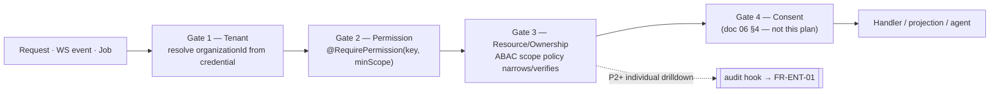

# Plan 03 — RBAC & Permissions

> The authorization backbone. It turns the [Personas & RBAC](../02-personas-and-rbac.md) matrix into
> executable code: a fixed **permission catalog**, org-editable **roles**, and three server-side
> **gates** (tenant → permission → resource/ownership) that every REST call, WebSocket event, and
> background/report job passes without exception. HR being aggregate-only, and "who looked at whom"
> being auditable, are enforced here — not left to convention.

| | |
|---|---|
| **Status** | Draft v1 |
| **Phase** | Phase 1 (Foundations) — see [Roadmap](./00-roadmap-and-phasing.md); configurability depth lands in Phase 4 |
| **Owner** | Platform / Security Eng |
| **Satisfies** | `FR-RBAC-01`, `FR-RBAC-02`, `FR-RBAC-03`, `FR-RBAC-04`; supports `FR-ENT-01`, `NFR-ISO` |
| **Depends on** | [02 — Multi-Tenancy](./02-multi-tenancy.md) (org hierarchy, `memberships`), [05 — Event Pipeline](./05-event-pipeline.md) (WS + job entry points), [19 — Enterprise Platform](./19-enterprise-platform.md) (audit sink, API keys) |
| **Nx projects** | `libs/backend/rbac` (`@eos/rbac`, `scope:backend type:feature`), `libs/backend/core` (`@eos/backend-core`, `type:infra` — `TenantContext`, ports), `libs/backend/database` (`@eos/database`, `type:infra` — `roles`/`permissions`/`role_permissions`), `libs/shared/enums` (`@eos/shared-enums` — `Role`, `Permission`, `Scope`), `libs/shared/contracts` (`@eos/contracts` — RBAC admin DTOs), `apps/api` + `apps/worker` (composition roots), `libs/frontend/feature-admin` (RBAC config UI) |

---

## 1. Goal & scope

- **In scope:**
  - A **code-defined permission catalog** (`resource:action[:scope]`) seeded into `permissions`, each row
    carrying `default_scope` and `hr_forbidden` (`FR-RBAC-01`).
  - Seven **default roles** (Owner, CTO, Eng Mgr, Team Lead, HR, Employee, Guest) as system templates.
  - **Configurable roles** per org (clone + edit, custom roles) within **guardrails** (`FR-RBAC-02`).
  - The **three enforcement gates** — tenant, permission, resource/ownership — applied uniformly to
    REST, WebSocket, and background/report paths (`FR-RBAC-03`, `NFR-ISO`).
  - `@RequirePermission` **guard** + **ABAC scope policies** that narrow queries, not just hide fields
    (`FR-RBAC-04`).
  - The **audit hook** for every individual drilldown (feeds `FR-ENT-01`).
- **Out of scope:** consent evaluation (that is the fourth gate, owned by [06 §4](../06-security-privacy-consent.md#4-consent-model)); the audit-log *store* and hash-chain (owned by [19](./19-enterprise-platform.md)); SSO/SCIM role provisioning (Phase 4); field-level encryption/serialization (doc 06 §1).
- **Anti-goals:** no privileged read path that skips these gates; no individual productivity scoring; HR never gains individual scope ([00 §4](../00-vision-and-scope.md#4-what-we-are-not-building-anti-goals)).

## 2. User stories

- As an **Owner**, I want to clone the *Team Lead* role and add `report:export:team`, so that my org's
  leads can self-serve exports — without me being able to accidentally grant HR individual access
  (`FR-RBAC-02`).
- As a **Team Lead**, I want the team PR queue to show only *my* team's PRs, so that scope is enforced by
  the query, not by trusting the client (`FR-RBAC-04`).
- As an **HR** partner, I want aggregate wellbeing rollups, so that I can inform policy — and I must be
  structurally unable to open a named person's timeline (`FR-RBAC-01`, doc 02 §1.5).
- As a **CTO**, I want to drill into an individual's timeline when policy permits, and I accept that the
  access is **audited**, so that "who looked at whom" is reviewable (`FR-RBAC-03`, `FR-ENT-01`).
- As an **Employee**, I want to see my own data and my team's shared views but not another person's
  private signals, so that the tool is not surveillance (doc 02 §1.1).
- As a **platform engineer**, I want the *same* permission check on a WebSocket subscribe and a nightly
  report job as on a REST call, so that no async path leaks data (`FR-RBAC-03`).

## 3. Domain model

Extends [04 §4 (RBAC tables)](../04-data-model.md#4-rbac-tables-fr-rbac). All three tables follow the
`TenantModel`/repository conventions (doc 04 §9); `permissions` is a **global** catalog (no
`organization_id`), the others are tenant-scoped.

| Table | Key columns | Notes |
|-------|-------------|-------|
| `permissions` (global catalog) | `key` (PK, `pr:read`), `resource`, `action`, `default_scope`, `hr_forbidden` (bool), `sensitivity` (P0–P4), `description` | **code-defined + seeded**; adding a permission is a platform release (migration), never runtime |
| `roles` | `id`, `organization_id?` (null ⇒ system template), `name`, `is_system` (bool), `cloned_from?` | system templates are read-only; an org clone gets its own `organization_id` |
| `role_permissions` | `role_id`, `permission_key` (FK → catalog), `scope` | the effective grant; `scope` may narrow but never widen `default_scope` for HR-forbidden rows |

`memberships` (from [02](./02-multi-tenancy.md)) links `user_id → (team_id?, role_id, scope)`; a user MAY
hold several (`FR-ORG-04`). An org-wide role (Owner/CTO) has `team_id = null`, org scope.

New enums in **`@eos/shared-enums`** (single source of truth, doc 04 §5 / doc 10 §2.1):

```ts
export enum Scope { Own = 'own', Team = 'team', Dept = 'dept', Org = 'org', Aggregate = 'agg' }
export enum Role  { Owner='owner', Cto='cto', EngMgr='eng_mgr', TeamLead='team_lead', Hr='hr', Employee='employee', Guest='guest' }
// Permission keys are catalog strings ('pr:read'); the catalog is the authority, not a giant enum.
```

**Sensitivity note:** RBAC rows are `P1` (config metadata). Reads of P2+ *subject data* under a
`:team`/`:dept`/`:org` scope are what trigger the audit hook (§7), not RBAC config reads.

## 4. Architecture & flow

RBAC sits in the **backend feature layer** (`@eos/rbac`), depending only downward on `@eos/backend-core`
(`TenantContext`, repository ports) and `@eos/database`, and on `@eos/shared-enums` — never on a sibling
feature (doc 03 §7, doc 10 §3). It exposes **ports**; `apps/api` and `apps/worker` are the only
composition roots that wire concrete guards and policies.

### 4.1 The four-gate pipeline (RBAC owns gates 1–3)



A request MUST clear **all** gates; any failure is `403 forbidden` (or `404 not_found` when revealing
existence would cross a tenant boundary — doc 05 §3.2). This mirrors [06 §3](../06-security-privacy-consent.md#3-authorization-tenant-isolation--rbac-nfr-iso-fr-rbac).

### 4.2 Ports introduced (`@eos/backend-core`, implemented in `@eos/rbac`)

```ts
// resolves effective permissions = union over the caller's memberships (role ∪ membership scope)
export interface PermissionResolver {
  effective(principal: RbacPrincipal): Promise<EffectivePermission[]>; // cached per (org,user), TTL + bust on role/membership write
}
// ABAC: is `resourceRef` within the caller's granted scope for this permission?
export interface ScopePolicy<TRef = ResourceRef> {
  readonly resource: string;                       // 'pr', 'timeline', 'sprint' …
  narrow(ctx: RbacContext, query: ScopedQuery): ScopedQuery;   // FR-RBAC-04: rewrite the query
  permits(ctx: RbacContext, ref: TRef): Promise<Decision>;     // per-resource check for item reads
}
```

`RbacContext` derives from the request-scoped `TenantContext` (doc 03 §9): `{ organizationId, userId,
roles, memberships, effective }`. The resolver is **cached** (Redis, per `org:user`) and **busted** on
any `role_permissions`/`memberships` write so a revocation takes effect immediately.

**No cross-boundary/cyclic deps:** `@eos/rbac` → `@eos/backend-core` + `@eos/database` + `@eos/shared-*`
only; sibling features (`@eos/auth`, `@eos/ai`) reach RBAC through the ports above (doc 10 §4.3), never
by importing its models.

## 5. API & realtime surface

RBAC is mostly a *guard* on other plans' endpoints, plus a small **admin surface** for role config. All
under `/api/v1`, contracts in `@eos/contracts` (zod, doc 05 §8). Every route below is itself guarded.

| Method + path | Purpose | Permission |
|---|---|---|
| `GET /rbac/permissions` | list the catalog (with `hr_forbidden`, `default_scope`) | `rbac:read` |
| `GET /rbac/roles` | list org roles + system templates | `rbac:read` |
| `POST /rbac/roles` | create/clone a role | `rbac:manage` |
| `PATCH /rbac/roles/{id}` | edit a role's permission set (guardrails applied) | `rbac:manage` |
| `DELETE /rbac/roles/{id}` | delete a **custom** role (system roles 409) | `rbac:manage` |
| `PUT /rbac/memberships/{id}/role` | assign a role to a membership | `rbac:manage` |

- **RBAC on other endpoints** is declarative: `@RequirePermission('pr:read')` on the handler; the ABAC
  policy for `pr` narrows the query to the caller's teams (`FR-RBAC-04`). Scope-limited views **narrow
  the query**, they do not post-filter fields (doc 05 §3.3).
- **WebSocket:** every `subscribe` runs the same permission + scope check before a room join; rooms are
  server-named and `org:{orgId}`-prefixed so fan-out cannot cross tenant/scope (doc 05 §5.1). Joining
  `org:{orgId}:team:{teamId}` requires `timeline:read:team`/`pr:read:team` on *that* team.
- **Public API keys** (doc 05 §4): a key carries a **subset** of its creator's permissions and MUST NOT
  exceed them; API-key calls hit the identical guard stack.
- Failures use the canonical error object (doc 05 §3.2): `403 forbidden`, and `403 consent_required` only
  when gate 4 (doc 06) denies.

## 6. AI involvement

Agents are **not exempt** — they run through the same three gates. The `Agent` port
([07 §3](../07-ai-architecture.md#3-the-agent-port-stable-contract)) carries an `actor: RbacPrincipal`
and a `scope: QueryScope`; agent tool handlers inject `ctx.organizationId` and re-check `ctx.actor`
permissions server-side, so **the model can request data but never widen scope**
([07 §4.4](../07-ai-architecture.md#44-tool-calling-stays-inside-the-tenant-boundary)). The Manager
Copilot answering "how is Alice doing?" is subject to the *asker's* permissions and, if it resolves to an
individual drilldown, emits the same audit record as a UI drilldown (§7). RBAC provides the
`PermissionResolver`/`ScopePolicy` ports the AI layer consumes; it does not embed AI logic.

## 7. Security, privacy & consent

- **Composition — most restrictive wins.** RBAC decides *who may see what exists*; consent (doc 06 §4)
  decides *whether a signal was collected*. A signal-bearing read returns only the **intersection**
  (doc 02 §3, doc 06 §3.2). RBAC never overrides a missing consent.
- **HR aggregate-only, by construction (`FR-RBAC-01`).** Every catalog entry that can identify an
  individual's activity is marked `hr_forbidden = true`. The config UI and the server both reject
  granting such a permission to a role whose lineage is HR, and reject any HR grant at scope `own`/`team`/
  `dept`. HR reads are `:agg` only, with k-anonymity (k ≥ 5) enforced downstream (doc 06 §5).
- **Guardrails on configurability (`FR-RBAC-02`).** An org MAY clone + edit roles and create custom ones,
  but MUST NOT: grant an `hr_forbidden` permission to HR; remove `org:settings:write` from Owner; grant a
  permission at a scope wider than its `default_scope` unless the role is Owner/CTO. The catalog itself is
  immutable at runtime (adding a permission = platform release). Every role/membership change is audited.
- **Individual drilldown always audited (`FR-ENT-01`).** The ABAC policy, when it authorizes a P2+ read
  of *another* user's data under a `:team`/`:dept`/`:org` scope, emits an audit intent —
  `{ actor, action: 'timeline:read', resource, subjectUserId, scope }` — to the [19](./19-enterprise-platform.md)
  audit sink **even for Owner/CTO** (doc 06 §7). Aggregate reads do not (no individual is identified).
- **No client-supplied `organizationId`** (gate 1) — always from the credential (`NFR-ISO`, doc 05 §2.2).

## 8. Implementation plan (phased tasks)

Small, reviewable PRs; Nx project in brackets; each ships green.

1. **Catalog + enums** [`@eos/shared-enums`, `@eos/database`] — define `Scope`/`Role`, the code-defined
   permission catalog with `hr_forbidden`/`default_scope`, migration for `permissions`/`roles`/
   `role_permissions`, and a seeder for the catalog + 7 system-role templates (matrix from doc 02 §2.2).
   *Acceptance:* seed is idempotent; catalog matches doc 02; system roles read-only.
2. **PermissionResolver + cache** [`@eos/rbac`, `@eos/backend-core`] — resolve effective permissions
   (role ∪ membership), Redis cache keyed `org:user`, bust on write. *Acceptance:* multi-membership user
   resolves the union; cache invalidates within the request after a role edit.
3. **`@RequirePermission` guard** [`@eos/rbac`] — NestJS guard reading the decorator's `(key, minScope)`,
   wired globally in `apps/api`. *Acceptance:* missing/insufficient permission → `403`; unit-tested per
   role.
4. **ScopePolicy registry + first policies** [`@eos/rbac`] — `pr`, `timeline`, `sprint` policies that
   `narrow()` queries to the caller's teams/dept (`FR-RBAC-04`) and `permits()` on item reads.
   *Acceptance:* Team Lead PR list is team-scoped by query; cross-team item read → `404`.
5. **Audit hook** [`@eos/rbac` → `@eos/backend-core` port] — emit drilldown audit intents to the
   [19](./19-enterprise-platform.md) sink. *Acceptance:* every P2+ individual drilldown produces exactly
   one audit record; aggregate reads produce none.
6. **WS + worker enforcement** [`apps/api`, `apps/worker`] — same guard on `subscribe` and on
   report/agent jobs (pass `RbacContext` into the job payload; re-resolve, never trust the client).
   *Acceptance:* WS subscribe to an unauthorized team room → `error{forbidden}`; a report job for a
   user's scope cannot read beyond it.
7. **RBAC admin API + guardrails** [`apps/api`, `@eos/contracts`] — role CRUD with guardrail validation
   (HR-forbidden, Owner-locked perms, scope-widening block). *Acceptance:* granting `timeline:read:team`
   to HR → `422 unprocessable`; removing `org:settings:write` from Owner → `422`.
8. **Config UI** [`libs/frontend/feature-admin`] — clone/edit roles, matrix editor that *disables*
   HR-forbidden cells for HR-lineage roles (defense-in-depth over the server check). *Acceptance:*
   forbidden cells are non-interactive and server rejects if bypassed.

## 9. Testing (`unit` / `integration` / `e2e`)

Per [09 — Testing Strategy](../09-testing-strategy.md). RBAC is a security control — **negative tests are
first-class**, and the cross-tenant/HR fixtures MUST fail closed.

- **Unit** — `PermissionResolver` union math (multi-membership, org-wide vs team roles); guardrail
  validator (HR-forbidden, Owner-locked, scope-widening); each `ScopePolicy.narrow()`/`permits()`.
- **Integration (must-have negative/security):**
  - **AuthZ negative matrix** — for each default role × each permission, assert allow/deny exactly per
    doc 02 §2.2. A drift here fails CI.
  - **HR-cannot-see-individual** — HR calling `GET /timelines/{userId}` → `403`; HR WS subscribe to a
    user room → `forbidden`; attempting to grant HR an `hr_forbidden` permission → `422`. This is a
    pinned fixture (doc 06 §10 elevation row).
  - **Scope narrowing** — Team Lead PR/timeline list returns only their team; a foreign resource id →
    `404` (indistinguishable from "absent", `NFR-ISO`).
  - **Tenant isolation** — a valid token for org A cannot read org B via any route/param; client-supplied
    `organizationId` is ignored (shared CI fixture, doc 06 §3.1).
  - **No privileged async path** — WS subscribe and report/agent jobs enforce identical checks to REST.
- **e2e** — Team Lead journey (see only their team), CTO audited drilldown (record appears in audit log),
  Owner clones a role and the new grant takes effect on the next request (cache bust).

## 10. Observability

Per [deployment/03 — Observability](../deployment/03-observability.md).

- **Metrics:** `rbac.decision_total{result=allow|deny, gate, permission}`, `rbac.cache_hit_ratio`,
  `rbac.resolver_latency_ms` (p95), `rbac.hr_forbidden_block_total` (should be ~0 in steady state —
  spikes signal a misconfigured client), `rbac.drilldown_audited_total`.
- **Logs:** one structured line per denial `{ correlationId, orgId, userId, permission, scope, gate,
  reason }`; never logs P3/P4 payloads (doc 05 §11). Config changes log actor + before/after diff.
- **Alerts:** sustained deny-rate spike (possible probing / broken client); any drilldown that reads P2+
  **without** a matching audit record (invariant violation → page on-call); resolver p95 breaching the
  dashboard-latency budget (`NFR-LATENCY`).

## 11. Acceptance criteria

- [ ] Seven default roles seeded from the doc 02 matrix; system templates read-only (`FR-RBAC-01`).
- [ ] Permission catalog is code-defined, seeded, with `hr_forbidden` + `default_scope` per row
  (`FR-RBAC-01`).
- [ ] Orgs can clone/edit/create roles within guardrails; catalog immutable at runtime (`FR-RBAC-02`).
- [ ] Every REST route, WS event, and background/report/agent job passes tenant → permission →
  resource/ownership gates; no bypass path exists (`FR-RBAC-03`, `NFR-ISO`).
- [ ] Scope-limited views narrow the **query** (`FR-RBAC-04`); foreign resources return `404`.
- [ ] HR cannot be granted or exercise any individual-identifying permission (server + UI) — pinned test
  green (`FR-RBAC-01`, doc 02 §1.5).
- [ ] Every individual drilldown (incl. Owner/CTO/Copilot) emits one audit record (`FR-ENT-01`).
- [ ] AuthZ negative matrix and tenant-isolation fixtures fail closed in CI.

## 12. Risks & open questions

| Risk / question | Mitigation / decision |
|---|---|
| **Stale permission cache** grants access after a revoke | TTL + explicit bust on role/membership write; sensitive endpoints MAY re-check a Redis denylist (doc 06 §2.4). Revocation target < 1 min. |
| **ABAC policy sprawl** — a new resource without a policy silently over-returns | Registry is **default-deny**: a resource with no registered `ScopePolicy` fails closed (`403`), never open. Lint check that every `type:feature` read has a policy. |
| **Multi-team scope ambiguity** (user is Lead of A, Employee of B) | Effective scope is the **union**; each policy evaluates per-resource against the *relevant* membership, not a global max scope. Covered by union unit tests. |
| **Guardrail bypass via API** (client skips the UI) | Guardrails re-validated **server-side** on every role write; UI disabling is defense-in-depth only. |
| **Open:** should custom roles support **negative** (deny) permissions, or additive-only? | *Decision (v1):* additive-only from the catalog — simpler to reason about and audit; revisit if a customer needs explicit denies. |
| **Open:** Guest scoping to a single project vs a shared view | Tracked with [16 — Dashboards](./16-dashboards.md); v1 Guest = read-only `:project` scope, time-boxed, no PII (doc 02 §1.7). |

---

_Template version 1. Next sibling: [04 — Desktop Agent](./04-desktop-agent.md)._
</content>
</invoke>
