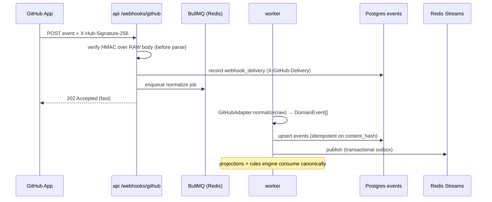

# Plan 06 — GitHub Integration

> Connects an organization's GitHub via a **GitHub App**, ingests repository/PR/review activity through
> **signed webhooks** plus periodic **backfill/reconciliation**, and normalizes it into canonical
> `DomainEvent`s. From those events, worker projections compute PR analytics and **DORA** metrics, and a
> rules engine (feeding the GitHub AI agent) detects bottlenecks with cited evidence. GitHub is the
> highest-signal source in the platform — code, review, and delivery flow all originate here.

| | |
|---|---|
| **Status** | Draft v1 |
| **Phase** | Phase 1 (ingest) → Phase 2 (DORA + bottlenecks) (see [Roadmap](./00-roadmap-and-phasing.md)) |
| **Owner** | Platform Eng — Integrations |
| **Satisfies** | `FR-GH-01`, `FR-GH-02`, `FR-GH-03`, `FR-GH-04`, `FR-GH-05`, `FR-GH-06` (from [PRD](../01-product-requirements.md)) |
| **Depends on** | [05 — Event Pipeline](./05-event-pipeline.md), [03 — RBAC](./03-rbac-permissions.md), [13 — AI Agents](./13-ai-agents.md); libs `@eos/events`, `@eos/database`, `@eos/contracts` |
| **Nx projects** | `libs/backend/integrations` (`scope:backend,type:feature`), `apps/api` (webhook route), `apps/worker` (jobs), `libs/shared/{enums,types,contracts}` (leaf) |

---

## 1. Goal & scope

- **In scope:**
  - Connection to an org's GitHub organization via a **GitHub App** installation (`FR-GH-01`): install
    flow, installation-token minting, least-privilege scopes.
  - **Webhook ingest** with mandatory HMAC-SHA256 signature verification, plus a periodic
    **backfill/reconciliation** job that repairs gaps from missed deliveries (`FR-GH-06`).
  - A `GitHubAdapter` implementing the `SourceAdapter` port that normalizes repos, commits, branches,
    pushes, PRs, reviews, review comments, approvals, and requested-changes into canonical
    `DomainEvent`s (`FR-GH-02`).
  - Worker projections: **`pr_metrics`** (review wait, merge wait, stale, large-PR, code ownership,
    review participation/load, merge/deploy frequency) and **`dora_metrics`** (deploy freq, lead time,
    change-failure rate, MTTR) — `FR-GH-03`, `FR-GH-04`.
  - A **bottleneck rules engine** producing explainable `recommendations` (`FR-GH-05`).
  - GitHub identity → internal `users` mapping via `external_accounts`.
- **Out of scope:** GitHub OAuth **sign-in** (that is `FR-AUTH-02`, [plan 01](./01-authentication-identity.md));
  ticket↔PR linking (`FR-SPR-03`, [plan 07](./07-sprint-tracking.md)); notification delivery
  ([plan 17](./17-notifications.md)) — this plan only *emits* recommendations.
- **Anti-goals:** no line-by-line code content storage, no "commit-quality" or keystroke scoring, no
  cross-tenant repo aggregation ([Vision §4](../00-vision-and-scope.md#4-what-we-are-not-building-anti-goals)).

## 2. User stories

- As a **Team Lead**, I want to see which PRs have waited longest for review, so that I can rebalance the
  queue before work goes stale. (`FR-GH-03`, `FR-GH-05`)
- As an **Engineering Manager**, I want to know when one reviewer is carrying most of the review load, so
  that I can spread it fairly. (`FR-GH-05`)
- As a **CTO / VP Eng**, I want per-repo **DORA** metrics (deploy freq, lead time, change-failure rate,
  MTTR), so that I can track delivery health org-wide. (`FR-GH-04`)
- As an **Individual Contributor**, I want my commits and reviews to appear on my timeline attributed to
  me, so that my work is represented accurately. (`FR-GH-02`)
- As an **Owner / Admin**, I want to connect GitHub in a few clicks with least-privilege scopes, so that
  we grant only what analytics needs. (`FR-GH-01`)
- As a **Manager**, I want each bottleneck flagged with the exact PRs/reviews behind it, so that I trust
  and can act on the recommendation. (`FR-GH-05`, `NFR-EXPLAIN`)

## 3. Domain model

GitHub emits canonical `events` (doc 04 §5); this plan adds new `EventType`s and two projection tables.
It also uses the existing `integrations` and `external_accounts` tables (doc 04 §8).

### 3.1 New `EventType`s in `@eos/shared-enums`

All sourced as `EventSource='github'`. `subjectUserId` is the mapped internal user (§4.4); `null` when
the actor is unmapped (still stored, attributed later on backfill).

| Domain | EventType(s) | Correlation |
|--------|--------------|-------------|
| Repo | `github.repo.created`, `github.repo.archived` | `correlationId = repo:{repoId}` |
| Push/branch | `github.push`, `github.branch.created`, `github.branch.deleted` | `repo:{repoId}` |
| Commit | `github.commit` (one per commit in a push) | `repo:{repoId}` |
| PR | `github.pr.opened`, `.ready_for_review`, `.review_requested`, `.merged`, `.closed`, `.reopened` | `pr:{repoId}:{number}` |
| Review | `github.review.submitted` (`state`: approved \| changes_requested \| commented), `github.review.dismissed` | `pr:{repoId}:{number}` |
| Comment | `github.review_comment.created`, `github.pr_comment.created` | `pr:{repoId}:{number}` |
| Deploy | `github.deployment.created`, `github.deployment.status` (success/failure) | `deploy:{repoId}:{deployId}` |

Every PR-lifecycle event shares a **stable `correlationId`** (`pr:{repoId}:{number}`) so a projection can
assemble a PR's full history and answer "why is this number what it is" (`NFR-EXPLAIN`).

### 3.2 Projection tables (extend doc 04 §6)

**`pr_metrics`** — one row per PR (tenant-scoped, rebuildable from `events`):

| Column | Notes |
|--------|-------|
| `organization_id`, `repo_id`, `pr_number` | leading composite key `(organization_id, repo_id, pr_number)` |
| `author_user_id`, `title`, `state`, `base_ref` | |
| `opened_at`, `first_review_at`, `merged_at`, `closed_at` | timestamps drive wait calcs |
| `review_wait_seconds` | `first_review_at − ready_at` (int seconds) |
| `merge_wait_seconds` | `merged_at − opened_at` |
| `additions`, `deletions`, `files_changed`, `is_large` | large-PR flag vs org threshold |
| `is_stale` | open + idle > threshold |
| `reviewer_user_ids` (jsonb), `approval_count`, `changes_requested_count` | participation |
| `ownership` (jsonb) | top code-owners for changed paths (from CODEOWNERS) |
| `derived_from` (jsonb) | event ids that produced this row (`NFR-EXPLAIN`) |
| `sensitivity` | **P1** (title/rollup) / **P2** (per-person activity) — doc 06 §1 |

**`dora_metrics`** — one row per `(organization_id, repo_id, period)` (daily/weekly rollup): `deploy_freq`,
`lead_time_seconds_p50/p90`, `change_failure_rate`, `mttr_seconds`, `derived_from`. See §5.3.

`reviewer_load` (doc 04 §6) is also written here from review events for overload detection.

### 3.3 Sensitivity

Repo/PR titles and DORA rollups are **P1**; per-person commit/review activity is **P2**; GitHub OAuth /
App installation tokens and the webhook signing secret are **P4** (field-encrypted, never sent to any UI —
doc 06 §1). No P3/P4 leaves the service boundary.

## 4. Architecture & flow

Fits the [event-first core](../03-system-architecture.md#5-event-first-core): thin webhook handler →
enqueue → worker normalizes via the `SourceAdapter` port → append to `events` + publish to the bus →
projections + rules engine consume canonically.

### 4.1 Ports introduced

```ts
// libs/backend/integrations/src/github/ports.ts
export interface SourceAdapter {                       // shared port (doc 03 §8)
  readonly source: 'github';
  normalize(delivery: RawDelivery): Promise<DomainEvent[]>;   // pure: raw → canonical, no I/O
}

export interface GitHubAppClient {                     // installation-token + REST/GraphQL
  installationToken(installationId: number): Promise<string>;  // cached, auto-refreshed
  listPullRequests(repo: RepoRef, since: string): AsyncIterable<GhPull>;
  listReviews(repo: RepoRef, prNumber: number): Promise<GhReview[]>;
}
```

`GitHubAdapter` (the concrete `SourceAdapter`) is **pure** — it takes a raw payload and returns events,
with no network or DB access — which is exactly what makes it fixture-testable (§9). All GitHub I/O lives
behind `GitHubAppClient`. Concrete impls live in `libs/backend/integrations`; `apps/api` wires them
(composition root, doc 03 §7). No cross-boundary or cyclic deps: `integrations` depends only downward on
`@eos/events`, `@eos/database`, `shared/*`.

### 4.2 Ingest sequence (webhook path)



### 4.3 Connection (`FR-GH-01`) — GitHub App, least privilege

We ship a **GitHub App** (one manifest, org installs it), not a personal OAuth token or PAT. Rationale:
short-lived **installation tokens** (1-hour, auto-refreshed), fine-grained repo selection by the customer,
higher rate limits (per-installation), and clean revocation.

- **Least-privilege permissions (read-only):** `contents:read`, `metadata:read`, `pull_requests:read`,
  `members:read` (identity mapping), `deployments:read`, `checks:read`. **No write scopes** — this plan
  never mutates GitHub.
- **Webhook events subscribed:** `push`, `pull_request`, `pull_request_review`,
  `pull_request_review_comment`, `issue_comment`, `create`/`delete` (branches), `deployment`,
  `deployment_status`, `installation`, `installation_repositories`.
- **Install flow:** Admin clicks *Connect GitHub* → redirected to the App install page → GitHub redirects
  back with `installation_id` → we persist an `integrations` row (`provider='github'`,
  `config={installationId, accountLogin, repoSelection}`), then kick off the initial **backfill** (§4.5).
- Installation id → token exchange uses the App's JWT (signed with the App private key, **P4**); tokens
  are cached in Redis keyed by `installationId` with TTL just under expiry.

### 4.4 Identity mapping (GitHub → internal user)

Each event carries a GitHub actor (`login`, numeric `id`). Resolution order:

1. Exact match in `external_accounts` (`provider='github'`, `external_id=<gh user id>` → `user_id`).
2. On App install, we call `members:read`, fetch each member's **verified** GitHub email, and match to
   `users.email` within the org — auto-creating `external_accounts` links. Email match MUST use a verified
   GitHub email to prevent spoofed attribution.
3. Unmatched actors (bots, ex-members) → event stored with `subjectUserId = null`; a nightly job
   **re-attributes** once a link appears (projections are rebuildable, so late mapping self-heals).

Admins can manually confirm/override ambiguous mappings in integration settings.

### 4.5 Backfill & reconciliation (`FR-GH-06`)

Webhooks are at-least-once but can be **missed** (downtime, delivery failures). Two safety nets:

- **Initial backfill** on install: paginate the REST/GraphQL API for open + recently-closed PRs, reviews,
  and the last N days of pushes/deployments per selected repo; feed each through the **same**
  `GitHubAdapter.normalize` path — so backfilled and live data are identical and dedup for free
  (`FR-EVT-02`).
- **Periodic reconciliation** (scheduled BullMQ, e.g. hourly): for active repos, list PRs updated since the
  last cursor and diff against `pr_metrics`; any PR whose GitHub `updated_at` is newer than our latest
  event triggers a targeted re-fetch. Missed `X-GitHub-Delivery` gaps (detected via `webhook_deliveries`)
  are also replayed. Reconciliation is **idempotent** — replaying an already-seen event is a no-op via
  `content_hash`.

## 5. Metrics & projections

### 5.1 PR analytics (`FR-GH-03`)

Computed by the `PrMetricsProjector` (worker consumer of `github.pr.*` / `github.review.*`):

| Metric | Definition |
|--------|------------|
| **Review wait** | `first_review_at − ready_for_review_at` (excludes draft time) |
| **Merge wait** | `merged_at − opened_at` |
| **Stale PR** | `state=open` AND no activity for > org `stalePrHours` (default 48h) |
| **Large PR** | `additions + deletions > org.largePrLines` (default 500) OR `files_changed > 30` |
| **Code ownership** | top owners of changed paths from repo `CODEOWNERS`; flags "no owner reviewed" |
| **Review participation / load** | distinct reviewers per PR; per-reviewer counts feed `reviewer_load` |
| **Merge frequency** | merges per repo/team per period |
| **Deployment frequency** | successful `github.deployment.status` per repo per period (→ DORA) |

Each row stores `derived_from` (the contributing event ids) so the UI "Why" affordance can deep-link into
the [Daily Timeline](./12-daily-timeline.md) (`FR-TL-03`, `NFR-EXPLAIN`).

### 5.2 DORA metrics (`FR-GH-04`)

| DORA metric | Computation |
|-------------|-------------|
| **Deployment frequency** | count of successful deployments per repo/period |
| **Lead time for changes** | `deploy_time − first_commit_time` for commits in that deploy (p50/p90) |
| **Change-failure rate** | deployments followed by a failure/rollback signal ÷ total deployments |
| **MTTR** | mean time from a failed deployment (or incident open) to the next successful deploy |

Deployments come from GitHub `deployment` / `deployment_status` events; where an org uses external CI/CD,
the same `github.deployment.*` shape is emitted by a webhook or by a future deploy adapter (contract is
stable). Failure/rollback is inferred from `deployment_status=failure` and, later, incident sources.

### 5.3 Rebuild & idempotency

Projections are **rebuildable from `events`** (doc 04 §6): a `rebuild` job truncates a repo's projection
rows and replays its events in `occurredAt` order. Every projector is idempotent — reprocessing an event
converges to the same row (upsert keyed on the PR/period, guarded by the source event set).

## 6. AI involvement — bottleneck detection (`FR-GH-05`)

The **GitHub agent** (doc 07 §2) reads `pr_metrics` / `dora_metrics` / `reviewer_load` and runs a
deterministic **rules engine**; each firing rule produces a `recommendations` row with non-empty
`evidence` (event ids + reasoning) — grounded-or-silent (doc 07 §1). Rules run cheaply (SQL/thresholds);
the LLM only *phrases* the explanation over already-cited evidence, so a bottleneck can never be
hallucinated.

| Rule | Fires when | Evidence attached |
|------|-----------|-------------------|
| **PR waiting > threshold** | open PR `review_wait` (or idle) > `stalePrHours` | PR id, opened_at, requested reviewers, event ids |
| **Overloaded reviewer** | one reviewer holds > `reviewerLoadPct` (default 50%) of open review requests on a team | reviewer id, the PR ids assigned |
| **Inactive critical repo** | a repo flagged `critical` has no push/PR in > `inactiveRepoDays` | repo id, last event id + timestamp |
| **Large risky PR** | `is_large` AND touches owned/critical paths AND < 2 reviewers | PR id, diff size, changed paths, reviewer set |
| **Missing reviewers** | PR ready > `reviewAssignHours` with zero requested reviewers | PR id, ready_at, CODEOWNERS candidates |

Each recommendation is ranked by impact and de-duplicated by the Recommendation agent
([plan 15](./15-recommendations.md)); outward actions (e.g. notifying a reviewer) go through the
**human-approval gate** (`FR-ENT-08`, doc 07 §8) — this plan only proposes.

## 7. Security, privacy & consent

- **Signature verification is mandatory** (doc 05 §6.2): HMAC-SHA256 over the **raw** request body with the
  App webhook secret, compared in constant time, **before** JSON parsing. Bad/missing signature → `401`,
  dropped, rate-counted.
- **Secrets are P4** (doc 06 §1): App private key, webhook signing secret, and installation tokens are
  field-encrypted / KMS-wrapped and **never** returned to any frontend. Tokens live only in the worker/API
  service layer.
- **Consent (`NFR-CONSENT`):** GitHub activity is a `code_activity` signal type. Per-person attribution
  (`subjectUserId`) is written only where a consent row grants it; otherwise the event is stored
  repo-scoped (`subjectUserId=null`) for aggregate P1 metrics but not surfaced on a person's timeline. The
  more restrictive of RBAC and consent wins (doc 06).
- **RBAC (`FR-RBAC-03`):** read endpoints require `pr:read` / `metrics:read`, scoped by team ownership;
  connecting/disconnecting GitHub requires `integration:manage` (Owner/Admin). Every install, token mint,
  and manual identity override is written to `audit_logs` (`FR-ENT-01`).
- **Tenant isolation (`NFR-ISO`):** installation → org is resolved server-side from the `integrations`
  row; `organizationId` is never taken from the webhook payload. All projection writes go through
  tenant-scoped repositories (doc 04 §5).

## 8. API & realtime surface

All under `/api/v1`, JWT-authed except the webhook (HMAC), envelope + errors per doc 05 §3.

| Method + path | Purpose | Permission |
|---------------|---------|-----------|
| `POST /webhooks/github` | inbound GitHub events (HMAC, `202`) | signature |
| `POST /integrations/github/install` | complete install (exchange `installation_id`) | `integration:manage` |
| `DELETE /integrations/github` | disconnect (revoke, keep historical events) | `integration:manage` |
| `POST /integrations/github/backfill` | trigger manual backfill/reconcile | `integration:manage` |
| `GET /pull-requests?teamId=&status=` | PR list w/ metrics (cursor-paged) | `pr:read` |
| `GET /repos/{repoId}/dora?period=` | DORA rollups | `metrics:read` |
| `GET /repos/{repoId}/bottlenecks` | active bottleneck recs + evidence | `pr:read` |

Request/response shapes are **zod schemas in `@eos/contracts`**, shared by FE/BE (doc 05 §8). Live updates
fan out over WebSocket as `pr.metrics.updated` / `dora.updated` to the team room within ≤ 2s p95
(`NFR-LATENCY`, doc 05 §5).

## 9. Implementation plan (phased tasks)

Each row is a small, reviewable PR in `libs/backend/integrations` unless noted.

| # | Task | Project | Acceptance |
|---|------|---------|-----------|
| 1 | `EventType`s + zod contracts + `pr_metrics`/`dora_metrics` migrations | `shared/*`, `@eos/database` | migrations run in CI; enums exported |
| 2 | `GitHubAppClient` (App JWT → installation token, cached) + rate-limit wrapper | integrations | unit tests w/ nock/fixtures |
| 3 | `GitHubAdapter.normalize` (pure) for all event types | integrations | fixture tests (§ below) pass |
| 4 | Webhook route + HMAC verify + enqueue (`202`) | `apps/api` | bad-signature → 401; good → job enqueued |
| 5 | Normalize worker → append events + publish (outbox) | `apps/worker` | idempotent re-delivery is a no-op |
| 6 | Identity mapping + `external_accounts` linking + re-attribution job | integrations | unmapped→null; late link self-heals |
| 7 | Install flow + initial backfill | api + worker | install persists integration; backfill fills events |
| 8 | `PrMetricsProjector` (wait/stale/large/ownership/load) | worker | metric-correctness tests pass |
| 9 | `DoraProjector` (freq/lead/CFR/MTTR) | worker | matches worked fixtures |
| 10 | Reconciliation scheduler + `webhook_deliveries` gap replay | worker | injected gap is repaired |
| 11 | Bottleneck rules engine → `recommendations` w/ evidence | integrations + `@eos/ai` | each rule test fires w/ correct evidence |
| 12 | Read endpoints + WS fan-out | api | contract + RBAC + tenant-isolation tests |

## 10. Testing (`unit` / `integration` / `e2e`)

Per [09 — Testing Strategy](../09-testing-strategy.md).

- **Unit — adapter normalization from recorded fixtures.** Real GitHub webhook payloads (captured, PII
  scrubbed) live in `__fixtures__/github/*.json`. Each asserts `normalize(raw)` yields the exact
  `DomainEvent[]` (type, `correlationId`, `externalId`, `contentHash`, mapped subject). This is the
  contract test for `FR-GH-02` and the regression net for GitHub payload quirks.
- **Unit — metric correctness.** Given a synthetic PR event stream, assert `review_wait`, `merge_wait`,
  `is_stale`, `is_large`, ownership, and reviewer-load values; and DORA (lead time p50/p90, change-failure
  rate, MTTR) against hand-computed fixtures.
- **Unit — bottleneck rules.** One test per rule: crafted `pr_metrics`/`reviewer_load` rows → assert the
  rule fires (or not) and that the emitted `recommendation.evidence` contains the expected event/PR ids
  (`NFR-EXPLAIN`).
- **Integration — idempotent webhook ingest.** POST the same signed delivery twice → exactly one set of
  `events`, one projection state (`FR-EVT-02`). POST with a tampered body → `401`, nothing persisted.
- **Integration — reconciliation.** Drop a delivery, run the reconciler → the missing PR's events and
  metrics appear, no duplicates.
- **Security / negative (must-have):** invalid HMAC → `401`; webhook payload claiming another
  `organization_id` is ignored (org resolved from installation, `NFR-ISO`); unmapped actor never attributed
  to a wrong user; P4 secrets never present in any API response.
- **e2e:** install App (mock GitHub) → open PR → request review → merge → assert `pr_metrics` populated,
  `pr.metrics.updated` pushed over WS, and a "review waiting" recommendation with evidence.

## 11. Observability

Per [deployment/03](../deployment/03-observability.md). Emit: webhook deliveries received / verified /
rejected (by reason), normalize-job latency & failures, events appended per type, projection lag,
reconciliation gaps found/repaired, installation-token mint count + cache hit-rate, and **GitHub API
rate-limit remaining** (gauge) with an alert as it approaches zero. Every log line carries
`correlationId` + `organizationId` (doc 05 §11); `X-GitHub-Delivery` is logged for replay/audit.

## 12. Risks & open questions

| Risk / question | Mitigation / status |
|-----------------|---------------------|
| **Rate limits** (per-installation REST/GraphQL) during backfill | Token-bucket per installation (doc 05 §9); honor `X-RateLimit-Remaining` + `Retry-After`; prefer GraphQL for bulk PR fetch; backfill in throttled batches on the worker |
| **Missed webhooks** cause metric drift | Periodic reconciliation + `webhook_deliveries` gap replay (§4.5); projections rebuildable |
| **Identity ambiguity** (no verified email, shared bots) | Store `subjectUserId=null`, re-attribute on link; manual admin override; never guess |
| **DORA deployment signal** varies by org CI/CD | Start with GitHub `deployment` events; stable `github.deployment.*` contract lets external CI adapters plug in later |
| **Large monorepo PRs** skew ownership/large-PR rules | Configurable per-org thresholds; ownership via CODEOWNERS, not heuristics |
| **Open:** should `push`-derived commits attribute co-authors (`Co-authored-by`)? | Proposed: emit one `github.commit` per trailer author; decide in review |
| **Open:** GraphQL vs REST for reconciliation cost | Benchmark during task 10 |

---

_Satisfies `FR-GH-01`..`FR-GH-06`. Next sibling: [07 — Sprint Tracking](./07-sprint-tracking.md)._
