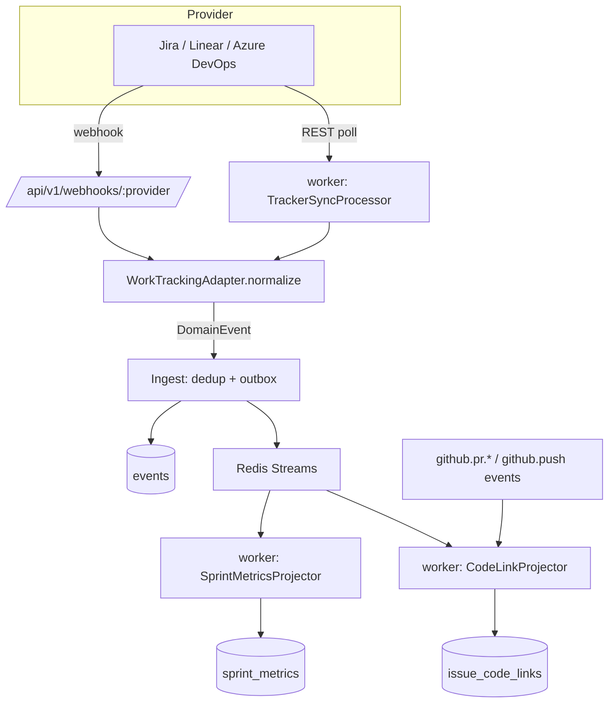

# Plan 07 — Sprint / Issue-Tracker Integration (Jira · Linear · Azure DevOps)

> Connects the org's work-tracking tool through **one provider-agnostic adapter** and turns the raw
> sprints/issues into canonical events. Those events project into `sprint_metrics` (velocity, burndown,
> estimation accuracy, completion %) and are cross-linked to GitHub PRs/commits by issue key, so "planned
> work" and "delivered code" sit on the same timeline. Jira ships first; Linear and Azure DevOps plug in
> behind the same contract with zero downstream change.

| | |
|---|---|
| **Status** | Draft v1 |
| **Phase** | Phase 2 — Insight (see [Roadmap](./00-roadmap-and-phasing.md)) |
| **Owner** | Integrations / Platform Eng |
| **Satisfies** | `FR-SPR-01`, `FR-SPR-02`, `FR-SPR-03`, `FR-SPR-04` (from [PRD](../01-product-requirements.md)) |
| **Depends on** | [05 — Event Pipeline](./05-event-pipeline.md), [06 — GitHub Integration](./06-github-integration.md), [04 — Data Model](../04-data-model.md) |
| **Nx projects** | `@eos/integrations` (`scope:backend type:feature`), `@eos/database` (`type:infra`), `@eos/events`, `@eos/shared-enums`, `@eos/contracts`, `apps/api`, `apps/worker` (see [10 — Boundaries](../10-shared-packages-and-boundaries.md)) |

---

## 1. Goal & scope

- **In scope:**
  - A **`WorkTrackingAdapter`** port (a `SourceAdapter` specialization, doc 03 §8) with a **Jira** impl;
    **Linear** and **Azure DevOps** impls behind the identical contract (`FR-SPR-04`).
  - Sync of sprints, epics, stories, tasks, bugs, **estimates**, **actuals**, dependencies, blocked and
    reopened issues, normalized to canonical `sprint.*` / `issue.*` events (`FR-SPR-01`).
  - The **`sprint_metrics`** projection: velocity, burndown series, estimation accuracy, completion %
    (`FR-SPR-02`), each row carrying `derived_from` for explainability (`NFR-EXPLAIN`).
  - **PR/commit ↔ ticket linking** by issue key parsed from branch, PR title/body, and commit messages
    (`FR-SPR-03`).
  - OAuth 3LO + PAT token handling (P4), **incremental sync**, webhook + poll reconciliation, and
    provider rate-limit budgeting.
- **Out of scope:** writing back to the tracker (transitions, comments) — an outward action that would go
  through the [human-approval gate](../07-ai-architecture.md#8-guardrails--safety); sprint *forecasting*
  narratives (the **Sprint agent**, [13 — AI Agents](./13-ai-agents.md), consumes `sprint_metrics`).
- **Anti-goals:** no individual "productivity ranking" from story points; velocity is a **team** signal,
  never a per-person score ([Vision §4](../00-vision-and-scope.md#4-what-we-are-not-building-anti-goals)).

## 2. User stories

- As a **Team Lead**, I want blocked and reopened issues surfaced against the active sprint, so that I can
  unblock the team today. (`FR-SPR-01`)
- As a **Team Lead**, I want live burndown and a completion %, so that I know mid-sprint if we will land.
  (`FR-SPR-02`)
- As an **Engineering Manager**, I want estimation accuracy per team over time, so that planning improves.
  (`FR-SPR-02`)
- As an **Individual Contributor**, I want my merged PRs auto-linked to their tickets, so that "done code"
  reflects on the board without manual bookkeeping. (`FR-SPR-03`)
- As an **Owner/Admin**, I want to connect Jira today and swap to Linear later without a data migration,
  so that tool choice isn't a lock-in. (`FR-SPR-04`)
- As a **CTO**, I want velocity trends across teams, so that I can compare delivery health, not people.
  (`FR-SPR-02`)

## 3. Domain model

Extends [04 — Data Model](../04-data-model.md). All tables are tenant-scoped via `TenantModel`
(`organization_id`, doc 04 §9). Sprint/issue metadata is **P1**; assignees make issue rows **P2**
(doc 06 §1).

New `EventSource` values `linear`, `azure_devops` join the existing `jira` in `@eos/shared-enums`. New
provider-neutral `EventType`s (the adapter normalizes every provider into these):

| EventType | Emitted when | Key payload |
|-----------|--------------|-------------|
| `sprint.created` / `sprint.started` / `sprint.closed` | sprint lifecycle | `sprintKey`, `startAt`, `endAt`, `goal` |
| `issue.created` | new epic/story/task/bug | `issueKey`, `issueType`, `estimatePoints?`, `parentKey?` |
| `issue.updated` | field change | `issueKey`, `changed[]` |
| `issue.transitioned` | status/column change | `issueKey`, `fromStatus`, `toStatus`, `category` (`todo`/`in_progress`/`done`) |
| `issue.assigned` | assignee change | `issueKey`, `assigneeExternalId` |
| `issue.estimated` | estimate set/changed | `issueKey`, `estimatePoints`, `previous?` |
| `issue.completed` | moved to a `done` category | `issueKey`, `completedAt`, `actualSeconds?` |
| `issue.reopened` | `done` → not-done | `issueKey`, `reopenCount` |
| `issue.blocked` / `issue.unblocked` | flag/blocker link toggled | `issueKey`, `blockerKey?`, `reason?` |
| `issue.dependency.linked` | blocks/relates link added | `issueKey`, `targetKey`, `linkType` |

New tables:

| Table | Key columns | Notes |
|-------|-------------|-------|
| `tracker_projects` | `id`, `organization_id`, `integration_id`, `provider`, `external_id`, `key`, `name`, `board_id?` | one per Jira/Linear/ADO project mirrored |
| `sprints` | `id`, `organization_id`, `tracker_project_id`, `external_id`, `key`, `name`, `state`, `start_at`, `end_at`, `goal` | current read model of sprints |
| `issues` | `id`, `organization_id`, `tracker_project_id`, `external_id`, `key` (unique per org), `type`, `status`, `status_category`, `estimate_points`, `actual_seconds?`, `assignee_user_id?`, `sprint_id?`, `parent_id?`, `reopen_count`, `is_blocked` | latest snapshot, rebuildable from events |
| `issue_links` | `id`, `organization_id`, `source_issue_id`, `target_issue_id`, `link_type` (`blocks`/`relates`/`duplicates`) | dependency graph |
| `issue_code_links` | `id`, `organization_id`, `issue_id`, `ref_type` (`branch`/`pr`/`commit`), `github_ref`, `confidence`, `linked_by` (`key_match`/`manual`) | PR/commit ↔ ticket (`FR-SPR-03`) |

Projection (extends doc 04 §6 — generalizes `sprint_metrics`, first cited as `jira.*`, to all providers):

| Read model | Built from | Serves |
|-----------|-----------|--------|
| `sprint_metrics` | `sprint.*`, `issue.*` events | velocity, burndown series (jsonb), estimation accuracy, completion % — with `derived_from` event ids |

## 4. Architecture & flow

Event-first ([03 §5](../03-system-architecture.md#5-event-first-core)): the adapter is a **source**, the
metrics are a **projection**, and nothing downstream knows which provider produced an event.

```ts
// @eos/integrations — the port every tracker implements (a SourceAdapter, doc 03 §8)
export interface WorkTrackingAdapter extends SourceAdapter {
  readonly provider: 'jira' | 'linear' | 'azure_devops';
  // Pull a page of changes since a cursor; MUST be resumable and idempotent.
  fetchDelta(ctx: SyncContext, cursor: SyncCursor | null): Promise<DeltaPage>;
  // Normalize one raw provider payload (poll page item OR webhook body) → canonical Events.
  normalize(raw: RawTrackerPayload, ctx: SyncContext): DomainEvent[];
  verifyWebhook(req: RawRequest, secret: string): boolean; // HMAC / shared-secret, provider-specific
}
```



- Concrete impls live in `libs/backend/integrations/src/{jira,linear,azure-devops}`; only `apps/worker`
  and `apps/api` (composition roots) wire them to the port — feature code depends on the interface, so no
  cross-boundary or cyclic deps (doc 03 §7).
- The **CodeLinkProjector** subscribes to both `issue.*` and `github.*` (from [plan 06](./06-github-integration.md))
  events — code↔ticket linking is just another projection, not a special path.

## 5. API & realtime surface

Under `/api/v1`; contracts are zod schemas in `@eos/contracts` (doc 05). RBAC per doc 02. `organizationId`
is derived from the credential, never on the wire (`NFR-ISO`).

| Method + path | Purpose | Permission |
|---------------|---------|------------|
| `POST /integrations/tracker/connect` | Start OAuth / store PAT for a provider | `integration:manage` (Owner/Admin) |
| `GET  /integrations/tracker/callback` | OAuth redirect; exchange code → tokens (P4) | signed state |
| `POST /integrations/tracker/{id}/sync` | Trigger a backfill/reconcile job | `integration:manage` |
| `POST /webhooks/{provider}` | Inbound provider webhook (HMAC verified, §7) | signature |
| `GET  /sprints?teamId=&state=active` | List sprints (cursor-paged) | `sprint:read` scoped |
| `GET  /sprints/{id}/metrics` | Velocity, burndown, completion %, estimation accuracy + `derivedFrom` | `sprint:read` scoped |
| `GET  /issues?sprintId=&status=&blocked=true` | Issue collection (cursor-paged) | `issue:read` scoped |

- **Realtime (`/realtime`):** `sprint.metrics.updated` and `issue.blocked` events fan out to subscribed
  team dashboards within ~2s of ingestion (`FR-EVT-04`, `NFR-LATENCY`).
- Reads hit the projection/read-model tables, never raw `events`, on the hot path (doc 04 §10).

## 6. AI involvement

No agent runs *inside* this plan; it produces the grounded inputs agents cite.

- The **Sprint agent** ([07 — AI Architecture §2](../07-ai-architecture.md#2-agent-fleet)) reads
  `sprint_metrics` + `issue.*` events to explain sprint health and completion probability, citing the
  ticket/event ids this plan persists (`FR-SPR-02`, `NFR-EXPLAIN`).
- The **Risk** and **Recommendation** agents consume blocked/reopened/dependency signals for cross-source
  risk correlation.
- Any *write-back* to the tracker is an outward action ⇒ **human-approval gate** (`FR-ENT-08`); this plan
  intentionally stays read-only, so no gate is triggered here.

## 7. Security, privacy & consent

Reference [06 — Security](../06-security-privacy-consent.md).

- **Tokens (P4).** OAuth access/refresh tokens and PATs stored field-encrypted in `oauth_tokens`
  (KMS-wrapped DEK), **never** returned to any UI (doc 06 §1). Refresh handled server-side; least-privilege
  scopes (read-only) requested.
- **Webhook verification.** Inbound webhooks verified by provider HMAC/shared-secret + timestamp with a
  **constant-time compare**; replays rejected via nonce/timestamp window (doc 06 §8). Signing secrets
  rotate with an N/N-1 overlap window.
- **Sensitivity.** Sprint/issue metadata is **P1**; assignee linkage makes an issue row **P2** and any
  individual drilldown is **audited** (doc 06 §1, §7). Ticket free-text (titles/descriptions) is treated
  as **untrusted evidence**, never instructions, when it reaches an agent (doc 07 §8).
- **Consent.** Tracker data is org-work data at the project level; no per-signal employee consent is
  required to ingest sprint/issue metadata, but `assignee_user_id` mapping goes through `external_accounts`
  and respects the same RBAC scope as the rest of the platform (`FR-RBAC-03`).
- **Audit.** Connect/disconnect and any manual sync write `audit_logs` rows (`FR-ENT-01`).

## 8. Implementation plan (phased tasks)

Small, reviewable PRs (doc 08). Each lists project + acceptance.

1. **Enums & contracts** (`@eos/shared-enums`, `@eos/contracts`) — add `EventSource` `linear`/`azure_devops`,
   the `sprint.*`/`issue.*` `EventType`s and typed payloads, and the API zod schemas. *Accept:* types
   compile; discriminated union exhaustive.
2. **Migrations & models** (`@eos/database`) — `tracker_projects`, `sprints`, `issues`, `issue_links`,
   `issue_code_links`, `sprint_metrics`; repositories with tenant scope. *Accept:* migration up/down clean;
   repo enforces `organizationId`.
3. **`WorkTrackingAdapter` port + Jira impl** (`@eos/integrations`) — `fetchDelta`, `normalize`,
   `verifyWebhook`; map Jira issue types/statuses → canonical categories. *Accept:* golden Jira fixtures
   normalize to expected `DomainEvent[]`.
4. **OAuth + token storage** (`apps/api`) — connect/callback endpoints, encrypted `oauth_tokens`, refresh.
   *Accept:* round-trip connect; token never serialized to UI.
5. **Incremental sync + rate limiting** (`apps/worker`) — `TrackerSyncProcessor` (BullMQ), cursor
   persistence, token-bucket per org+provider, webhook fast-path. *Accept:* resumes from cursor; backs off
   on `429`.
6. **`SprintMetricsProjector`** (`apps/worker`) — velocity, burndown series, estimation accuracy,
   completion %; idempotent + rebuildable; `derived_from` populated. *Accept:* replay produces identical
   rows.
7. **`CodeLinkProjector`** (`apps/worker`) — parse issue keys from branch/PR/commit; write `issue_code_links`.
   *Accept:* PR titled `PROJ-123 …` links to issue `PROJ-123`.
8. **Read APIs + realtime** (`apps/api`) — sprint/issue/metrics endpoints, WS fan-out. *Accept:* dashboard
   shows live burndown ≤2s after ingest.
9. **Linear + Azure DevOps impls** (`@eos/integrations`) — second/third adapter behind the same port; no
   projection or API change. *Accept:* same fixture suite passes per provider; downstream code untouched.

## 9. Testing (`unit` / `integration` / `e2e`)

Per [09 — Testing Strategy](../09-testing-strategy.md).

- **Unit — adapter normalization:** Jira/Linear/ADO fixtures → canonical events; verify status→category
  mapping, estimate/actual extraction, blocked/reopened/dependency detection, and **idempotent
  `contentHash`** (same payload twice → one event, `FR-EVT-02`).
- **Unit — metric correctness:** seeded event streams → assert velocity, burndown points, **estimation
  accuracy** (`Σ actual / Σ estimate`), completion %; a reopened issue correctly drops completion %; empty
  sprint yields zeros, not `NaN`.
- **Unit — PR↔ticket linking:** key parser matches `PROJ-123` in branch/PR/commit; ignores false positives
  (`PROJECT-2026` year, code snippets); multiple keys → multiple links; unknown key → no link.
- **Integration:** webhook → ingest → projection path with **tenant isolation** (org A's webhook never
  writes org B rows) and **idempotency** (duplicate webhook delivery → no double-count).
- **Negative/security (must-have):** forged HMAC signature rejected `401`; replayed webhook rejected;
  cursor tampering rejected; token never present in any API response body.
- **e2e:** connect Jira → seed a sprint → move issues through statuses → dashboard shows correct burndown,
  completion %, and a merged PR linked to its ticket.

## 10. Observability

Per [deployment/03 — Observability](../deployment/03-observability.md).

- **Metrics:** `tracker_sync_duration_seconds`, `tracker_api_rate_remaining` (per provider),
  `tracker_events_normalized_total{provider}`, `sprint_metrics_projection_lag_seconds`,
  `issue_code_links_created_total`, `webhook_signature_failures_total`.
- **Logs:** structured per sync run — provider, project, cursor before/after, pages, events emitted,
  429/backoff count; correlation id linking webhook → event → projection.
- **Alerts:** projection lag > 60s (`NFR-LATENCY` risk), sync error rate > 5%, sustained rate-limit
  exhaustion, spike in webhook signature failures (possible spoofing).

## 11. Acceptance criteria

- [ ] Jira connect works; sprints/epics/stories/tasks/bugs, estimates, actuals, dependencies, blocked and
      reopened issues sync into canonical events. (`FR-SPR-01`)
- [ ] `sprint_metrics` exposes velocity, burndown, estimation accuracy, completion %, each with
      `derived_from`. (`FR-SPR-02`, `NFR-EXPLAIN`)
- [ ] GitHub PRs/commits link to tickets by key from branch/PR/commit. (`FR-SPR-03`)
- [ ] A Linear (or Azure DevOps) impl passes the same fixture suite with **no** projection/API change.
      (`FR-SPR-04`)
- [ ] Ingest is idempotent and tenant-isolated; webhook signatures verified; tokens never leave the server.
      (`FR-EVT-02`, `NFR-ISO`, doc 06)

## 12. Risks & open questions

| Risk | Mitigation |
|------|------------|
| Jira Cloud REST rate limits (cost-based, per-tenant) throttle backfill | Token-bucket per org+provider, webhook-first, backfill in small pages off-peak; respect `Retry-After` |
| Estimates in mixed units (points vs hours vs time-tracking) skew accuracy | Normalize per project config; store raw + normalized; expose the unit in `sprint_metrics` |
| Issue keys collide across providers/projects after a swap | Namespace `issue_code_links`/`issues.key` by `tracker_project_id`; keep provider on every row |
| Azure DevOps uses "iterations/area paths", not sprints 1:1 | Adapter maps iteration → `sprint`, area path → project; note mapping in the ADO impl |
| Deleted/moved issues leave stale projection rows | Handle `issue.deleted`/tombstone events; projection rebuild from log reconciles |

**Open:** (1) Do we backfill closed historical sprints or only from connect date? (2) Should manual
PR↔ticket link overrides (`linked_by='manual'`) be exposed in the UI in Phase 2 or deferred?

---

_Next: [08 — Microsoft Teams Integration](./08-teams-integration.md)_
