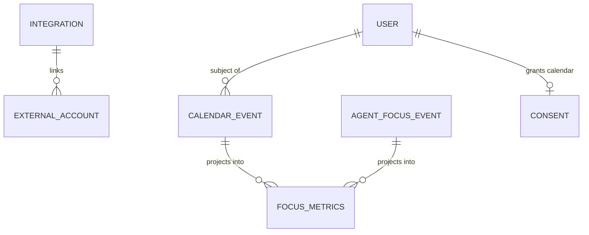

# Plan 09 — Calendar Integration

> Connects an org's **Google Calendar** and **Microsoft Outlook** (read-only) so the platform can see
> *when meetings happen* — never what is said in them. From free/busy blocks it derives **meeting time,
> deep-work windows, interruptions, and meeting overload**, projects them into `focus_metrics`, and feeds
> a **focus-vs-meeting balance** to the [Daily Timeline](./12-daily-timeline.md) and the manager
> meeting-load view. Meeting **titles are optional and redactable**; the default signal is a busy block,
> not a subject line. This is calendar-as-workload-signal, explicitly not calendar surveillance.

| | |
|---|---|
| **Status** | Draft v1 |
| **Phase** | Phase 3 — Reach (see [Roadmap](./00-roadmap-and-phasing.md)) |
| **Owner** | Platform Eng — Integrations |
| **Satisfies** | `FR-CAL-01`, `FR-CAL-02`, `FR-CAL-03` |
| **Depends on** | [01 — Authentication](./01-authentication.md) (OAuth linking, `oauth_tokens`), [05 — Event Pipeline](./05-event-pipeline.md) (canonical `Event`, idempotent ingest), [03 — RBAC](./03-rbac.md) + consent gate; projects onto [12 — Daily Timeline](./12-daily-timeline.md) and [16 — Dashboards](./16-dashboards.md) |
| **Nx projects** | `libs/backend/integrations` (`@eos/integrations`, `scope:backend`/`type:feature`) — adds the `calendar` `SourceAdapter` + `CalendarProvider` port; worker consumer for the `focus_metrics` projection. Consumes `@eos/backend-core`, `@eos/database`, `@eos/events`, `@eos/contracts`, `@eos/shared-enums`; wired in `apps/api` (OAuth + sync trigger) and `apps/worker` (poll/backfill + projection) |

---

## 1. Goal & scope

- **In scope:** OAuth (read-only) connect for Google Calendar and Outlook/Microsoft 365; incremental
  sync of **busy/free blocks + minimal event metadata** via push channels + reconciliation poll;
  normalization to canonical `calendar.*` events; a `focus_metrics` projection deriving meeting minutes,
  deep-work blocks, interruptions, and a meeting-overload flag; a self "focus vs meeting" read and a
  team **meeting-load** manager view.
- **Out of scope:** meeting **recording, transcription, or content capture** (`Vision §6`); writing to
  calendars (read-only); scheduling/booking; the desktop-agent focus signal itself
  ([04 — Desktop Agent](./04-desktop-agent.md) emits `agent.focus.*` — this plan *consumes* it alongside
  calendar data).
- **Anti-goals:** no individual "meeting productivity score," no exposure of meeting attendees/subjects
  as a default, no capture of meeting audio/video/notes
  ([Vision §4](../00-vision-and-scope.md#4-what-we-are-not-building-anti-goals)). Calendar data frames
  *team meeting load and lost focus*, not *who is in which meeting*.

## 2. User stories

- `As an Employee, I want to connect my work calendar read-only, so that my timeline shows focus vs meeting time without me logging it.` — `FR-CAL-01`
- `As an Employee, I want meeting titles hidden by default, so that connecting my calendar doesn't leak what my meetings are about.` — `FR-CAL-01`, `NFR-PRIVACY`
- `As an Employee, I want to see my deep-work windows and how meetings fragmented them, so that I can protect focus time.` — `FR-CAL-02`
- `As an Engineering Manager, I want a team meeting-load view, so that I can spot who is drowning in meetings and rebalance — as a team-flow problem, not to rank people.` — `FR-CAL-03`
- `As an Engineering Manager, I want a meeting-overload signal correlated with stalled work, so that I can protect the team's deep-work capacity.` — `FR-CAL-02`, `FR-CAL-03`
- `As an Owner/Admin, I want calendar collection consent-gated and revocable, so that it respects our privacy policy.` — `NFR-CONSENT`

## 3. Domain model

Extends [04 — Data Model](../04-data-model.md). Reuses `integrations`, `external_accounts`,
`oauth_tokens` (P4) and the `consents` table; the `signal_type` gating this module is **`calendar`**
(and, if the org enables titles, **`calendar_titles`**). New projection + one detail table below; all
tenant-scoped (`organization_id`, `TenantModel`) and classified per
[06 §1](../06-security-privacy-consent.md#1-data-classification-p0p4).

| Table / model | Key columns | Sensitivity | Notes |
|---|---|---|---|
| `calendar_events` (raw, minimal) | `id`, `organization_id`, `subject_user_id`, `provider`, `external_id`, `starts_at`, `ends_at`, `is_all_day`, `busy_status`, `is_recurring`, `attendee_count`, `is_organizer`, `response_status`, `title_enc?`, `content_hash` | P3 (`title_enc` P4) | one row per instance; **`title_enc` null unless** `calendar_titles` enabled + consented; unique `(organization_id, provider, external_id, content_hash)` |
| `focus_metrics` (projection, extends [04 §6](../04-data-model.md#6-projections-read-models)) | `id`, `organization_id`, `subject_user_id`, `metric_date`, `meeting_minutes`, `focus_minutes`, `deep_work_blocks`, `longest_focus_min`, `interruptions`, `back_to_back_meetings`, `meeting_overload`, `working_minutes`, `derived_from` | P2 (aggregate) / P3 (own detail) | rebuildable from `calendar.*` + `agent.focus.*`; `derived_from` = source event ids (`NFR-EXPLAIN`) |

New enums in `@eos/shared-enums`: `IntegrationProvider` gains `google_calendar`, `microsoft_calendar`;
`CalendarBusyStatus` (`busy`|`tentative`|`free`|`oof`); `EventSource` already includes `calendar`
([04 §5](../04-data-model.md#5-the-canonical-event-fr-evt-01)). New `EventType`s:
`calendar.event.synced`, `calendar.event.removed`.



## 4. Architecture & flow

Fits the event-first core ([03 §3](../03-system-architecture.md)): the calendar is a **source**; a
`CalendarProvider` adapter normalizes provider payloads into canonical `Event`s, deduped idempotently;
a worker consumer projects them into `focus_metrics`. Nothing downstream knows which provider produced
an event.

**Ports introduced** (interfaces in `@eos/backend-core`; concrete adapters in `@eos/integrations`,
wired in `apps/api`/`apps/worker`):

| Port | Contract | Default adapters |
|---|---|---|
| `CalendarProvider` (a `SourceAdapter`) | `authorizeUrl`, `exchangeCode`, `watch(userId)`, `syncDelta(cursor)`, `stopWatch` | Google (`calendar.readonly`, `events.watch` push channels, `syncToken` deltas) · Microsoft Graph (`Calendars.Read`, change-notification subscriptions, `deltaLink`) |
| `FocusProjector` | `apply(events) → focus_metrics upsert` | consumes `calendar.*` **and** `agent.focus.*` for the day/user |

```mermaid
sequenceDiagram
  participant C as SPA
  participant API as Integrations API (apps/api)
  participant P as CalendarProvider
  participant EB as Event Pipeline (05)
  participant W as FocusProjector (apps/worker)
  C->>API: POST /integrations/calendar/google/connect
  API->>P: authorizeUrl (state+PKCE, read-only scope)
  P-->>C: consent screen → callback
  API->>P: exchangeCode → tokens (P4) + register watch channel
  Note over API: record consent(signal='calendar'); store oauth_tokens (P4)
  P->>API: push notification (event changed)
  API->>P: syncDelta(cursor) → minimal busy blocks
  API->>EB: emit calendar.event.synced / .removed (consent-checked at ingest)
  EB->>W: fan-out → FocusProjector
  W->>W: derive meeting/focus/interruptions → upsert focus_metrics (derived_from)
```

Read-only scopes only. Google push channels expire and are **renewed by a worker cron**; Graph
subscriptions likewise. A nightly **reconciliation poll** (`deltaLink`/`syncToken`) heals missed
notifications — webhooks-first, backfill-always, per [01 PRD §5](../01-product-requirements.md#5-assumptions--constraints).
`nx graph` confirms `@eos/integrations` depends only downward (`backend-core`, `database`, `events`) —
no sibling feature-lib edge, no cycle.

### 4.1 Derivation heuristics (deterministic, disclosed)

Computed against the user's configured **working hours** (org default, user-overridable); all constants
live in `@eos/shared-constants`, not magic numbers.

- **Meeting minutes** = summed duration of `busy`/`tentative` events the user accepted (or organizes)
  within working hours; overlapping events counted once.
- **Focus minutes** = working minutes not covered by a meeting **and** corroborated by `agent.focus.*`
  where the desktop agent is present (calendar-only users get calendar-derived focus with lower
  confidence, noted in `derived_from`).
- **Deep-work block** = an uninterrupted focus span ≥ `DEEP_WORK_MIN_MINUTES` (default 90).
- **Interruptions** = count of meetings/context-switches that split a would-be deep-work block.
- **Meeting overload** = `meeting_minutes / working_minutes ≥ MEETING_OVERLOAD_RATIO` (default 0.5)
  **or** `back_to_back_meetings ≥ BACK_TO_BACK_THRESHOLD` (default 4). A flag, not a score.

## 5. API & realtime surface

All under `/api/v1`; request/response are zod schemas in `@eos/contracts`
([05 §8](../05-api-and-realtime.md)), returning the canonical envelope
([05 §3](../05-api-and-realtime.md#31-response-envelope)). RBAC enforced per route
([05 §3](../05-api-and-realtime.md); [06 §3](../06-security-privacy-consent.md#3-authorization-tenant-isolation--rbac-nfr-iso-fr-rbac)).

| Method + path | Purpose | Auth / permission | FR |
|---|---|---|---|
| `POST /integrations/calendar/:provider/connect` | begin read-only OAuth (state+PKCE) | access JWT, `own` | `FR-CAL-01` |
| `GET  /integrations/calendar/:provider/callback` | exchange code, store P4 tokens, register watch, record `calendar` consent | access JWT + `state` | `FR-CAL-01` |
| `DELETE /integrations/calendar` | disconnect: stop watch, revoke tokens, halt collection | access JWT, `own` | `FR-CAL-01`, `NFR-CONSENT` |
| `POST /webhooks/calendar/:provider` | provider push notification (verified) → delta sync | provider signature/channel token | `FR-CAL-01` |
| `GET  /me/focus-metrics?from&to` | own focus vs meeting balance + deep-work/interruptions | access JWT, `own` | `FR-CAL-02` |
| `GET  /teams/:teamId/meeting-load?from&to` | team meeting-load rollup (aggregate, k-anon) | access JWT, `meeting_load:read:team` | `FR-CAL-03` |

**Realtime:** on projection update the worker emits `focus_metrics.updated` to the subject's user room
and the team room (manager scope), so timeline + meeting-load refresh within `NFR-LATENCY`
([05 §5](../05-api-and-realtime.md#5-realtime--websocket-socketio)). `title_enc` is **never** serialized
to any surface; the team view returns aggregates only, suppressed below k≥5
([06 §5](../06-security-privacy-consent.md#5-privacy-engineering-nfr-privacy)).

## 6. AI involvement (if any)

The **Meeting agent** ([07 §2](../07-ai-architecture.md#2-agent-fleet), `FR-CAL-02`) reads `focus_metrics`
+ `calendar.*` events and produces grounded insight — e.g. *"Team lost 11 focus-hours to meetings this
week; 3 members meeting-overloaded"* — citing the contributing calendar/focus event ids as `Evidence`.
It **never** reads meeting titles/attendees; it reasons over durations and counts. Output is read-only
insight (no outward action, so no human-approval gate is required —
[07 §8](../07-ai-architecture.md#8-guardrails--safety)).

## 7. Security, privacy & consent

Concrete application of [06 §4–5](../06-security-privacy-consent.md#4-consent-model-nfr-consent-fr-agent-fr-ent-03).

- **Consent-gated (`NFR-CONSENT`).** Collection requires an active `consents` row for `signal_type =
  calendar`. The ingest fast-path drops any `calendar.*` event whose subject lacks it
  ([06 §4.1](../06-security-privacy-consent.md#41-data-model--semantics)); disconnect + revoke stop
  collection ≤ 1 min (stop watch channel + Redis consent-cache invalidation).
- **Data minimization (`NFR-PRIVACY`).** Default signal is a **busy block** (`starts/ends/busy_status/
  attendee_count`) — **titles, descriptions, attendee identities, and locations are not stored**.
  Titles are captured only if the org **explicitly enables** `calendar_titles` *and* the employee grants
  that distinct consent; then `title_enc` is stored **field-encrypted (P4)** and shown only to the owner.
- **Sensitivity.** Calendar-derived focus data is **P3** ([06 §1](../06-security-privacy-consent.md#1-data-classification-p0p4));
  `focus_metrics` team aggregates are P2 and pseudonymized/ k-anonymized (k≥5) for manager/HR-adjacent
  reads. HR never sees an individual's calendar detail.
- **No recording.** The platform consumes calendar metadata only; it never records or transcribes a
  meeting ([Vision §6](../00-vision-and-scope.md#6-scope--mvp-vs-full)).
- **RBAC.** `meeting_load:read:team` is team-scoped; individual focus detail is `own` + audited manager
  drilldown only where policy + consent permit ([06 §3.2](../06-security-privacy-consent.md#32-rbac--the-more-restrictive-wins-rule)).
- **Audit (`FR-ENT-01`).** Connect/disconnect, title-enable toggle, and any individual focus drilldown
  are written to `audit_logs` ([06 §7](../06-security-privacy-consent.md#7-audit-logging-fr-ent-01)).

## 8. Implementation plan (phased tasks)

Each a small PR in `@eos/integrations` (+ `@eos/database` migration, `@eos/contracts` schema) unless noted.

1. **Migrations + repositories** for `calendar_events` and `focus_metrics`; enums + `EventType`s in
   `@eos/shared-enums`. *Accept:* migrations run in CI; each repo has a tenant-isolation test (§9).
2. **`CalendarProvider` port + Google adapter** (OAuth read-only, `syncToken` delta, `events.watch`).
   *Accept:* connect → busy blocks ingested as `calendar.event.synced`; consent recorded.
3. **Microsoft Graph adapter** behind the same port (subscriptions + `deltaLink`). *Accept:* provider
   parity test — same canonical events from an equivalent fixture.
4. **Ingest normalization + consent-gated drop**; webhook verification per provider. *Accept:* event
   for a non-consented user is dropped pre-persist (`ingest.dropped.no_consent` metric).
5. **`FocusProjector`** deriving meeting/focus/deep-work/interruptions/overload from `calendar.*` +
   `agent.focus.*`. *Accept:* fixture day yields expected `focus_metrics`; projection is rebuildable.
6. **Watch-channel renewal cron + reconciliation poll**. *Accept:* a dropped notification is healed by
   the nightly delta; expired channels auto-renew.
7. **APIs**: `/me/focus-metrics`, `/teams/:teamId/meeting-load` (k-anon aggregate) + `focus_metrics.updated`
   WS push. *Accept:* team view suppresses cohorts < 5; own view shows deep-work/interruptions.
8. **Title opt-in path**: org toggle + `calendar_titles` consent + `title_enc` (P4). *Accept:* titles
   absent by default; present only when both gates pass; never serialized to team views.

## 9. Testing (`unit` / `integration` / `e2e`)

Per [09 — Testing Strategy](../09-testing-strategy.md). Deterministic — injected `clock`, stubbed
provider adapters, fixture calendars; no live Google/Graph calls.

- **Unit:** derivation heuristics (deep-work ≥ 90m, interruption counting, overload ratio, overlapping
  meetings counted once, working-hours windowing); recurring-instance expansion; delta cursor advance.
- **Integration (Testcontainers PG/Redis, real migrations):**
  - **Tenant isolation (`NFR-ISO`) — mandatory:** cross-tenant read of `calendar_events`/`focus_metrics`
    fails closed; `assertTenantScoped()` sweep ([09 §5.1](../09-testing-strategy.md#51-tenant-isolation-nfr-iso--mandatory-pattern)).
  - **Idempotency (`FR-EVT-02`):** re-delivered notification / replayed delta produces no duplicate rows.
  - **Consent-gate (negative, security-critical):** no `calendar` consent ⇒ event dropped pre-persist;
    revoke stops collection and stops the watch channel.
  - **Provider parity:** Google and Graph fixtures yield identical canonical `calendar.*` events.
  - **Privacy (negative):** with titles disabled, `title_enc` is null and never appears in any response;
    team meeting-load suppresses cohorts < 5.
- **E2E (Playwright, mocked OAuth):** connect Google → busy blocks appear → timeline shows focus vs
  meeting → disconnect halts collection and clears future sync.

## 10. Observability

Per [deployment/03 — Observability](../deployment/03-observability.md). One structured log per sync
(`{ correlationId, orgId, subjectUserId, provider, delta_count }`) with **no** titles/attendees/PII
([05 §11](../05-api-and-realtime.md)). Metrics: `calendar_sync_total{provider,outcome}`,
`calendar_watch_renew_total`, `calendar_ingest_dropped_no_consent_total`,
`focus_projection_lag_seconds`, `meeting_overload_flag_total`. **Alerts:** watch-channel renewal failures
(silent data gap), sync error-rate per provider, projection lag > SLO.

## 11. Acceptance criteria

- [ ] Google Calendar and Outlook connect **read-only** via OAuth; tokens stored P4; consent recorded. — `FR-CAL-01`
- [ ] Meeting **titles are absent by default**; captured only under org toggle + `calendar_titles` consent, encrypted, owner-only. — `FR-CAL-01`, `NFR-PRIVACY`
- [ ] `focus_metrics` derives meeting minutes, deep-work blocks, interruptions, and a meeting-overload flag, and is rebuildable from events. — `FR-CAL-02`
- [ ] Own timeline shows focus-vs-meeting balance; manager meeting-load view is aggregate + k-anonymized. — `FR-CAL-03`
- [ ] Revoking `calendar` consent / disconnecting stops collection ≤ 1 min and stops the watch channel. — `NFR-CONSENT`
- [ ] Cross-tenant, idempotency, consent-gate, and privacy negative tests pass in CI. — `NFR-ISO`, `FR-EVT-02`

## 12. Risks & open questions

| Risk / question | Mitigation / decision |
|---|---|
| Google push channels & Graph subscriptions expire (silent data gaps) | Renewal cron + nightly `deltaLink`/`syncToken` reconciliation; alert on renewal failure. |
| Provider rate limits on delta sync at scale | Per-user delta cursors + backoff; batch renewals; webhooks-first minimizes polling (`NFR-COST`). |
| Calendar-only users (no desktop agent) have lower-confidence focus | Mark `derived_from` provenance + confidence; UI labels calendar-only focus as estimated. |
| All-day / declined / OOF events skewing meeting minutes | Count only accepted `busy`/`tentative` within working hours; exclude all-day + declined. |
| **Open:** default working-hours source (calendar working-location vs user setting)? | Proposed: org default + per-user override; ignore provider working-location v1 — confirm with product. |

---

_Next: [10 — IDE & Browser Analytics](./10-ide-browser-analytics.md)_
