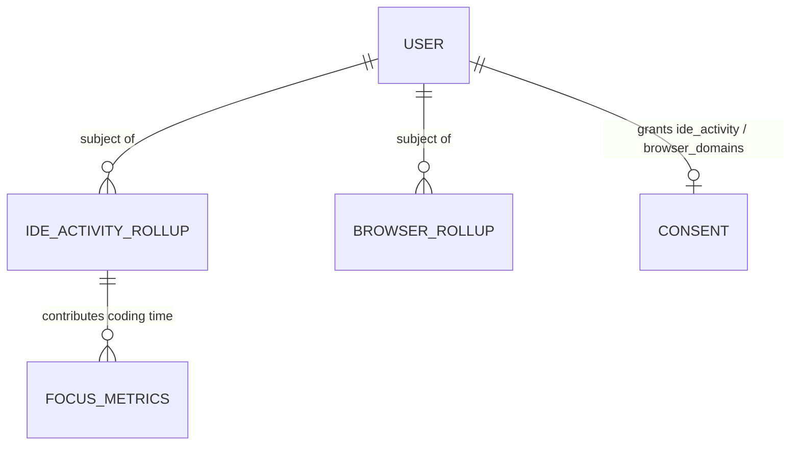
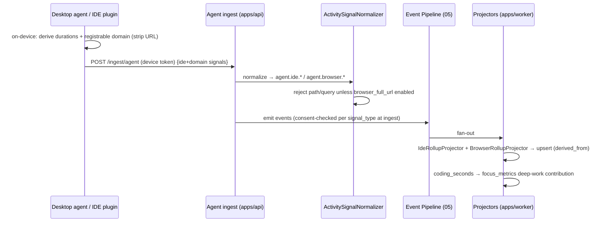

# Plan 10 — IDE & Browser Analytics

> Turns two consent-gated local signals into flow insight. **IDE analytics** measures where engineering
> time actually goes — coding, debugging, testing, building — plus the languages, extensions, and
> workspace in play, from the [desktop agent](./04-desktop-agent.md) and an **optional** IDE plugin.
> **Browser analytics** is **domain-level by default** (`github.com`, `stackoverflow.com`, …) — never
> full URLs, never page content — with finer tracking possible *only* if the org explicitly enables it
> and the employee re-consents. Both feed `focus_metrics` and the timeline. This measures *flow*, not
> keystrokes: no screen capture, no URLs, no ranking.

| | |
|---|---|
| **Status** | Draft v1 |
| **Phase** | Phase 3 — Reach (see [Roadmap](./00-roadmap-and-phasing.md)) |
| **Owner** | Platform Eng — Activity & Agent |
| **Satisfies** | `FR-IDE-01`, `FR-BR-01` |
| **Depends on** | [04 — Desktop Agent](./04-desktop-agent.md) (collection + `/api/v1/ingest/agent`), [05 — Event Pipeline](./05-event-pipeline.md) (canonical `Event`, idempotency, consent gate), [09 — Calendar](./09-calendar-integration.md) (`focus_metrics` projection); projects onto [12 — Daily Timeline](./12-daily-timeline.md), [16 — Dashboards](./16-dashboards.md) |
| **Nx projects** | `libs/backend/activity-analytics` (`@eos/activity-analytics`, `scope:backend`/`type:feature`) — normalizers + `ide_activity_rollups` / `browser_rollups` projections + query services. Collection lives in the Rust agent (`apps/agent`, plan 04) and an optional IDE plugin (`tools/ide-plugin`); backend consumes `@eos/backend-core`, `@eos/database`, `@eos/events`, `@eos/contracts`, `@eos/shared-enums`; wired in `apps/api` (read) + `apps/worker` (projection) |

---

## 1. Goal & scope

- **In scope:** normalize IDE signals (`agent.ide.*`) — coding / debug / test / build durations, active
  languages, workspace/repo, and installed extensions — from the desktop agent and an optional VS Code /
  JetBrains plugin; normalize **domain-level** browser signals (`agent.browser.*`); project both into
  `ide_activity_rollups` and `browser_rollups`; contribute coding time to `focus_metrics` deep-work;
  surface both on the timeline and dashboards, all **consent-gated per signal**.
- **Out of scope:** the agent binary + local buffering itself ([04](./04-desktop-agent.md)); full-URL or
  page-content capture (only behind an explicit org enable, and even then never page content);
  keystroke/screen capture (a hard product boundary, never built); AI-tool usage analytics
  ([11 — AI Usage](./11-ai-usage-analytics.md) owns `ai_tool.*`).
- **Anti-goals:** no full browsing history, no per-page dwell, no individual "activity score," no
  screenshots or keystrokes — ever
  ([Vision §4](../00-vision-and-scope.md#4-what-we-are-not-building-anti-goals)). Domain-level is the
  *ceiling* by default, not a starting point we tighten from.

## 2. User stories

- `As an Employee, I want to see how my day split across coding, debugging, testing, and builds, so that I understand where my time went.` — `FR-IDE-01`
- `As an Employee, I want browser tracking to record only domains, so that connecting it never exposes what I read or search.` — `FR-BR-01`, `NFR-PRIVACY`
- `As an Employee, I want to toggle IDE and browser signals independently, so that I consent to each separately and can pause either.` — `NFR-CONSENT`
- `As an Engineering Manager, I want aggregate team time-in-build vs time-in-code, so that I can spot a flaky-build tax slowing the team — as a process problem, not to grade individuals.` — `FR-IDE-01`
- `As a CTO, I want language/workspace mix across the org, so that I understand where engineering effort concentrates.` — `FR-IDE-01`
- `As an Owner/Admin, I want finer browser tracking OFF unless I explicitly enable it, so that domain-only is the safe default.` — `FR-BR-01`

## 3. Domain model

Extends [04 — Data Model](../04-data-model.md). Signals arrive as canonical `Event`s via the agent
ingest path; this plan adds two projections + reuses `consents`. Consent `signal_type`s:
**`ide_activity`**, **`app_usage`**, **`browser_domains`** (and, only if the org enables finer tracking,
**`browser_full_url`**). All tenant-scoped; classification per
[06 §1](../06-security-privacy-consent.md#1-data-classification-p0p4) (**P3**).

| Table / model | Key columns | Sensitivity | Notes |
|---|---|---|---|
| `ide_activity_rollups` (projection) | `id`, `organization_id`, `subject_user_id`, `metric_date`, `coding_seconds`, `debug_seconds`, `test_seconds`, `build_seconds`, `languages` (jsonb: `{lang: seconds}`), `top_extensions` (jsonb), `workspace_ref`, `derived_from` | P3 (own) / P2 (aggregate) | rebuildable from `agent.ide.*`; feeds `focus_metrics` deep-work |
| `browser_rollups` (projection) | `id`, `organization_id`, `subject_user_id`, `metric_date`, `domain`, `category`, `active_seconds`, `visits`, `derived_from` | P3 | **`domain` only** (registrable domain); `path`/`query` never stored by default; `category` = dev/docs/vcs/social/other |

New `EventType`s in `@eos/shared-enums`: `agent.ide.coding`, `agent.ide.debug`, `agent.ide.test`,
`agent.ide.build`, `agent.ide.extensions`, `agent.browser.domain`. `EventSource` is `agent`
([04 §5](../04-data-model.md#5-the-canonical-event-fr-evt-01)). New enum `BrowserDomainCategory`.

## 4. Architecture & flow

Fits the event-first core ([03 §3](../03-system-architecture.md)). **Collection happens locally** and is
minimized *before it leaves the device* ([04](./04-desktop-agent.md), `FR-AGENT-06`): the agent (and
optional plugin) derive **durations and the registrable domain** on-device and post canonical-shaped
signals to `/api/v1/ingest/agent` (device token). The backend normalizes, consent-gates, persists as
events, and projects.

**The domain-only guarantee is enforced at the edge and re-enforced server-side:** the agent strips any
URL to its registrable domain (public-suffix list) *before* sending; the ingest normalizer additionally
**rejects any payload containing a path/query** for the `browser_domains` signal — finer data is only
accepted when the org has enabled `browser_full_url` *and* the subject consented to it (`FR-BR-01`).

**Ports** (interfaces in `@eos/backend-core`; impls in `@eos/activity-analytics`):

| Port | Contract | Notes |
|---|---|---|
| `ActivitySignalNormalizer` | `normalize(agentPayload) → Event[]` | maps agent/plugin payloads to `agent.ide.*` / `agent.browser.*`; enforces domain-only |
| `IdeRollupProjector` | `apply(events) → ide_activity_rollups upsert` | sums durations by category/day; merges languages/extensions |
| `BrowserRollupProjector` | `apply(events) → browser_rollups upsert` | rolls up per domain/day; categorizes domain |

**Optional IDE plugin.** A thin VS Code / JetBrains extension (`tools/ide-plugin`) reports the same
signal shapes to the local agent (preferred) or directly to ingest with a device-scoped token. It adds
fidelity (debug/test/build boundaries, active language) the OS-level agent can't infer, but the system
degrades gracefully without it — agent-only users still get coding/app time. `nx graph` confirms
`@eos/activity-analytics` depends only downward; no sibling feature-lib edge.

## 5. API & realtime surface

Ingest reuses the agent endpoint ([05 §Ingest](../05-api-and-realtime.md)); this plan adds **read**
routes. Under `/api/v1`, zod schemas in `@eos/contracts`, canonical envelope, RBAC per route.

| Method + path | Purpose | Auth / permission | FR |
|---|---|---|---|
| `POST /ingest/agent` (shared) | agent/plugin posts IDE + domain signals | device token | `FR-IDE-01`, `FR-BR-01` |
| `GET  /me/ide-activity?from&to` | own coding/debug/test/build split + languages | access JWT, `own` | `FR-IDE-01` |
| `GET  /me/browser-activity?from&to` | own domain-level rollup | access JWT, `own` | `FR-BR-01` |
| `GET  /teams/:teamId/ide-activity?from&to` | aggregate team time-in-category (k-anon) | access JWT, `activity:read:team` | `FR-IDE-01` |
| `GET  /orgs/current/language-mix?from&to` | org language/workspace mix | access JWT, `activity:read:org` | `FR-IDE-01` |

**Realtime:** on projection update the worker emits `ide_activity.updated` / `browser_activity.updated`
to the subject's user room (own dashboard) and the team room for aggregates
([05 §5](../05-api-and-realtime.md#5-realtime--websocket-socketio)). Team/org reads are aggregate + k≥5
suppressed ([06 §5](../06-security-privacy-consent.md#5-privacy-engineering-nfr-privacy)); no full URL is
ever serializable because none is stored by default.

## 6. AI involvement (if any)

The **Activity agent** ([07 §2](../07-ai-architecture.md#2-agent-fleet), `FR-AI-01`) may cite
`ide_activity_rollups` / `browser_rollups` when narrating what a person/team actually did, and the
**Risk agent** may correlate a high `build_seconds` share (flaky-build tax) with stalled work — each
citing the projection rows as `Evidence` ([07 §6](../07-ai-architecture.md#6-explainability-by-construction-nfr-explain)).
Agents read **domains and durations only**, never URLs or page content. No agent takes an outward
action here, so no human-approval gate applies.

## 7. Security, privacy & consent

The strongest privacy surface in the product after AI-usage; implements
[06 §4–5](../06-security-privacy-consent.md#4-consent-model-nfr-consent-fr-agent-fr-ent-03).

- **Per-signal consent (`NFR-CONSENT`).** `ide_activity`, `app_usage`, and `browser_domains` are
  **independent** opt-ins; granting one grants nothing else. The ingest fast-path drops any signal whose
  subject lacks the matching consent, **before persistence**
  ([06 §4.1](../06-security-privacy-consent.md#41-data-model--semantics)). Pausing the agent or revoking
  a signal stops it ≤ 1 min (Redis consent-cache invalidation + agent manifest poll).
- **Domain-only by default (`FR-BR-01`, `NFR-PRIVACY`).** Browser signals are the **registrable domain
  only** — no path, query, fragment, or page content. Finer tracking requires **both** an explicit org
  policy enable **and** a distinct `browser_full_url` re-consent; the normalizer rejects path/query
  otherwise. Domain-only is the default *and* the enforced ceiling.
- **No screens / keystrokes — ever.** The agent has no such capability compiled in
  (`FR-AGENT-03`, [06 §4.4](../06-security-privacy-consent.md#44-desktop-agent-fr-agent-020306)).
- **Sensitivity.** IDE/app usage and browser domains are **P3**
  ([06 §1](../06-security-privacy-consent.md#1-data-classification-p0p4)); team/org rollups are P2,
  pseudonymized + k-anonymized (k≥5). HR never sees individual IDE/browser detail.
- **Local preview (`FR-AGENT-06`).** The employee can see, on-device, exactly which domains/durations
  will be sent before they leave the machine.
- **RBAC + audit.** `activity:read:team`/`:org` are aggregate-scoped; any individual drilldown is
  audited ([06 §7](../06-security-privacy-consent.md#7-audit-logging-fr-ent-01)), even for Owner/CTO.
  Enabling `browser_full_url` is an audited admin action + employee notice.

## 8. Implementation plan (phased tasks)

Each a small PR in `@eos/activity-analytics` (+ `@eos/database` migration, `@eos/contracts` schema,
agent/plugin change) unless noted.

1. **Migrations + repositories** for `ide_activity_rollups`, `browser_rollups`; `EventType`s + enums.
   *Accept:* migrations run in CI; each repo has a tenant-isolation test (§9).
2. **`ActivitySignalNormalizer`** mapping agent payloads → `agent.ide.*`; consent-gate per signal.
   *Accept:* IDE signals for a non-consented user dropped pre-persist.
3. **Browser normalizer with domain-only enforcement** (public-suffix strip + path/query rejection).
   *Accept:* a payload with a path is rejected unless `browser_full_url` enabled + consented.
4. **`IdeRollupProjector`** (coding/debug/test/build/languages/extensions/workspace). *Accept:* fixture
   day yields expected rollup; rebuildable from events.
5. **`BrowserRollupProjector`** (per-domain rollup + categorization). *Accept:* domains bucketed;
   no path ever stored.
6. **Feed `focus_metrics`**: coding_seconds contributes to deep-work corroboration
   ([09 §4.1](./09-calendar-integration.md)). *Accept:* focus deep-work reflects agent coding time.
7. **Optional IDE plugin** (`tools/ide-plugin`) reporting debug/test/build boundaries + active language.
   *Accept:* plugin-present users get finer split; agent-only users still get coding/app time.
8. **Read APIs + WS pushes** (own detail; team/org aggregate + k-anon). *Accept:* team/org views suppress
   cohorts < 5; own view shows category split.

## 9. Testing (`unit` / `integration` / `e2e`)

Per [09 — Testing Strategy](../09-testing-strategy.md). Deterministic — fixture agent payloads, injected
`clock`; no real agent/IDE.

- **Unit:** duration bucketing by category; language/extension merge; **registrable-domain extraction**
  (public-suffix edge cases: `foo.github.io`, `co.uk`); path/query rejection; categorizer mapping.
- **Integration (Testcontainers PG/Redis, real migrations):**
  - **Tenant isolation (`NFR-ISO`) — mandatory:** cross-tenant read of either rollup fails closed
    ([09 §5.1](../09-testing-strategy.md#51-tenant-isolation-nfr-iso--mandatory-pattern)).
  - **Per-signal consent (negative, security-critical):** `ide_activity` granted but `browser_domains`
    not ⇒ browser events dropped, IDE events kept.
  - **Domain-only (negative, security-critical):** a browser payload with `path`/`query` is **rejected**
    while `browser_full_url` is off; accepted (and stored) only when org-enabled + consented.
  - **Idempotency (`FR-EVT-02`):** re-posted agent batch produces no duplicate rollup rows.
  - **Privacy:** no `browser_rollups` row ever contains a path/query; team/org views suppress k < 5.
- **E2E (Playwright, mocked agent):** consent to IDE only → coding split appears, browser view empty;
  add browser consent → domains appear (no URLs); pause agent → collection stops.

## 10. Observability

Per [deployment/03 — Observability](../deployment/03-observability.md). Structured ingest log
(`{ correlationId, orgId, subjectUserId, signal_type, count }`) — **never** a URL, path, or domain value
in logs. Metrics: `activity_ingest_total{signal_type,outcome}`,
`activity_ingest_dropped_no_consent_total{signal_type}`, `browser_fullurl_rejected_total` (should trend
to ~0 when the feature is off), `ide_rollup_lag_seconds`. **Alerts:** any
`browser_fullurl_rejected_total` spike while the org has finer tracking **disabled** (possible
misbehaving client), projection lag > SLO.

## 11. Acceptance criteria

- [ ] IDE analytics reports coding / debug / test / build time, languages, extensions, and workspace from agent and/or plugin. — `FR-IDE-01`
- [ ] Browser analytics stores **domain only** by default; path/query rejected unless org-enabled + re-consented. — `FR-BR-01`
- [ ] `ide_activity` and `browser_domains` are independent opt-ins; revoke/pause stops collection ≤ 1 min. — `NFR-CONSENT`
- [ ] Coding time contributes to `focus_metrics` deep-work; both projections are rebuildable from events. — `FR-IDE-01`
- [ ] Team/org views are aggregate + k-anonymized (k≥5); no full URL is ever serialized. — `NFR-PRIVACY`
- [ ] Cross-tenant, per-signal-consent, and domain-only negative tests pass in CI. — `NFR-ISO`, `NFR-SEC`

## 12. Risks & open questions

| Risk / question | Mitigation / decision |
|---|---|
| A misbehaving plugin/client tries to send full URLs | Server-side domain-only enforcement rejects path/query unless explicitly enabled; alert on rejection spikes. |
| Registrable-domain extraction edge cases (`github.io`, `co.uk`) | Bundle a maintained public-suffix list; unit-tested edge fixtures; extract on-device **and** re-validate server-side. |
| Attributing "coding" vs "reading code" without keystrokes | Use active-window + IDE-plugin editor-focus signals; label as *active editor time*, not typing — never keystroke-derived. |
| Double-counting when agent **and** plugin both report | Dedup by `(source_client, window, content_hash)`; prefer plugin fidelity where both present. |
| Idle time inflating durations | Idle threshold from `@eos/shared-constants`; agent emits active spans only, gaps excluded. |
| **Open:** default browser categorizer taxonomy (dev/docs/vcs/social/other) — org-editable? | Proposed: ship a default map, allow org overrides in Phase 4 — confirm with product. |

---

_Next: [11 — AI Usage Analytics](./11-ai-usage-analytics.md)_
