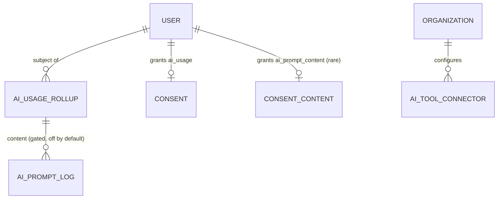
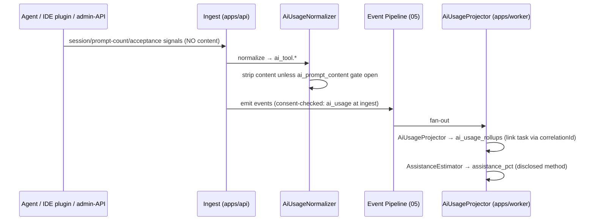

# Plan 11 — AI Usage Analytics

> Answers the question the [vision](../00-vision-and-scope.md#2-the-problem) calls out as a black box:
> *is AI actually helping, on what, and how much?* Tracks usage across **Claude, ChatGPT, Copilot,
> Cursor, Gemini, and Windsurf** — sessions, prompt **counts**, time, the linked task, and which tool —
> and produces **adoption + productivity reports** plus a disclosed **"estimated AI assistance %"**.
> Crucially, **prompt-content logging is OFF by default**: everything here runs on counts and durations.
> Turning content logging on requires an org policy toggle, an audit record, an employee notice, a
> distinct consent, and P4 access controls. No content, by default, ever leaves the tool.

| | |
|---|---|
| **Status** | Draft v1 |
| **Phase** | Phase 3 — Reach (see [Roadmap](./00-roadmap-and-phasing.md)) |
| **Owner** | Platform Eng — AI & Analytics |
| **Satisfies** | `FR-AIU-01`, `FR-AIU-02`, `FR-AIU-03` |
| **Depends on** | [04 — Desktop Agent](./04-desktop-agent.md) + [10 — IDE & Browser](./10-ide-browser-analytics.md) (signal collection), [05 — Event Pipeline](./05-event-pipeline.md) (canonical `Event`, consent gate), [07 — AI Architecture](../07-ai-architecture.md) (AI-Usage agent); feeds [16 — Dashboards](./16-dashboards.md), [18 — Reports](./18-reports.md) |
| **Nx projects** | `libs/backend/ai-usage` (`@eos/ai-usage`, `scope:backend`/`type:feature`) — normalizers, `ai_usage_rollups` projection, assistance-% estimator, report builders. Collection via the desktop agent / IDE plugin / browser signals (plans 04, 10) and optional org admin-API connectors; consumes `@eos/backend-core`, `@eos/database`, `@eos/events`, `@eos/contracts`, `@eos/shared-enums`; wired in `apps/api` (read + policy) + `apps/worker` (projection + reports). The **AI-Usage agent** itself lives in `@eos/ai` ([07 §2](../07-ai-architecture.md#2-agent-fleet)) |

---

## 1. Goal & scope

- **In scope:** detect AI-tool usage (sessions, prompt counts, active time, tool, linked task) across the
  six named tools; normalize to `ai_tool.*` events; project into `ai_usage_rollups` (per person aggregate,
  per team, per tool); a disclosed **estimated AI-assistance %** heuristic; adoption/productivity reports;
  and the **gated, off-by-default** prompt-content logging path with its policy + audit + notice controls.
- **Out of scope:** the platform's *own* LLM agent spend/accounting (that is `agent_runs`,
  [07 §7](../07-ai-architecture.md#7-model-routing--cost-control-nfr-cost)); any individual productivity
  *score* or ranking (a hard anti-goal); reading prompt content by default.
- **Anti-goals:** no covert content capture, no per-employee AI ranking/leaderboard, no using AI-usage to
  discipline individuals ([Vision §4](../00-vision-and-scope.md#4-what-we-are-not-building-anti-goals)).
  "Estimated AI assistance %" is a **team-and-adoption** signal with published methodology, never a
  personal grade.

## 2. User stories

- `As an Employee, I want to see which AI tools I use and how much, so that I understand my own workflow — without my prompts being stored.` — `FR-AIU-01`, `FR-AIU-02`
- `As an Engineering Manager, I want per-team AI adoption and tool mix, so that I can support the team's tooling — not rank people by it.` — `FR-AIU-03`
- `As a CTO, I want an org AI-adoption report and an estimated assistance % with disclosed methodology, so that I can judge whether our AI spend is paying off.` — `FR-AIU-03`
- `As an Employee, I want prompt-content logging OFF unless I'm explicitly told and consent, so that enabling it can never be silent.` — `FR-AIU-02`
- `As an Owner/Admin, I want turning on content logging to require a policy toggle + audit + employee notice, so that it is a deliberate, accountable act.` — `FR-AIU-02`
- `As an HR user, I want only aggregate, k-anonymized AI-adoption figures, so that I never see an individual's AI activity.` — `NFR-PRIVACY`

## 3. Domain model

Extends [04 — Data Model](../04-data-model.md). Signals arrive as `ai_tool.*` events; this plan adds the
projection + a **gated** content table. Consent `signal_type`s: **`ai_usage`** (counts/durations —
required for any collection) and **`ai_prompt_content`** (the distinct opt-in for content, off by
default). Classification per [06 §1](../06-security-privacy-consent.md#1-data-classification-p0p4).

| Table / model | Key columns | Sensitivity | Notes |
|---|---|---|---|
| `ai_usage_rollups` (projection, [04 §6](../04-data-model.md#6-projections-read-models)) | `id`, `organization_id`, `subject_user_id`, `metric_date`, `tool`, `sessions`, `prompt_count`, `active_seconds`, `accepted_suggestions?`, `linked_task_ids` (jsonb), `assistance_pct?`, `derived_from` | P3 (own) / P2 (aggregate) | **counts + durations only**; rebuildable from `ai_tool.*`; `assistance_pct` per §4.2 |
| `ai_prompt_logs` (gated, off by default) | `id`, `organization_id`, `subject_user_id`, `tool`, `occurred_at`, `prompt_enc`, `response_enc?`, `policy_version` | **P4** | written **only** when all §7 gates pass; field-encrypted; service-role read; **never** serialized to any UI |
| `ai_tool_connectors` | `id`, `organization_id`, `tool`, `mode` (`client_signal`\|`admin_api`), `config` (jsonb), `status` | P1 | optional org-provided admin-API exports (e.g. Copilot for Business usage) |

New `EventType`s in `@eos/shared-enums`: `ai_tool.session.started`, `ai_tool.session.ended`,
`ai_tool.prompt.counted` (**count only, no content**), `ai_tool.suggestion.accepted`. `EventSource` is
`ai_tool` ([04 §5](../04-data-model.md#5-the-canonical-event-fr-evt-01)). New enum `AiTool`
(`claude`|`chatgpt`|`copilot`|`cursor`|`gemini`|`windsurf`).

## 4. Architecture & flow

Fits the event-first core ([03 §3](../03-system-architecture.md)). Detection is **local and content-free
by default**: the desktop agent / IDE plugin / browser-domain signals ([10](./10-ide-browser-analytics.md))
recognize AI-tool sessions (by app, IDE extension, or AI-tool domain such as `claude.ai`,
`chat.openai.com`, `gemini.google.com`) and emit **session/duration/count** events — never content.
Copilot/Cursor/Windsurf acceptance signals come from the IDE plugin. An optional **admin-API connector**
mode ingests org-authorized usage exports (seat-level, aggregate) where a tool offers them.

**Ports** (interfaces in `@eos/backend-core`; impls in `@eos/ai-usage`):

| Port | Contract | Notes |
|---|---|---|
| `AiUsageNormalizer` | `normalize(signal) → Event[]` | maps agent/plugin/connector payloads → `ai_tool.*`; drops any content unless gated |
| `AiUsageProjector` | `apply(events) → ai_usage_rollups upsert` | per (day, user, tool) counts/durations; links task via correlation ([07/12](./12-daily-timeline.md)) |
| `AssistanceEstimator` | `estimate(rollup, coding) → pct` | disclosed heuristic (§4.2) |
| `PromptContentSink` | `store(prompt) → ai_prompt_logs` | **only** invoked when all §7 gates pass; P4 encrypt |

Linking to a task uses the same `correlationId` the timeline uses ([12](./12-daily-timeline.md)): an AI
session overlapping active work on ticket X is attributed to X, with the linking events recorded in
`derived_from` (`NFR-EXPLAIN`). `nx graph` confirms `@eos/ai-usage` depends only downward and does not
import `@eos/ai` (the agent reads `ai_usage_rollups` through a repository, not the reverse).

### 4.2 Estimated AI-assistance % — disclosed methodology (`FR-AIU-03`)

A transparent heuristic, **surfaced with its formula in the UI**, never a hidden score:

> `assistance_pct = clamp( w1·(ai_active_seconds / coding_seconds) + w2·(accepted_suggestions / commits_touched_loc_proxy), 0, 100 )`

- Inputs: `ai_active_seconds` (overlap of `ai_tool.*` sessions with `agent.ide.coding`,
  [10](./10-ide-browser-analytics.md)), `coding_seconds`, `accepted_suggestions` (Copilot/Cursor/Windsurf),
  and a commit-size proxy. Weights `w1`,`w2` are org-configurable constants in `@eos/shared-constants`.
- **It is an estimate, disclosed as such.** The UI shows the formula, the inputs, and an "estimate"
  label; the figure is **aggregate-first** (team/org) and, at the individual level, own-view only.
- **It is not a productivity score.** It measures *AI leverage*, is never ranked across employees, and is
  barred from HR views ([06 §5](../06-security-privacy-consent.md#5-privacy-engineering-nfr-privacy)).

## 5. API & realtime surface

Under `/api/v1`, zod schemas in `@eos/contracts`, canonical envelope, RBAC per route.

| Method + path | Purpose | Auth / permission | FR |
|---|---|---|---|
| `POST /ingest/agent` (shared) | agent/plugin posts AI-tool session/count signals | device token | `FR-AIU-01` |
| `GET  /me/ai-usage?from&to` | own tool mix, sessions, prompt counts, assistance % | access JWT, `own` | `FR-AIU-01/03` |
| `GET  /teams/:teamId/ai-adoption?from&to` | team adoption + tool mix (aggregate, k-anon) | access JWT, `ai_usage:read:team` | `FR-AIU-03` |
| `GET  /orgs/current/ai-adoption?from&to` | org adoption report + assistance % + methodology | access JWT, `ai_usage:read:org` | `FR-AIU-03` |
| `GET  /orgs/current/ai-policy/content-logging` | read content-logging policy state | access JWT, `org:settings:read` | `FR-AIU-02` |
| `PUT  /orgs/current/ai-policy/content-logging` | toggle content logging (audited, triggers notice) | access JWT, `org:settings:write` | `FR-AIU-02` |

**Realtime:** `ai_usage.updated` pushed to the subject's user room and team room on projection update
([05 §5](../05-api-and-realtime.md#5-realtime--websocket-socketio)). Team/org reads are aggregate + k≥5
suppressed. **`ai_prompt_logs` (P4) is never serialized to any surface**
([06 §1](../06-security-privacy-consent.md#1-data-classification-p0p4)); there is no read API that returns
prompt content to a UI.

## 6. AI involvement (if any)

The **AI-Usage agent** ([07 §2](../07-ai-architecture.md#2-agent-fleet), `FR-AIU-03`) reads
`ai_usage_rollups` (never `ai_prompt_logs`) and produces the adoption/assistance readout with **rollup
provenance** as `Evidence` ([07 §6](../07-ai-architecture.md#6-explainability-by-construction-nfr-explain)) —
e.g. *"Backend team AI adoption 78%, Copilot-led; estimated assistance 22% (formula shown)."* The
**Recommendation agent** may suggest enablement/training actions from adoption gaps. Both are read-only
insight; any outward action (e.g. posting a report) passes the human-approval gate
([07 §8](../07-ai-architecture.md#8-guardrails--safety), `FR-ENT-08`).

## 7. Security, privacy & consent

The most sensitive surface in the product; implements
[06 §5](../06-security-privacy-consent.md#5-privacy-engineering-nfr-privacy) and the
[Vision §4](../00-vision-and-scope.md#4-what-we-are-not-building-anti-goals) prompt-logging boundary.

- **`ai_usage` consent required (`NFR-CONSENT`).** No collection without an active `ai_usage` consent;
  ingest drops otherwise, before persistence
  ([06 §4.1](../06-security-privacy-consent.md#41-data-model--semantics)). Revoke stops collection ≤ 1 min.
- **Prompt-content logging is OFF by default (`FR-AIU-02`).** Writing `ai_prompt_logs` requires **all** of:
  1. an **org policy toggle** (`content-logging = on`),
  2. an **audit record** of who enabled it and when ([06 §7](../06-security-privacy-consent.md#7-audit-logging-fr-ent-01)),
  3. an **employee notice** (and a policy-version bump that **re-solicits consent**, [06 §4.2](../06-security-privacy-consent.md#42-policy-versioning)),
  4. a **distinct `ai_prompt_content` consent** from each subject, and
  5. **P4 access controls** — field-encrypted, service-role read only, never sent to any UI.

  Absent any one, the `PromptContentSink` is never invoked and the normalizer strips content. This is a
  five-gate `AND`, enforced in code, not a checkbox.
- **Counts, not content, is the norm.** All reports, the assistance %, and the agent operate on
  `ai_usage_rollups` (durations/counts). Content, if ever enabled, is a separate P4 store no analytic
  path reads.
- **Sensitivity & aggregation.** AI-usage counts are **P3**; team/org rollups P2, pseudonymized +
  k-anonymized (k≥5). HR sees aggregate only, never an individual
  ([06 §5](../06-security-privacy-consent.md#5-privacy-engineering-nfr-privacy)).
- **No ranking.** No endpoint or report ranks employees by AI usage or assistance %; the composition rule
  ([06 §3.2](../06-security-privacy-consent.md#32-rbac--the-more-restrictive-wins-rule)) applies.
- **Audit.** Content-logging toggle, connector connect/disconnect, and any individual AI-usage drilldown
  are audited, even for Owner/CTO.

## 8. Implementation plan (phased tasks)

Each a small PR in `@eos/ai-usage` (+ `@eos/database` migration, `@eos/contracts` schema, agent/plugin
change) unless noted.

1. **Migrations + repositories** for `ai_usage_rollups`, `ai_tool_connectors`; `EventType`s + `AiTool`
   enum. *Accept:* migrations run in CI; each repo has a tenant-isolation test (§9).
2. **`AiUsageNormalizer`** for agent/plugin session + prompt-count + acceptance signals (content-free).
   *Accept:* six tools recognized; content never present; non-consented user dropped pre-persist.
3. **`AiUsageProjector`** → per (day, user, tool) rollups; task linking via `correlationId`.
   *Accept:* fixture day yields expected rollup; rebuildable; task links recorded in `derived_from`.
4. **`AssistanceEstimator`** with disclosed formula + org-config weights. *Accept:* formula + inputs
   surfaced; deterministic on fixtures; clamped 0–100.
5. **Read APIs + WS** (own detail; team/org aggregate + k-anon adoption reports). *Accept:* team/org
   suppress cohorts < 5; methodology returned with the org report.
6. **Content-logging policy path**: five-gate enforcement (`PromptContentSink`, `ai_prompt_content`
   consent, policy-version bump, employee notice, audit, P4 encryption). *Accept:* with any gate off,
   **no** `ai_prompt_logs` row is written and content is stripped.
7. **Optional admin-API connectors** (e.g. Copilot for Business usage export) behind `ai_tool_connectors`.
   *Accept:* aggregate seat usage ingested; no per-prompt content.
8. **Reports** (adoption, per-tool, per-team, executive AI-adoption) wired to [18 — Reports](./18-reports.md).
   *Accept:* exportable, scheduled, methodology-disclosed, aggregate-only.

## 9. Testing (`unit` / `integration` / `e2e`)

Per [09 — Testing Strategy](../09-testing-strategy.md). Deterministic — fixture signals, injected
`clock`; no real AI tools.

- **Unit:** tool recognition (six tools via app/extension/domain); prompt-count vs content separation;
  assistance-% formula (clamping, weight config, zero-coding guard); task-linking by correlation window.
- **Integration (Testcontainers PG/Redis, real migrations):**
  - **Tenant isolation (`NFR-ISO`) — mandatory:** cross-tenant read of `ai_usage_rollups` /
    `ai_prompt_logs` fails closed ([09 §5.1](../09-testing-strategy.md#51-tenant-isolation-nfr-iso--mandatory-pattern)).
  - **`ai_usage` consent (negative, security-critical):** no consent ⇒ event dropped pre-persist.
  - **Prompt-logging five-gate (negative, security-critical):** with the policy off / no
    `ai_prompt_content` consent / stale policy version, `ai_prompt_logs` is **never** written and content
    is stripped; only with **all** gates does a P4 row appear.
  - **No content leakage:** serializer tests assert `prompt_enc`/`response_enc` never appear in any
    response ([09 §9](../09-testing-strategy.md#9-multi-tenancy--security-test-requirements)); no read API
    returns content.
  - **No ranking:** team/org endpoints return aggregates only, suppress k < 5, expose no per-employee
    ordering.
- **E2E (Playwright, mocked signals):** consent to `ai_usage` → own tool mix + assistance % appear;
  enable content logging (all gates) → notice shown + re-consent required; revoke → collection stops.

## 10. Observability

Per [deployment/03 — Observability](../deployment/03-observability.md). Structured ingest log
(`{ correlationId, orgId, subjectUserId, tool, signal }`) — **never** prompt text. Metrics:
`ai_usage_ingest_total{tool,outcome}`, `ai_usage_dropped_no_consent_total`,
`ai_prompt_content_writes_total` (**must be 0 unless a policy is enabled** — a key guardrail alert),
`assistance_estimate_runs_total`, `ai_usage_rollup_lag_seconds`. **Alerts:** any
`ai_prompt_content_writes_total > 0` for an org **without** an active content-logging policy (critical —
possible gate bypass), ingest error-rate per tool, projection lag > SLO.

## 11. Acceptance criteria

- [ ] Usage tracked across Claude, ChatGPT, Copilot, Cursor, Gemini, Windsurf: sessions, prompt counts, time, linked task, tool. — `FR-AIU-01`
- [ ] Prompt-content logging is **OFF by default**; enabling requires policy toggle + audit + employee notice + `ai_prompt_content` consent + P4 controls (five-gate `AND`). — `FR-AIU-02`
- [ ] Adoption/productivity reports per person aggregate, per team, per tool. — `FR-AIU-03`
- [ ] Estimated AI-assistance % is produced with its methodology disclosed and is never a ranked personal score. — `FR-AIU-03`
- [ ] `ai_prompt_logs` (P4) is never serialized to any UI; no read API returns content. — `NFR-PRIVACY`, `NFR-SEC`
- [ ] Cross-tenant, `ai_usage`-consent, five-gate content, no-content-leak, and no-ranking tests pass in CI. — `NFR-ISO`, `NFR-SEC`

## 12. Risks & open questions

| Risk / question | Mitigation / decision |
|---|---|
| Detecting web-tool sessions (Claude/ChatGPT/Gemini) without content | Domain-level session timing from browser signals ([10](./10-ide-browser-analytics.md)); counts inferred from session boundaries, never scraped content. |
| Assistance-% being read as a productivity grade | Publish the formula + inputs, label "estimate," aggregate-first, no ranking, HR-barred; documented in the report itself. |
| Accidental content capture via a plugin/connector | `PromptContentSink` is the only content write path and is behind the five-gate `AND`; normalizer strips content; alert on any unexpected `ai_prompt_logs` write. |
| Admin-API connectors returning seat-level PII | Ingest aggregate seat usage only; map to internal users via `external_accounts`; no prompt content from connectors. |
| Prompt-count accuracy varies by tool | Disclose per-tool method + confidence in `derived_from`; treat counts as indicative, durations as primary. |
| **Open:** default assistance-% weights `w1`/`w2` and whether orgs may hide the metric | Proposed: conservative defaults in `@eos/shared-constants`, org-tunable, org may disable display — confirm with product. |

---

_Next: [12 — Daily Timeline](./12-daily-timeline.md)_
