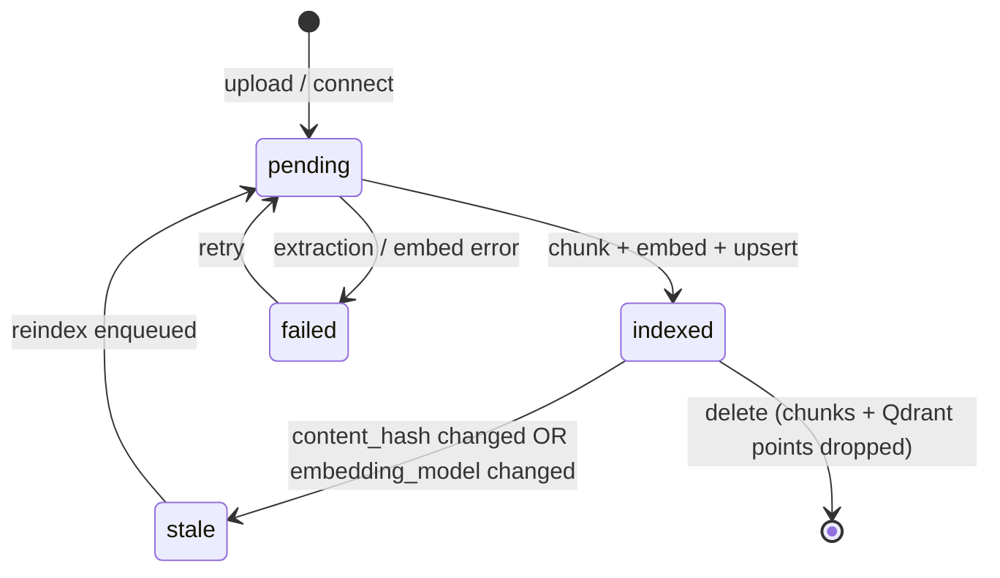
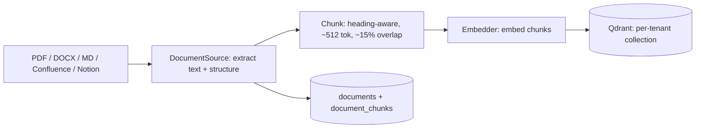
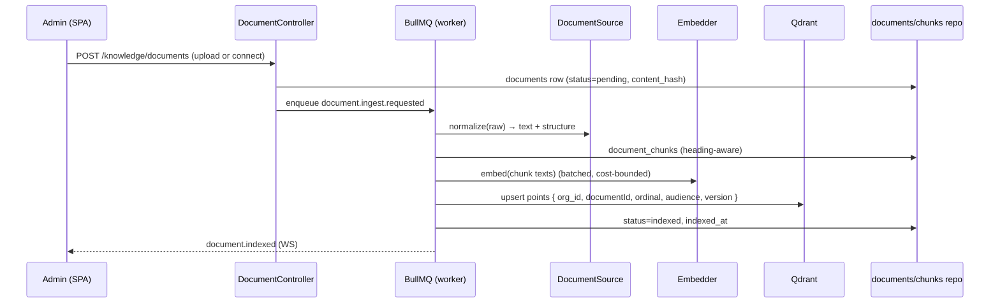

# Plan 14 — RAG Knowledge Base

> Lets employees and the Manager Copilot ask questions of the org's own documents — "What is our
> deployment process?" — and get answers **grounded in cited source passages**, never the model's
> parametric memory. Documents (PDF/DOCX/Markdown/Confluence/Notion) are normalized by source adapters,
> chunked heading-aware, embedded, and stored in **per-tenant Qdrant** with a mandatory `organizationId`
> filter. Retrieval is hybrid (dense + sparse, RRF-fused, reranked) and always applies the RBAC/audience
> filter in the query. Generation answers **only** from retrieved chunks and cites each claim. This plan
> implements [07 §5](../07-ai-architecture.md#5-rag-pipeline-fr-rag) and exposes the `KnowledgeRetriever`
> port the Knowledge agent and Copilot consume ([13](./13-ai-agents.md)).

| | |
|---|---|
| **Status** | Draft v1 |
| **Phase** | Phase 2 — Insight (see [Roadmap](./00-roadmap-and-phasing.md)) |
| **Owner** | AI / Platform Eng |
| **Satisfies** | `FR-RAG-01`, `FR-RAG-02`, `FR-RAG-03` · supports `NFR-EXPLAIN`, `NFR-ISO`, `NFR-COST` |
| **Depends on** | [05 — Event Pipeline](./05-event-pipeline.md) (worker jobs), [03 — RBAC](./03-rbac.md) (audience → permission), [13 — AI Agents](./13-ai-agents.md) (`ModelRouter`, Knowledge agent consumer) |
| **Nx projects** | `libs/rag` (`@eos/rag`, `scope:backend`/`type:feature`) — `DocumentSource`/`Embedder`/`KnowledgeRetriever` ports, chunker, Qdrant adapter; consumes `@eos/backend-core`, `@eos/database`, `@eos/events`, `@eos/contracts`, `@eos/shared-enums`. Ingestion jobs run on `apps/worker`; upload/ask HTTP surface in `apps/api`. |

---

## 1. Goal & scope

- **In scope:** source adapters for **PDF, DOCX, Markdown, Confluence, Notion** normalizing to text + structural metadata (`FR-RAG-01`); heading-aware chunking (~512 tokens, ~15% overlap) into `documents`/`document_chunks`; embedding behind an `Embedder` port into **per-tenant Qdrant** ([07 §5.1](../07-ai-architecture.md#51-ingest--chunk--embed--store)); the ingestion pipeline as **worker jobs**; retrieval with a mandatory `organizationId` + `audience` payload filter (`FR-RAG-03`); **hybrid search** (dense + sparse, reciprocal-rank fusion, lightweight rerank); **answers with citations** (`FR-RAG-02`); re-embedding/versioning on model or document change.
- **Out of scope:** the Knowledge agent and Copilot orchestration ([13](./13-ai-agents.md)) — this plan exposes `KnowledgeRetriever`; the document-upload UI ([16](./16-dashboards.md)); OCR of scanned images beyond what the PDF adapter extracts (later phase).
- **Anti-goals:** no unfiltered/cross-tenant search path, no answer from parametric memory when retrieval is empty, no answer that returns a document above the caller's audience clearance ([Vision §4](../00-vision-and-scope.md#4-what-we-are-not-building-anti-goals), [07 §5.2](../07-ai-architecture.md#52-retrieve--answer-with-citations)).

## 2. User stories

- `As an Employee, I want to ask "how do we cut a release?" and get an answer with links to the runbook, so that I trust it and can read the source.` — `FR-RAG-02`
- `As an Owner, I want to connect our Confluence and Notion spaces, so that existing docs become answerable without re-authoring.` — `FR-RAG-01`
- `As a Team Lead, I want a doc marked "leads only" to be invisible to ICs in search, so that audience restrictions hold in retrieval, not just the UI.` — `FR-RAG-03`
- `As any user, I want "I don't have a document for that" when nothing relevant exists, so that I never get a confident-but-fabricated answer.` — `NFR-EXPLAIN`
- `As an admin, I want re-uploading a doc to re-index cleanly and stale vectors to disappear, so that answers reflect the current version.` — `FR-RAG-01`
- `As an Owner, I want embedding cost bounded, so that ingesting a large space doesn't blow the AI budget.` — `NFR-COST`

## 3. Domain model

Uses `documents` and `document_chunks` from [04 §7](../04-data-model.md#7-ai--knowledge-tables); this plan owns them and adds versioning columns. Tenant-scoped (`organization_id`, `TenantModel`, [04 §9](../04-data-model.md#9-sequelize-conventions)).

| Table | Key columns | Sensitivity | Notes |
|-------|-------------|-------------|-------|
| `documents` | `id`, `organization_id`, `title`, `source` (`pdf`/`docx`/`markdown`/`confluence`/`notion`), `external_ref`, `audience` (jsonb: role/team scope), `storage_key`, `content_hash`, `status` (`pending`/`indexed`/`failed`/`stale`), `version`, `embedding_model`, `indexed_at` | P1/P2 | `audience` limits retrieval (`FR-RAG-03`); `content_hash` dedups re-ingest; `version` bumps on re-index |
| `document_chunks` | `id`, `organization_id`, `document_id`, `ordinal`, `text`, `token_count`, `qdrant_point_id`, `heading_path` | P1/P2 | one row per chunk; `qdrant_point_id` joins the vector; `heading_path` powers the citation label |

Qdrant holds the vectors: **one collection per tenant** (or a shared collection with a **mandatory `organizationId` payload filter**) — never crossing tenants ([04 §7](../04-data-model.md#7-ai--knowledge-tables), [06 §3.1](../06-security-privacy-consent.md#31-tenant-isolation-nfr-iso)). Payload carries `{ organizationId, documentId, ordinal, audience, version }`. New enums in `@eos/shared-enums`: `DocumentSource`, `DocumentStatus`, `EmbeddingModel`. New `EventType`s: `document.ingest.requested`, `document.indexed`, `document.reindex.requested`.

A document's `status` is a small state machine the worker drives; a doc only answers queries while `indexed`:





## 4. Architecture & flow

`@eos/rag` is a NestJS feature lib providing `RagModule`. It depends **down** on `@eos/backend-core`, `@eos/database` (repositories only), `@eos/events`, and the `ModelRouter`/`Embedder` from [13](./13-ai-agents.md); it depends on **no sibling feature lib** ([10 §3](../10-shared-packages-and-boundaries.md#3-the-layered-dag)). Ingestion is **worker jobs** (BullMQ, [05](./05-event-pipeline.md)); retrieval is a synchronous port call. `nx graph` confirms no cross-boundary/cyclic edges.

**Ports introduced** (interfaces in `@eos/rag`, concrete impls wired at the app edge):

| Port | Contract | Default adapter |
|------|----------|-----------------|
| `DocumentSource` | `normalize(raw): NormalizedDoc` (text + headings + page + author + audience) | one adapter per source; adding a source is another adapter (`FR-RAG-01`) |
| `Chunker` | `chunk(NormalizedDoc): Chunk[]` | heading-first split, pack to ~512 tokens, ~15% overlap ([07 §5.1](../07-ai-architecture.md#51-ingest--chunk--embed--store)) |
| `Embedder` | `embed(texts): number[][]` | cheap embedding model (Gemini/OpenAI `text-embedding-3-large` class), chosen per §7 |
| `VectorStore` | `upsert`, `search`, `delete` — all with a mandatory tenant filter | Qdrant (ADR-0007), per-tenant collection |
| `KnowledgeRetriever` | `retrieve(query, ctx): Citation[]` — RBAC/audience-filtered, hybrid | dense + sparse fusion + rerank (§4.2) |

### 4.1 Ingestion (worker jobs, `FR-RAG-01`)



Re-ingest is idempotent by `content_hash`: an unchanged doc is a no-op; a changed doc bumps `version`, re-embeds, upserts new points, and **deletes the old version's points** so stale vectors never answer ([07 §5.1](../07-ai-architecture.md#51-ingest--chunk--embed--store)). Embedding-model change triggers a `document.reindex.requested` sweep for affected docs.

**Chunking & embedding parameters (tunable, defaults from [07 §5.1](../07-ai-architecture.md#51-ingest--chunk--embed--store)):**

| Parameter | Default | Rationale |
|-----------|---------|-----------|
| Split strategy | heading-first, then pack | a citation lands on a coherent passage, not a mid-sentence window |
| Target chunk size | ~512 tokens | balances retrieval precision against context cost |
| Overlap | ~15% | preserves continuity across chunk boundaries |
| Embedding batch size | provider-tuned | bulk calls smooth spend + respect rate limits (`NFR-COST`) |
| Retrieval `k` | 8, shrinks near budget cap | fewer chunks under budget pressure ([07 §7.3](../07-ai-architecture.md#73-budget-cap--enforcement)) |
| Relevance floor | score threshold | below it, retrieval returns empty → "no source" answer, not a guess |

### 4.2 Retrieval → answer with citations (`FR-RAG-02`, `FR-RAG-03`)

`KnowledgeRetriever.retrieve` **always** applies a Qdrant payload filter for `organizationId` **and** the `audience` the actor may see — enforced in the query, not the prompt. Dense vector search is fused with a sparse/keyword (BM25-style) pass via **reciprocal-rank fusion**, then a lightweight rerank; this recovers exact-term matches (error codes, config keys, ticket IDs) pure embeddings miss ([07 §5.2](../07-ai-architecture.md#52-retrieve--answer-with-citations)). Generation is instructed to answer **only** from retrieved chunks and to cite each claim; if retrieval returns nothing above the relevance floor, the agent says so — it does not fall back to parametric memory.

```ts
// Retrieval carries the tenant + audience filter in the query — there is no
// unfiltered search path (NFR-ISO, FR-RAG-03). Citations are stored with the answer.
const hits = await vectorStore.search({
  organizationId: ctx.organizationId,                 // mandatory
  audienceFilter: rbac.audienceFor(ctx.actor),        // enforced in the query
  denseVector: await embedder.embed([query]),
  sparseQuery: query,                                  // BM25 pass, fused via RRF
  k: budget.tightK(),                                  // NFR-COST: k shrinks near budget cap
});
// Citation surfaced to UI + stored in copilot_messages:
//   [doc:{documentId}#chunk:{ordinal}] "verbatim quote"  → deep-links to the passage
```

## 5. API & realtime surface

All under `/api/v1`; zod schemas in `@eos/contracts`. `organizationId` resolved from auth context, never client input.

| Method + path | Purpose | RBAC permission | FR |
|---------------|---------|-----------------|-----|
| `POST /knowledge/documents` | upload a file or connect a Confluence/Notion source | `knowledge:manage` | `FR-RAG-01` |
| `GET  /knowledge/documents` | list docs + index status | `knowledge:read` (scoped) | `FR-RAG-01` |
| `DELETE /knowledge/documents/:id` | remove doc + drop its vectors | `knowledge:manage` | `FR-RAG-01`, `FR-ENT-07` |
| `POST /knowledge/documents/:id/reindex` | force re-embed (e.g. after model change) | `knowledge:manage` | `FR-RAG-01` |
| `POST /knowledge/ask` | ask a document question; returns answer + citations | `knowledge:read` (scoped) | `FR-RAG-02` |

`POST /knowledge/ask` is the direct path for the Knowledge agent; the Manager Copilot ([13](./13-ai-agents.md)) calls `KnowledgeRetriever` in-process for the "pure doc question" branch ([07 §4.2](../07-ai-architecture.md#42-graph)). **Realtime:** ingestion emits `document.indexed` to the admin's WS room so status updates live ([05 §5](../05-api-and-realtime.md#5-realtime)).

## 6. AI involvement (if any)

The **Knowledge agent** ([07 §2](../07-ai-architecture.md#2-agent-fleet)) and the Copilot's RAG branch answer over this pipeline. Evidence cited: `{ documentId, chunkId, quote }` per claim, stored in `copilot_messages.evidence` and rendered by the **Why** affordance, deep-linking into the source document ([07 §6](../07-ai-architecture.md#6-explainability-by-construction-nfr-explain)). Embedding uses a cheap model behind the `Embedder` port; answer generation uses the `ModelRouter` (task class = standard reasoning, `claude-sonnet-5`, §7).

## 7. Security, privacy & consent

- **Per-tenant isolation (`NFR-ISO`).** One Qdrant collection per tenant, or a shared collection with a **mandatory `organizationId` payload filter** — retrieval MUST always carry the tenant filter; there is no unfiltered search path ([06 §3.1](../06-security-privacy-consent.md#31-tenant-isolation-nfr-iso)). A cross-tenant retrieval attempt is a CI fixture that MUST fail closed.
- **Audience / RBAC (`FR-RAG-03`).** A document's `audience` limits who can retrieve it, enforced in the Qdrant query filter, then re-checked against `ctx.actor` in the retriever — the more restrictive of RBAC and audience wins ([06 §3.2](../06-security-privacy-consent.md#32-rbac--the-more-restrictive-wins-rule)). Ingested doc content is P1/P2; audience-restricted content never leaks to a lower-clearance caller.
- **Injection defense.** Retrieved chunks are untrusted content; they are wrapped as clearly-delimited evidence blocks for the generation step — data to analyze, never commands ([13 §7](./13-ai-agents.md#7-security-privacy--consent), [07 §8](../07-ai-architecture.md#8-guardrails--safety)).
- **Grounding.** Generation answers only from retrieved chunks with a citation per claim; empty retrieval → an explicit "no source" answer, never parametric memory ([07 §5.2](../07-ai-architecture.md#52-retrieve--answer-with-citations)).
- **Cost (`NFR-COST`).** Embedding is bulk/batched on the worker to smooth spend and respect provider rate limits; retrieval `k` and rerank depth shrink near the org budget cap ([07 §7.3](../07-ai-architecture.md#73-budget-cap--enforcement)).
- **Right-to-erasure (`FR-ENT-07`).** Deleting a document (or a user purge) drops its `document_chunks` **and** its Qdrant points; recorded in `audit_logs` ([06 §9.1](../06-security-privacy-consent.md#91-gdpr)).
- **Secrets.** Confluence/Notion tokens are P4 (`oauth_tokens`, encrypted, [04 §8](../04-data-model.md#8-integration--consent-tables)); never returned to any UI.

## 8. Implementation plan (phased tasks)

Ordered, each a small PR in `@eos/rag` (+ migration, contract schema) unless noted.

1. **Migrations + repositories** for `documents`/`document_chunks` (versioning columns); `documents` upload endpoint (status=pending). *Accept:* migrations run in CI; each repo ships a tenant-isolation test (§9).
2. **`DocumentSource` adapters (PDF, DOCX, Markdown)** normalizing to text + structure. *Accept:* golden fixtures produce stable headings/text.
3. **`Chunker`** (heading-first, ~512 tok, ~15% overlap) writing `document_chunks`. *Accept:* chunk boundaries land on coherent passages; overlap present.
4. **`Embedder` + `VectorStore` (Qdrant) adapter** with mandatory tenant filter; ingestion worker job wiring it end-to-end. *Accept:* upload → indexed; points carry `{org_id, audience, version}`; cross-tenant search fails closed.
5. **`KnowledgeRetriever` hybrid search** (dense + sparse + RRF + rerank) with audience filter. *Accept:* exact-term query recovers a keyword-only match; audience-restricted doc invisible to a lower-clearance actor.
6. **Answer-with-citations generation** via `ModelRouter`; `POST /knowledge/ask`. *Accept:* every claim cites a chunk; empty retrieval returns "no source," not a fabrication.
7. **Re-embedding / versioning** — content-hash idempotency, version bump, stale-point deletion, reindex sweep. *Accept:* re-upload replaces vectors; old version's points gone.
8. **Confluence + Notion source adapters** (OAuth connect, incremental sync). *Accept:* a connected space ingests and is answerable; tokens stored P4.

## 9. Testing (`unit` / `integration` / `e2e`)

Per [09 — Testing Strategy](../09-testing-strategy.md). Deterministic — stubbed `Embedder`/`ModelRouter` (fixed vectors/answers), no real provider calls in CI; a real Qdrant container for retrieval tests.

- **Unit:** chunker boundary/overlap; RRF fusion ordering; citation formatting; content-hash idempotency; audience→filter translation.
- **Integration (Testcontainers PG + Qdrant, real migrations):**
  - **Tenant isolation (`NFR-ISO`) — mandatory:** org A's query MUST return zero of org B's chunks even with an identical embedding; cross-tenant fixture fails closed ([09 §5.1](../09-testing-strategy.md#51-tenant-isolation-nfr-iso--mandatory-pattern)).
  - **Audience (negative, `FR-RAG-03`):** a "leads only" doc is retrievable by a lead, invisible to an IC — enforced in the query, verified even when the IC's embedding is a perfect match.
  - **Grounding (`FR-RAG-02`):** empty retrieval yields an explicit no-source answer; a populated retrieval yields an answer whose every claim resolves to a returned chunk.
  - **Hybrid recall:** an exact error-code query that dense search alone misses is recovered by the sparse pass.
  - **Re-index:** re-uploading a changed doc bumps `version`, upserts new points, and deletes the old ones; a query returns only current-version passages.
  - **Erasure (`FR-ENT-07`):** deleting a doc removes chunks **and** Qdrant points; an audit row is written.
- **E2E (Playwright, mocked model):** upload a runbook → ask "how do we deploy?" → answer renders with a citation that deep-links to the source passage.

## 10. Observability

Per [deployment/03 — Observability](../deployment/03-observability.md). Structured log per ingest (`{ correlationId, orgId, documentId, source, chunks, embedTokens, status }`) and per retrieval (`{ orgId, k, denseHits, sparseHits, fusedHits, latencyMs }`) — **no** document content in logs. Metrics: `rag_ingest_total{source,status}`, `rag_embed_tokens_total{orgId}`, `rag_retrieve_latency_p95`, `rag_empty_retrieval_total` (fabrication-risk signal), `rag_hybrid_recovered_total` (sparse pass value). **Alerts:** ingestion failure rate per source; a spike in `rag_empty_retrieval_total` (index gaps / bad chunking); Qdrant collection unavailability. Sentry captures ingest-job failures with `correlationId`.

## 11. Acceptance criteria

- [ ] PDF, DOCX, Markdown, Confluence, and Notion ingest → chunk → embed → per-tenant Qdrant via worker jobs. — `FR-RAG-01`
- [ ] Document questions are answered **with citations** to source docs; empty retrieval returns "no source," never parametric memory. — `FR-RAG-02`, `NFR-EXPLAIN`
- [ ] Retrieval always applies the `organizationId` + `audience` filter in the query; cross-tenant and audience negative tests pass in CI. — `FR-RAG-03`, `NFR-ISO`
- [ ] Hybrid search fuses dense + sparse results and recovers exact-term matches pure embeddings miss. — `FR-RAG-02`
- [ ] Re-uploading a doc re-indexes cleanly; stale vectors are deleted; deletion drops chunks + Qdrant points. — `FR-RAG-01`, `FR-ENT-07`
- [ ] Embedding runs as batched worker jobs; retrieval `k` degrades under the org AI budget. — `NFR-COST`

## 12. Risks & open questions

| Risk / question | Mitigation / decision |
|---|---|
| Confluence/Notion API rate limits on large spaces | Incremental sync + backfill; batched embedding; respect provider limits on the worker ([01 §5](../01-product-requirements.md#5-assumptions--constraints)). |
| Poor chunk boundaries hurt citation precision | Heading-first split + overlap; tune on labeled question→chunk sets; measure `retrieval quality` ([07 §9](../07-ai-architecture.md#9-evaluation)). |
| Shared-collection filter mistake → cross-tenant leak | Prefer per-tenant collections; if shared, the tenant filter is non-optional in the `VectorStore` port; CI fail-closed fixture. |
| Embedding-model change forces full re-index cost | Version documents; reindex sweep is batched and budget-aware; `embedding_model` recorded per doc. |
| Scanned-PDF text extraction quality | PDF adapter extracts embedded text first; OCR fallback deferred to a later phase (noted out of scope). |
| **Open:** per-tenant collection vs shared-with-filter at scale? | Proposed: per-tenant collections for MVP isolation clarity; revisit for many small tenants ([04 §7](../04-data-model.md#7-ai--knowledge-tables)). |

---

_Next: [15 — Recommendations Engine](./15-recommendations.md)_
