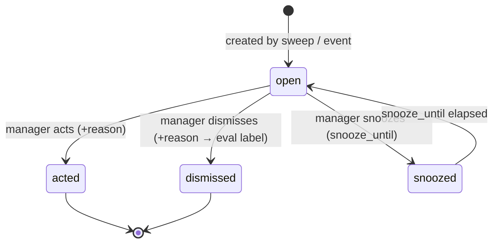
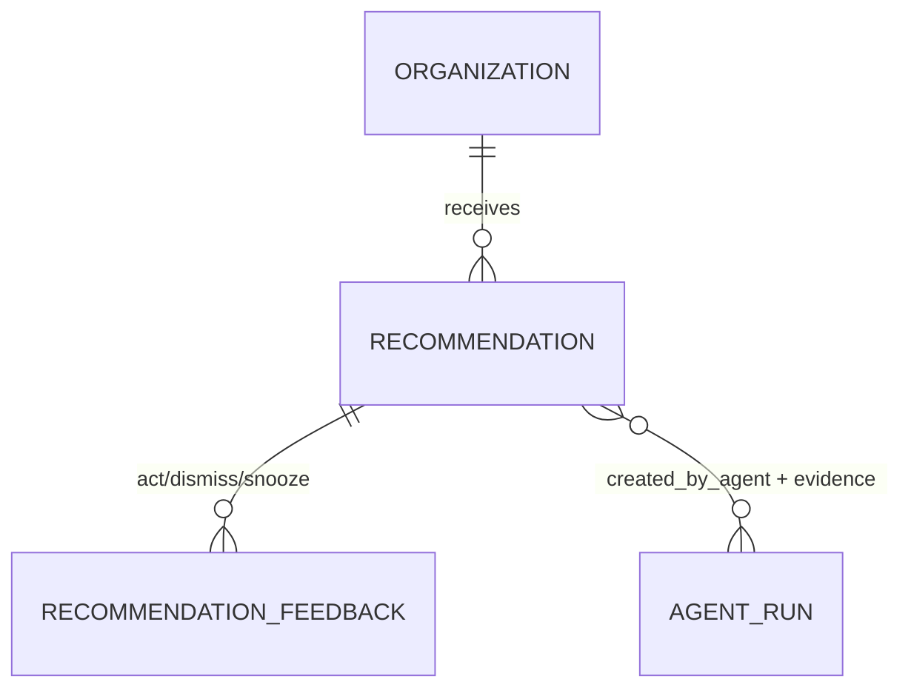
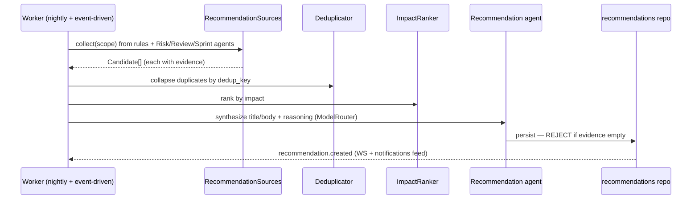

# Plan 15 — Recommendations Engine

> Turns agent findings and deterministic bottleneck rules into **actionable, ranked, de-duplicated
> recommendations**, each carrying its **why** (evidence + reasoning) at write time, and each with a
> lifecycle a manager can drive — **open → acted / dismissed / snoozed** — whose feedback feeds the eval
> loop. Sources are the bottleneck rule engine ([06 — GitHub](./06-github.md)) plus the Risk, Review, and
> Sprint agents ([13](./13-ai-agents.md)); the Recommendation agent synthesizes, impact-ranks, and
> collapses duplicates into `recommendations` rows. A recommendation with empty evidence is a bug the
> write path rejects. This plan implements [07 §6/§9](../07-ai-architecture.md#6-explainability-by-construction-nfr-explain).

| | |
|---|---|
| **Status** | Draft v1 |
| **Phase** | Phase 2 — Insight (see [Roadmap](./00-roadmap-and-phasing.md)) |
| **Owner** | AI / Platform Eng |
| **Satisfies** | `FR-REC-01`, `FR-REC-02`, `FR-REC-03` · supports `NFR-EXPLAIN`, `NFR-ISO`, `NFR-COST` |
| **Depends on** | [13 — AI Agents](./13-ai-agents.md) (Risk/Review/Sprint/Recommendation agents, `ModelRouter`, `agent_runs`), [06 — GitHub](./06-github.md) (bottleneck rules), [05 — Event Pipeline](./05-event-pipeline.md) (worker sweeps), [03 — RBAC](./03-rbac.md) (scope) |
| **Nx projects** | `libs/recommendations` (`@eos/recommendations`, `scope:backend`/`type:feature`) — sources, ranking, de-dup, lifecycle; consumes `@eos/backend-core`, `@eos/database`, `@eos/events`, `@eos/ai` (Recommendation agent), `@eos/contracts`, `@eos/shared-enums`. Nightly sweep on `apps/worker`; feed/action HTTP surface in `apps/api`. |

---

## 1. Goal & scope

- **In scope:** recommendation **sources** — the deterministic bottleneck rule engine ([06 §5](../06-github.md)) and the Risk/Review/Sprint agents ([13](./13-ai-agents.md)); **impact ranking**; **de-duplication** across sources; the **why** stored with each row (`evidence` jsonb = event ids/projections + reasoning chain + `created_by_agent`, `FR-REC-02`); the **lifecycle** (`open`/`acted`/`dismissed`/`snoozed`) with **feedback capture** feeding evals (`FR-REC-03`); the nightly sweep as a worker job and event-triggered incremental updates; the feed/action API.
- **Out of scope:** the agents that *produce* findings ([13](./13-ai-agents.md)); the projections/rules that *detect* bottlenecks ([06](./06-github.md)); the recommendations **UI** and Why-drawer rendering ([16 — Dashboards](./16-dashboards.md)); notification delivery of recs ([17 — Notifications](./17-notifications.md)).
- **Anti-goals:** no recommendation without evidence, no cross-tenant leakage, no outward action taken automatically (an "acted" transition is a human choice, not an AI side effect) ([Vision §4](../00-vision-and-scope.md#4-what-we-are-not-building-anti-goals), [07 §1](../07-ai-architecture.md#1-principles-non-negotiable)).

## 2. User stories

- `As an Engineering Manager, I want "Backend team has 14 pending reviews" surfaced with the PRs behind it, so that I can act on a concrete, evidenced problem.` — `FR-REC-01`, `FR-REC-02`
- `As a Team Lead, I want each recommendation to show its why — the events and the reasoning, so that I can verify before acting.` — `FR-REC-02`, `NFR-EXPLAIN`
- `As a manager, I want the top few recommendations by impact, not fifty near-duplicates, so that my attention goes to what matters.` — `FR-REC-03`
- `As a manager, I want to dismiss, act on, or snooze a recommendation with a reason, so that the feed reflects reality and the system learns.` — `FR-REC-03`
- `As a CTO, I want a "sprint completion probability dropped to 63%" recommendation the moment the Sprint agent detects it, so that risk surfaces early.` — `FR-REC-01`
- `As the AI team, I want dismissed/acted feedback captured as labels, so that ranking and prompts improve over time.` — `FR-REC-03`, [07 §9](../07-ai-architecture.md#9-evaluation)

## 3. Domain model

Owns `recommendations` from [04 §7](../04-data-model.md#7-ai--knowledge-tables); adds ranking/de-dup/feedback columns. Tenant-scoped (`organization_id`, `TenantModel`, [04 §9](../04-data-model.md#9-sequelize-conventions)).

| Table | Key columns | Sensitivity | Notes |
|-------|-------------|-------------|-------|
| `recommendations` | `id`, `organization_id`, `scope` (jsonb: team/project/user window), `type`, `title`, `body`, `impact_score` (int), `status` (`open`/`acted`/`dismissed`/`snoozed`), **`evidence` (jsonb: event ids + projections + reasoning)**, `created_by_agent`, `dedup_key`, `snooze_until?`, `created_at`, `updated_at` | P2 | empty `evidence` **rejected** by the write path ([07 §6](../07-ai-architecture.md#6-explainability-by-construction-nfr-explain)); `dedup_key` collapses cross-source duplicates |
| `recommendation_feedback` | `id`, `organization_id`, `recommendation_id`, `actor_user_id`, `action` (`act`/`dismiss`/`snooze`), `reason?`, `created_at` | P2 | one row per lifecycle transition; the label stream feeding evals (`FR-REC-03`) |

The `evidence` jsonb is the load-bearing "why" ([07 §6](../07-ai-architecture.md#6-explainability-by-construction-nfr-explain)) — the same `Evidence` shape agents emit ([13 §3](./13-ai-agents.md#3-domain-model)), so a rec's citations survive from source to feed:

```jsonc
// recommendations.evidence — written WITH the row, never reconstructed
{
  "eventIds": ["01J…pr.review_requested", "01J…pr.idle"],   // canonical events
  "projections": ["pr_metrics:team-backend:2026-07", "reviewer_load:u-42"],
  "reasoning": "14 PRs exceed the 48h review wait; 3 reviewers carry 80% of load → backlog is a reviewer-capacity problem, not author throughput."
}
```

New enums in `@eos/shared-enums`: `RecommendationType` (`review_backlog`, `stale_pr`, `sprint_risk`, `reviewer_overload`, `blocked_work`, `meeting_overload`, …), `RecommendationStatus`, `FeedbackAction`. New `EventType`s: `recommendation.created`, `recommendation.status_changed`, `recommendation.feedback_recorded`.

The `status` lifecycle a manager drives (`FR-REC-03`) — `snooze_until` reopens a snoozed rec automatically:





## 4. Architecture & flow

`@eos/recommendations` is a NestJS feature lib providing `RecommendationsModule`. It depends **down** on `@eos/backend-core`, `@eos/database` (repositories only), `@eos/events`, and `@eos/ai` (the Recommendation agent + `ModelRouter`); no sibling-to-sibling coupling ([10 §3](../10-shared-packages-and-boundaries.md#3-the-layered-dag)). Two triggers: a **nightly sweep** (BullMQ, batched — `NFR-COST`) and **event-driven incremental** updates when a source agent or rule emits a fresh finding ([05](./05-event-pipeline.md)). `nx graph` confirms no cross-boundary/cyclic edges.

**Ports introduced** (interfaces in `@eos/recommendations`):

| Port | Contract | Default adapter |
|------|----------|-----------------|
| `RecommendationSource` | `collect(scope): Candidate[]` — a candidate carries type, scope, impact signals, and evidence | bottleneck rules ([06](./06-github.md)); Risk/Review/Sprint agents ([13](./13-ai-agents.md)) |
| `Deduplicator` | `collapse(Candidate[]): Candidate[]` — merges by `dedup_key`, keeps richest evidence | rule-based key + agent-assisted merge |
| `ImpactRanker` | `rank(Candidate[]): Ranked[]` — orders by estimated impact | signal-weighted score, tie-broken by recency |
| `RecommendationWriter` | `persist(Ranked[])` — rejects empty evidence | writes `recommendations` + emits events |



The Recommendation agent ([07 §2](../07-ai-architecture.md#2-agent-fleet)) composes the human-readable title/body and the reasoning chain over the deterministic candidates — it never invents evidence; it explains the evidence the sources supplied. Each write carries `created_by_agent` and the source's `agent_runs` reference so the row and its cost/audit stay joined ([07 §6](../07-ai-architecture.md#6-explainability-by-construction-nfr-explain)).

**How ranking and de-dup decide the feed:**

| Stage | Input → output | Rule |
|-------|----------------|------|
| **Collect** | rules + agents → `Candidate[]` | each candidate carries type, scope, impact signals, and non-empty evidence |
| **De-dup** | `Candidate[]` → collapsed | group by `dedup_key` (type + scope + subject); keep the union of evidence, the strongest signals |
| **Rank** | collapsed → `Ranked[]` | `impact_score` = signal-weighted (blocked-work count, PR-wait hours, probability drop, staleness); recency breaks ties |
| **Write** | `Ranked[]` → `recommendations` | `upsertByDedupKey` — an existing open rec is updated, not duplicated; empty evidence rejected |

`impact_score` is stored so the feed sorts deterministically and the score is auditable — the same "why is this ranked here" guarantee the rest of the platform gives ([04 §6](../04-data-model.md#6-projections-read-models)). Weights are tuned against the acted/dismissed label stream (§7).

```ts
// The write path is the explainability invariant made concrete: no evidence, no row.
async persist(rec: RankedRecommendation): Promise<void> {
  if (!rec.evidence?.reasoning || evidenceIsEmpty(rec.evidence)) {
    throw new EmptyEvidenceError(rec);           // FR-REC-02 / NFR-EXPLAIN — a bug, not a warning
  }
  await this.repo.upsertByDedupKey({ ...rec, organizationId: ctx.organizationId });
  await this.events.emit('recommendation.created', rec.id);
}
```

## 5. API & realtime surface

All under `/api/v1`; zod schemas in `@eos/contracts`. `organizationId` from auth context, never client input; results scoped to the actor's RBAC window ([06 §3.2](../06-security-privacy-consent.md#32-rbac--the-more-restrictive-wins-rule)).

| Method + path | Purpose | RBAC permission | FR |
|---------------|---------|-----------------|-----|
| `GET  /recommendations` | ranked, de-duplicated open feed (scoped) | `recommendation:read:<scope>` | `FR-REC-01`, `FR-REC-03` |
| `GET  /recommendations/:id` | one rec with its full `evidence` (the Why) | `recommendation:read` + ownership | `FR-REC-02` |
| `POST /recommendations/:id/act` | mark acted (+ optional reason) | `recommendation:act:<scope>` | `FR-REC-03` |
| `POST /recommendations/:id/dismiss` | dismiss (+ reason → eval label) | `recommendation:act:<scope>` | `FR-REC-03` |
| `POST /recommendations/:id/snooze` | snooze until a time | `recommendation:act:<scope>` | `FR-REC-03` |

**Realtime:** `recommendation.created` and `recommendation.status_changed` push to the manager's WS room so the feed updates live ([05 §5](../05-api-and-realtime.md#5-realtime)). Individual drilldown into a rec's evidence is a P2 read — audited ([06 §7](../06-security-privacy-consent.md#7-audit-logging-fr-ent-01)).

## 6. AI involvement (if any)

The **Recommendation agent** ([07 §2](../07-ai-architecture.md#2-agent-fleet)) synthesizes candidates into ranked, de-duplicated rows; the Risk/Review/Sprint agents are upstream **sources**. Evidence cited per rec: contributing event ids + projection rows + the reasoning chain, rendered by the **Why** affordance — the cited events deep-link into the [Daily Timeline](./12-daily-timeline.md) (`FR-TL-03`). Synthesis uses the `ModelRouter` (task class = standard reasoning, `claude-sonnet-5`; Risk correlation may escalate to `claude-opus-4-8`, [13 §7](./13-ai-agents.md#7-security-privacy--consent)). **No outward action** is taken — a recommendation is a proposal; acting on it is a human transition, and any *outward* follow-up (e.g. notify a reviewer) goes through the human-approval gate ([13](./13-ai-agents.md), `FR-AI-04`).

## 7. Security, privacy & consent

- **Tenant isolation + RBAC (`NFR-ISO`).** Sources read only through scoped repositories; the feed returns only the actor's `own`/`team`/`dept` window ([06 §3](../06-security-privacy-consent.md#3-authorization-tenant-isolation--rbac-nfr-iso-fr-rbac)). A cross-tenant read is a CI fixture that fails closed.
- **Explainability (`NFR-EXPLAIN`, `FR-REC-02`).** `evidence` is written **with** the row at creation, never reconstructed; the write path rejects empty evidence. Mirrors the projection `derived_from` guarantee ([04 §6](../04-data-model.md#6-projections-read-models)).
- **Team-over-individual framing.** Recommendations frame flow and blockers, not people; no individual productivity score or ranking ([06 §5](../06-security-privacy-consent.md#5-privacy-engineering-nfr-privacy)). Aggregate/HR-scoped consumers read P0–P2 only, pseudonymized.
- **Audit (`FR-ENT-01`).** Every lifecycle transition (`act`/`dismiss`/`snooze`) and any individual-evidence drilldown is audited with actor + resource ([06 §7](../06-security-privacy-consent.md#7-audit-logging-fr-ent-01)).
- **Cost (`NFR-COST`).** The nightly sweep is batched on the worker; near the org budget cap the sweep down-routes synthesis (Sonnet→Haiku) and reduces breadth rather than overspending ([07 §7.3](../07-ai-architecture.md#73-budget-cap--enforcement)).
- **Feedback loop.** Dismiss/act/snooze become labels: dismissed recs feed the de-dup/ranking model and surface prompt/retrieval regressions; acted-on ones become positive examples. The loop closes on the lagging outcomes the product exists to move — PR review-wait, stale-PR age, sprint predictability ([07 §9](../07-ai-architecture.md#9-evaluation), [00 §7](../00-vision-and-scope.md#7-success-metrics)).

## 8. Implementation plan (phased tasks)

Ordered, each a small PR in `@eos/recommendations` (+ migration, contract schema) unless noted.

1. **Migrations + repositories** for `recommendations` (ranking/dedup/feedback columns) and `recommendation_feedback`. *Accept:* migrations run in CI; each repo ships a tenant-isolation test (§9).
2. **`RecommendationWriter` + empty-evidence rejection** + `recommendation.created` emit. *Accept:* a write with empty evidence throws; a valid write persists + emits.
3. **`RecommendationSource` (bottleneck rules)** adapter producing candidates with evidence. *Accept:* a stale-PR rule yields a candidate whose evidence resolves to real PR event ids.
4. **`RecommendationSource` (Risk/Review/Sprint agents)** adapters over [13](./13-ai-agents.md). *Accept:* a Sprint-risk finding becomes a candidate with the ticket ids behind it.
5. **`Deduplicator`** (dedup_key collapse, richest-evidence merge). *Accept:* two sources reporting the same review backlog collapse to one rec.
6. **`ImpactRanker`** (signal-weighted score) + ranked feed endpoint. *Accept:* the feed returns top-N by impact, not near-duplicates.
7. **Recommendation agent synthesis** (title/body/reasoning via `ModelRouter`) + nightly sweep worker job. *Accept:* synthesized rows carry `created_by_agent` + reasoning; sweep is batched/budget-aware.
8. **Lifecycle + feedback** (`act`/`dismiss`/`snooze` endpoints, `recommendation_feedback`, audit + eval label emit). *Accept:* transitions persist, audit, and emit `recommendation.feedback_recorded`; snoozed recs reappear after `snooze_until`.

## 9. Testing (`unit` / `integration` / `e2e`)

Per [09 — Testing Strategy](../09-testing-strategy.md). Deterministic — injected `clock`, stubbed sources + `ModelRouter`, no real provider calls in CI.

- **Unit:** empty-evidence rejection; dedup_key collapse; impact ranking order + recency tie-break; snooze expiry (`snooze_until` → reopen); feedback→label mapping.
- **Integration (Testcontainers PG/Redis, real migrations):**
  - **Tenant isolation (`NFR-ISO`) — mandatory:** the feed for org A MUST never contain org B recs; cross-tenant fixture fails closed ([09 §5.1](../09-testing-strategy.md#51-tenant-isolation-nfr-iso--mandatory-pattern)).
  - **RBAC scope:** a Team-Lead feed shows only team-scoped recs; org-wide recs excluded.
  - **Evidence invariant (negative, `FR-REC-02`):** a candidate with empty evidence is rejected at the write path; nothing persists.
  - **De-dup (`FR-REC-03`):** two sources emitting the same backlog produce exactly one rec with merged evidence.
  - **Lifecycle:** act/dismiss/snooze persist + audit; a snoozed rec reappears after expiry; feedback rows written.
  - **Idempotent sweep:** re-running the nightly sweep on unchanged data upserts by `dedup_key` — no duplicate rows.
- **E2E (Playwright, mocked model):** manager opens the feed → expands a rec's **Why** (evidence deep-links to the timeline) → dismisses with a reason → rec leaves the open feed and a feedback label is recorded.

## 10. Observability

Per [deployment/03 — Observability](../deployment/03-observability.md). Structured log per sweep (`{ correlationId, orgId, candidates, deduped, persisted, costMicros }`) and per transition (`{ orgId, recId, from, to, actor }`). Metrics: `recommendations_created_total{type}`, `recommendations_dedup_ratio`, `recommendation_status_total{status}`, `recommendation_usefulness_rate` (acted+useful / total — target ≥ 50%, [00 §7](../00-vision-and-scope.md#7-success-metrics)), `recommendation_feedback_total{action}`, sweep `costMicros`. **Alerts:** usefulness rate below target for an org (prompt/ranking regression); dedup ratio collapse (near-duplicate flood); sweep cost anomaly. Sentry captures sweep-job failures with `correlationId`.

## 11. Acceptance criteria

- [ ] Recommendations are produced from bottleneck rules **and** the Risk/Review/Sprint agents. — `FR-REC-01`
- [ ] Every recommendation includes its **why** — evidence (event ids/projections) + reasoning; empty-evidence writes are rejected. — `FR-REC-02`, `NFR-EXPLAIN`
- [ ] Recommendations are ranked by impact and de-duplicated across sources. — `FR-REC-03`
- [ ] Managers can act / dismiss / snooze with a reason; feedback is captured as eval labels. — `FR-REC-03`
- [ ] The feed is tenant- and RBAC-scoped; cross-tenant and scope negative tests pass in CI. — `NFR-ISO`, `FR-RBAC-03`
- [ ] The nightly sweep is batched and budget-aware; usefulness rate is measured against the ≥ 50% target. — `NFR-COST`, [00 §7](../00-vision-and-scope.md#7-success-metrics)

## 12. Risks & open questions

| Risk / question | Mitigation / decision |
|---|---|
| Over-recommending (alert fatigue) drops usefulness rate | Aggressive de-dup + impact ranking; cap feed breadth; feed dismiss signals back into ranking ([07 §9](../07-ai-architecture.md#9-evaluation)). |
| Impact score miscalibrated across sources | Signal-weighted score tuned on acted/dismissed labels; usefulness-rate alert catches regressions. |
| Duplicate recs from rules and agents describing the same problem | Shared `dedup_key` derivation across sources; agent-assisted merge keeps richest evidence. |
| Nightly sweep cost on large orgs | Batched worker jobs, budget-aware down-routing of synthesis; incremental event-driven updates reduce sweep load ([07 §7.3](../07-ai-architecture.md#73-budget-cap--enforcement)). |
| Snooze/act semantics unclear to users | Explicit lifecycle states + reason capture; UI copy defined in [16](./16-dashboards.md). |
| **Open:** should acting on a rec optionally trigger an outward action (notify reviewer)? | Proposed: yes, but only via the human-approval gate ([13](./13-ai-agents.md), `FR-AI-04`) — confirm the UX with product. |

---

_Next: [16 — Dashboards](./16-dashboards.md)_
