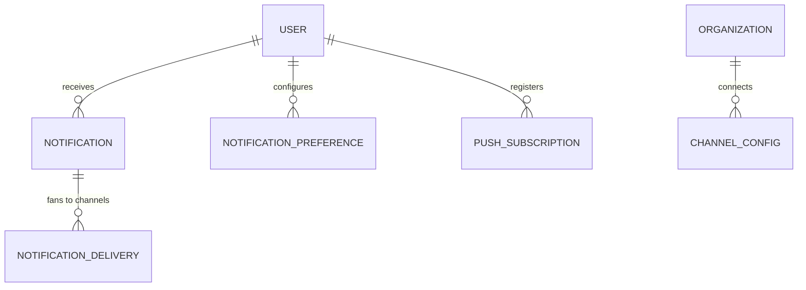

# Plan 17 — Notifications

> Delivers the right nudge to the right person on the channel they chose — **Teams, Slack, Email, or Web
> Push** — behind a single `NotificationChannel` port so a new channel is one adapter. Triggers fire from
> events and thresholds (PR pending > 48h, task overdue, sprint risk, deploy failure, meeting reminder,
> review request); every send respects the user's **channels, quiet hours, and per-type opt-out**, is
> **deduplicated and rate-limited**, rendered from per-type/per-channel **templates**, and tracked
> per-attempt with **retries**. Nothing is delivered that the recipient isn't authorized to see.

| | |
|---|---|
| **Status** | Draft v1 |
| **Phase** | Phase 2 — Insight (see [Roadmap](./00-roadmap-and-phasing.md)) |
| **Owner** | Platform / Integrations Eng |
| **Satisfies** | `FR-NOT-01`, `FR-NOT-02`, `FR-NOT-03` (from [PRD](../01-product-requirements.md)) |
| **Depends on** | [05 — Event Pipeline](./05-event-pipeline.md) (trigger events); [06 — GitHub](./06-github-integration.md) / [07 — Jira](./07-jira-sprints.md) / [09 — Calendar](./09-calendar.md) (signal sources); [03 — RBAC](./03-rbac.md); [08 — Teams](./08-teams-integration.md) (bot post-back); [01 — Auth](./01-authentication.md) (recipient identity) |
| **Nx projects** | `libs/backend/notifications` (`@eos/notifications`, `scope:backend`/`type:feature`) + BullMQ processors in `apps/worker` · frontend prefs in `libs/frontend/feature-settings` (`@eos/feature-settings`) + a Web-Push service worker in `apps/web` · consumes `@eos/backend-core`, `@eos/database`, `@eos/events`, `@eos/contracts`, `@eos/shared-enums` (see [10 — Boundaries](../10-shared-packages-and-boundaries.md)) |

---

## 1. Goal & scope

- **In scope:** the `NotificationChannel` port + Teams/Slack/Email/Web-Push adapters (`FR-NOT-01`); a
  **trigger layer** that turns events + threshold sweeps into notification intents (`FR-NOT-02`); user
  **preferences** — channel selection, quiet hours, per-type opt-out (`FR-NOT-03`); per-type/per-channel
  **templating**; **delivery tracking + retries** with backoff; **dedup + rate-limiting**; the in-app
  notification **bell** (WS-pushed) and preferences UI.
- **Out of scope:** the source integrations that emit the events (they are dependencies); the AI that
  *decides* a recommendation exists ([13](./13-ai-agents.md)/[15](./15-recommendations.md)) — notifications
  only *deliver*; report scheduling reuses this module's channels but lives in [18](./18-reports.md).
- **Anti-goals:** no notifying a manager about a signal an employee didn't consent to; no channel that
  bypasses quiet hours/opt-out; no unsolicited outward AI message without a human-approval gate
  ([Vision §4](../00-vision-and-scope.md#4-what-we-are-not-building-anti-goals), `FR-ENT-08`).

## 2. User stories

- `As an Employee, I want a nudge when a PR is waiting on my review, so that I unblock a teammate fast.` — `FR-NOT-02`
- `As a reviewer, I want to be told when a PR I own has sat > 48h, so that stale reviews don't slip.` — `FR-NOT-02`
- `As a Team Lead, I want a sprint-risk alert, so that I act before the sprint slips.` — `FR-NOT-02`
- `As a DevOps engineer, I want an immediate deploy-failure notification, so that I respond to incidents.` — `FR-NOT-02`
- `As any user, I want to pick my channels and set quiet hours, so that I'm not paged at 2am.` — `FR-NOT-03`
- `As any user, I want to mute a notification type I don't care about, so that the signal stays high.` — `FR-NOT-03`
- `As an admin, I want failed deliveries retried and visible, so that a Slack outage doesn't silently drop alerts.` — `FR-NOT-01`

## 3. Domain model

`notifications` already exists ([04 §8](../04-data-model.md#8-integration--consent-tables)); this plan adds
the tables below (all tenant-scoped, `TenantModel`, [04 §9](../04-data-model.md#9-sequelize-conventions);
sensitivity per [06 §1](../06-security-privacy-consent.md#1-data-classification-p0p4)).

| Table | Key columns | Sensitivity | Notes |
|-------|-------------|-------------|-------|
| `notifications` (extended) | `id`, `organization_id`, `recipient_user_id`, `type`, `title`, `body`, `resource_ref` (jsonb), `dedup_key`, `read_at?`, `created_at` | P2–P3 | one logical notification; fans to ≥1 channel delivery |
| `notification_deliveries` | `id`, `organization_id`, `notification_id`, `channel`, `status`, `attempts`, `provider_msg_id?`, `error?`, `next_retry_at?`, `sent_at?` | P2 | **per-channel** attempt record (`FR-NOT-01`) |
| `notification_preferences` | `id`, `organization_id`, `user_id`, `type?` (null = default), `channel`, `enabled`, `quiet_hours` (jsonb: `{tz, from, to, days}`) | P2 | channels + quiet hours + per-type opt-out (`FR-NOT-03`) |
| `push_subscriptions` | `id`, `organization_id`, `user_id`, `endpoint`, `p256dh`, `auth`, `ua`, `revoked_at?` | P3 | Web-Push (VAPID) browser subscriptions |
| `channel_configs` | `id`, `organization_id`, `channel`, `config` (jsonb), `oauth_token_ref?` | P4 (token) | org-level Slack/Teams workspace + email-from config; tokens in `oauth_tokens` |

New enums in `@eos/shared-enums`: `NotificationType` (`pr_pending` | `task_overdue` | `sprint_risk` |
`deploy_failure` | `meeting_reminder` | `review_request`), `NotificationChannel`
(`teams` | `slack` | `email` | `web_push` | `in_app`), `DeliveryStatus`
(`queued` | `sent` | `delivered` | `failed` | `suppressed` | `dead`). New `EventType`s:
`notification.created`, `notification.delivered`, `notification.failed`, `notification.read`.



## 4. Architecture & flow

`@eos/notifications` depends **down** on `@eos/backend-core`, `@eos/database` (repositories), `@eos/events`
(consumes trigger events, emits `notification.*`), and `@eos/contracts`; it imports **no sibling** feature
lib. Delivery runs on `apps/worker` (BullMQ), so a provider hiccup never blocks the API
([03 §4](../03-system-architecture.md#4-c4--level-2-containers)).

**Ports introduced** (interfaces in `@eos/backend-core`; adapters wired in `apps/api`/`apps/worker`):

| Port | Contract | Adapters |
|------|----------|----------|
| `NotificationChannel` | `channel`, `capabilities`, `render(intent, tmpl)`, `deliver(rendered, target): Promise<DeliveryResult>` | `TeamsChannel` (bot/Graph), `SlackChannel` (Web API/blocks), `EmailChannel` (transactional), `WebPushChannel` (VAPID) — the port [03 §8](../03-system-architecture.md#8-how-a-new-integrationagent-plugs-in-extensibility) names |
| `NotificationTrigger` | `type`, `subscribes: EventType[] \| Schedule`, `evaluate(ctx): Intent[]` | one per trigger (§4.2) |
| `TemplateRenderer` | `render(type, channel, locale, data)` | MJML/handlebars → channel-native payload |

```mermaid
sequenceDiagram
  participant E as Event bus / Scheduler
  participant T as Trigger layer
  participant P as Pipeline (dedup→prefs→quiet→rate)
  participant Q as BullMQ (per-channel)
  participant Ch as NotificationChannel adapter
  E->>T: pr.review.requested / hourly sweep
  T->>P: Intent { recipient, type, resourceRef, dedupKey }
  P->>P: dedup? opted-out? quiet hours? rate-limited?
  P->>Q: enqueue delivery per enabled channel
  Q->>Ch: render(template) + deliver(target)
  Ch-->>Q: DeliveryResult (ok / retryable / permanent)
  Q->>P: update notification_deliveries (+ emit notification.delivered/failed)
  Note over P,Q: retryable → backoff re-enqueue; permanent → dead
```

### 4.1 The delivery pipeline (order matters, fail-closed)

An `Intent` passes gates in order; the **first block wins** and is recorded (`suppressed`) for observability:

1. **Authorization** — the recipient MUST be entitled to the referenced resource ([02 §2.3](../02-personas-and-rbac.md#23-enforcement-server-side-always)); a notification never reveals a resource the recipient couldn't read in-app.
2. **Consent** — if the trigger derives from a collected signal, the subject's consent MUST be active (`NFR-CONSENT`); else drop.
3. **Dedup** — `dedup_key = hash(org, recipient, type, resourceId)`; a duplicate within the type's window is suppressed (`FR-NOT-03`).
4. **Preferences** — per-type opt-out and channel selection applied; disabled → no delivery for that channel.
5. **Quiet hours** — inside the user's window a **non-urgent** notification is deferred to the window's end; `deploy_failure` (urgent) MAY override per preference.
6. **Rate limit** — token-bucket per `(user, type)` and per `(org, channel)` in Redis ([05 §9](../05-api-and-realtime.md#9-rate-limiting)); over-budget coalesces into a digest.

### 4.2 Triggers (`FR-NOT-02`)

| Trigger | Kind | Source | Notes |
|---------|------|--------|-------|
| PR pending > 48h | scheduled sweep | `pr_metrics` + `STALE_PR_HOURS` ([shared-constants](../10-shared-packages-and-boundaries.md#21-shared--the-leaf-layer-framework-agnostic-universal)) | hourly; dedup so it fires once per PR/threshold |
| Task overdue | scheduled sweep | `sprint_metrics` | daily + on due-date crossing |
| Sprint risk | event | `recommendation.created` (Sprint agent) | AI-derived → human-approval gate if outward-initiated (§6) |
| Deploy failure | event | `github.deploy.failed` / DORA | **urgent**; may override quiet hours |
| Meeting reminder | scheduled | `calendar.*` | fires N min before; N is a preference |
| Review request | event | `github.review.requested` | to the requested reviewer |

Threshold triggers run as **idempotent** worker sweeps keyed by `dedup_key` so a re-run never double-sends;
event triggers consume the bus at-least-once and dedup makes redelivery harmless (`FR-EVT-02`).

## 5. API & realtime surface

Under `/api/v1`; zod schemas in `@eos/contracts`, canonical envelope ([05 §3](../05-api-and-realtime.md#3-envelope-errors-and-auth-on-the-wire)).

| Method + path | Purpose | Permission | FR |
|---------------|---------|------------|-----|
| `GET /api/v1/notifications` | list own (cursor-paginated), unread first | own | `FR-NOT-01` |
| `POST /api/v1/notifications/{id}/read` | mark read (idempotent) | own | `FR-NOT-01` |
| `GET/PUT /api/v1/notification-preferences` | read/update channels, quiet hours, per-type opt-out | own | `FR-NOT-03` |
| `POST /api/v1/notifications/push-subscriptions` · `DELETE …/{id}` | register/revoke Web-Push endpoint | own | `FR-NOT-01` |
| `POST /api/v1/notifications/test` | send a test to a chosen channel | own | `FR-NOT-01` |
| `PUT /api/v1/orgs/channel-configs/{channel}` | connect org Slack/Teams/email | `integration:manage` | `FR-NOT-01` |

- **Realtime.** In-app notifications push to `org:{orgId}:notifications:{userId}`
  ([05 §5.1](../05-api-and-realtime.md#51-channel--room-model)) as `notification.created`; read-state syncs
  via `notification.read` so the bell badge stays consistent across a user's tabs/devices.
- **Inbound channel callbacks** (Slack interactivity, Teams bot activity) arrive at
  `/api/v1/webhooks/{provider}` with **mandatory signature verification** before parsing
  ([05 §6.2](../05-api-and-realtime.md#62-inbound-webhooks-github--jira--teams-fr-gh-06)); writes carry an
  `Idempotency-Key`.

## 6. AI involvement (if any)

Notifications are mostly **deterministic** (thresholds/events). The **AI touch-point** is when a trigger's
source is an agent-produced `recommendation` (sprint risk): the *insight* is grounded elsewhere
([07 §6](../07-ai-architecture.md#6-explainability-by-construction-nfr-explain)) and the notification carries
a link to its `evidence`. Because a notification is an **outward action**, any **AI-initiated** send (e.g. a
Copilot proposing "notify the team") is **proposed, not executed** — it queues for **human approval**
(`FR-ENT-08`, `FR-AI-04`, [07 §8](../07-ai-architecture.md#8-guardrails--safety)). Rule/threshold triggers
the user has configured are user-consented system notifications and need no per-send approval.

## 7. Security, privacy & consent

- **Consent (`NFR-CONSENT`).** A trigger reading a collected signal (focus, calendar) MUST check active
  consent before notifying; revoked consent stops derived notifications within the same 1-minute guarantee.
- **Authorization.** The delivery pipeline re-checks the recipient's entitlement to the referenced resource
  ([02 §2.3](../02-personas-and-rbac.md#23-enforcement-server-side-always)) — a notification is never a side
  channel to leak a PR/ticket the recipient couldn't open in-app; **content is minimized** (title + safe
  summary + deep link, not sensitive body).
- **Channel secrets (P4).** Slack/Teams tokens and Web-Push VAPID keys live in the secret manager /
  `oauth_tokens` ([06 §6](../06-security-privacy-consent.md#6-secrets-management-nfr-sec)); `push_subscriptions`
  auth keys are P3, never serialized back.
- **Quiet hours & opt-out are enforced server-side**, not just hidden in the UI — the pipeline drops/defers
  before enqueue.
- **Audit (`FR-ENT-01`).** Channel-config changes and test sends are audited; delivery records are the
  operational trail. Reference [06 — Security, Privacy & Consent](../06-security-privacy-consent.md).

## 8. Implementation plan (phased tasks)

1. **Schema + repositories** for `notification_deliveries`, `notification_preferences`, `push_subscriptions`,
   `channel_configs`; extend `notifications`. *Accept:* migrations run in CI; each repo has a tenant-isolation
   test (§9).
2. **`NotificationChannel` port + `EmailChannel` + in-app** (bell) with `notification.created` WS push.
   *Accept:* an intent renders + delivers via email; bell updates live.
3. **Delivery pipeline** (dedup→prefs→quiet→rate) + BullMQ per-channel queues with backoff retries + dead-letter.
   *Accept:* opted-out/quiet/duplicate intents are suppressed and recorded; a retryable failure retries, a
   permanent one goes `dead`.
4. **Preferences API + `@eos/feature-settings` UI** (channels, quiet hours, per-type opt-out). *Accept:*
   changes take effect on the next trigger; server enforces, not just the UI.
5. **`SlackChannel` + `TeamsChannel`** (blocks/adaptive cards, signed inbound callbacks) + org `channel_configs`.
   *Accept:* signature-verified callbacks; org connect flow.
6. **`WebPushChannel`** (VAPID) + service worker + subscription register/revoke. *Accept:* push arrives;
   revoked/expired endpoints are pruned on `410 Gone`.
7. **Triggers** — review request, deploy failure (event) + PR-pending/task-overdue/meeting-reminder
   (scheduled sweeps) + sprint-risk (recommendation). *Accept:* each fires once per dedup window; sweeps are
   idempotent.

## 9. Testing (`unit` / `integration` / `e2e`)

Per [09 — Testing Strategy](../09-testing-strategy.md). Deterministic — injected `clock`, stubbed channel
adapters, no real Slack/Teams/SMTP/push.

- **Unit:** pipeline gate order (auth→consent→dedup→prefs→quiet→rate) with the **first block winning**;
  quiet-hours math across timezones/DST; dedup-key stability; rate-limit bucket; template rendering per
  channel; retry/backoff state machine (retryable vs permanent → `dead`).
- **Integration (Testcontainers PG/Redis):**
  - **Tenant isolation (`NFR-ISO`) — mandatory:** cross-tenant negative test per new repo
    ([09 §5.1](../09-testing-strategy.md#51-tenant-isolation-nfr-iso--mandatory-pattern)).
  - **Authorization (negative, security-critical):** an intent for a resource the recipient can't read is
    **not** delivered.
  - **Consent (negative):** a signal-derived trigger with revoked consent produces no notification.
  - **Idempotent sweep:** running the PR-pending sweep twice sends once (dedup); at-least-once event
    redelivery does not double-send.
  - **Quiet hours / opt-out:** deferral and suppression happen server-side; urgent `deploy_failure` override
    honored only when the preference allows.
- **E2E (Playwright, mocked providers):** set prefs → trigger a review request → in-app bell + one channel
  delivery; mute the type → next trigger suppressed; register Web-Push → receive a test push.

## 10. Observability

Per [deployment/03 — Observability](../deployment/03-observability.md). Structured log per delivery
(`{ correlationId, orgId, recipientId, type, channel, status, attempts }`) — **no** notification body/PII
([05 §11](../05-api-and-realtime.md#11-api-observability-nfr-obs)). Metrics: `notification_sent_total{type,channel,status}`,
`notification_suppressed_total{reason}`, `notification_delivery_latency_ms`, `notification_retry_total`,
`notification_dead_total{channel}`. **Alerts:** sustained `failed`/`dead` rate on a channel (provider outage
or bad token), delivery-latency p95 regression. Sentry on adapter 5xx with `correlationId`.

## 11. Acceptance criteria

- [ ] Notifications deliver via Teams, Slack, Email, and Web Push behind one `NotificationChannel` port. — `FR-NOT-01`
- [ ] Triggers fire for PR pending > 48h, task overdue, sprint risk, deploy failure, meeting reminder, review request. — `FR-NOT-02`
- [ ] Users control channels, quiet hours, and per-type opt-out; enforced server-side. — `FR-NOT-03`
- [ ] Every delivery is dedup'd, rate-limited, tracked per channel, and retried with backoff (dead-letter on permanent failure). — `FR-NOT-01`
- [ ] No notification reveals a resource the recipient couldn't read; consent-gated triggers respect revocation. — `NFR-CONSENT`, RBAC
- [ ] AI-initiated outward notifications pass a human-approval gate. — `FR-ENT-08`
- [ ] Cross-tenant, authorization, and consent negative tests pass in CI. — `NFR-ISO`

## 12. Risks & open questions

| Risk / question | Mitigation / decision |
|---|---|
| Notification storm on a busy team | Per-`(user,type)` rate limit + coalesce into a **digest** past threshold; dedup per resource/threshold. |
| Provider outage drops alerts silently | Per-channel retries with backoff + dead-letter + failure-rate alert; in-app channel always succeeds as fallback. |
| Quiet-hours timezone/DST bugs | Store IANA tz + compute against it; DST-boundary unit tests; urgent override is explicit per preference. |
| Web-Push subscription churn (expired endpoints) | Prune on `404/410 Gone`; re-subscribe on next visit; never retry a gone endpoint. |
| Slack/Teams token expiry | Refresh via `oauth_tokens`; on hard failure mark channel `needs_reconnect` and surface in settings. |
| **Open:** which types default to urgent-override quiet hours? | Proposed: only `deploy_failure`; everything else defers — confirm with product. |

---

_Next: [18 — Reports](./18-reports.md)_
