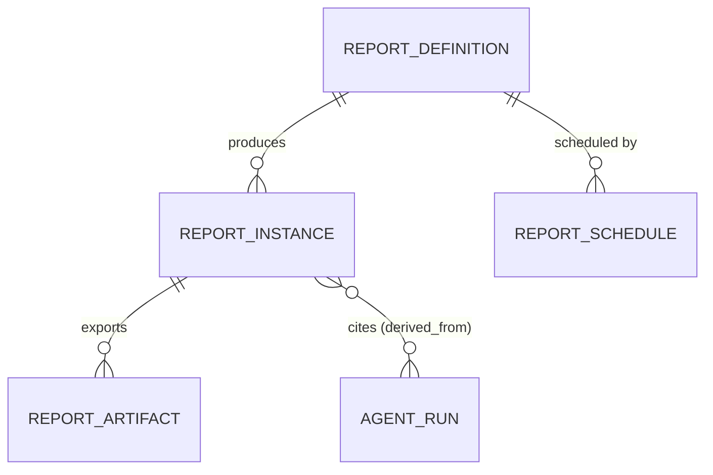

# Plan 18 — Reports

> Turns the platform's **projections** and **AI summaries** into shareable documents: Daily, Weekly,
> Sprint, Monthly, Engineering-Health, AI-Adoption, Productivity, Review-Analytics, and an **Executive
> Summary**. Reports are generated as **worker jobs** from read models plus grounded, **evidence-cited** AI
> narrative, **exportable** to PDF/CSV, and **schedulable** to email/Teams/Slack. Every report is RBAC-scoped
> — and HR only ever sees **aggregate** figures, never a named individual.

| | |
|---|---|
| **Status** | Draft v1 |
| **Phase** | Phase 3 — Reach (see [Roadmap](./00-roadmap-and-phasing.md)) |
| **Owner** | Product / Platform Eng |
| **Satisfies** | `FR-RPT-01`, `FR-RPT-02` (from [PRD](../01-product-requirements.md)) |
| **Depends on** | projections ([04 §6](../04-data-model.md#6-projections-read-models)); [13 — AI Agents](./13-ai-agents.md) & [15 — Recommendations](./15-recommendations.md) (grounded summaries); [17 — Notifications](./17-notifications.md) (delivery channels); [03 — RBAC](./03-rbac.md); [16 — Dashboards](./16-dashboards.md) (shared widgets/queries); S3 storage ([03 §4](../03-system-architecture.md#4-c4--level-2-containers)) |
| **Nx projects** | `libs/backend/reports` (`@eos/reports`, `scope:backend`/`type:feature`) + BullMQ processors in `apps/worker` · frontend `libs/frontend/feature-reports` (`@eos/feature-reports`) · consumes `@eos/backend-core`, `@eos/database`, `@eos/events`, `@eos/ai` (via port), `@eos/contracts`, `@eos/shared-enums` (see [10 — Boundaries](../10-shared-packages-and-boundaries.md)) |

---

## 1. Goal & scope

- **In scope:** the nine report types (`FR-RPT-01`); generation as **idempotent worker jobs** that read
  projections + call AI agents for grounded, cited narrative; **export** to PDF and CSV to S3 with signed
  download URLs; **scheduling** (cron per org) delivered via the [17 — Notifications](./17-notifications.md)
  channels (`FR-RPT-02`); RBAC scoping including **HR aggregate-only**; the report catalog/history UI.
- **Out of scope:** the projections and metrics themselves (dependencies); the agents that produce the
  narrative (owned by [13](./13-ai-agents.md)); the notification transport (owned by [17](./17-notifications.md)) —
  reports *use* it; live dashboards ([16](./16-dashboards.md)).
- **Anti-goals:** no report that hands HR an individual's activity; no AI narrative that isn't
  evidence-cited; no "surveillance report" ranking people ([Vision §4](../00-vision-and-scope.md#4-what-we-are-not-building-anti-goals), `NFR-EXPLAIN`).

## 2. User stories

- `As an Employee, I want a weekly summary of my own work, so that I can reflect and report up without a meeting.` — `FR-RPT-01`
- `As a Team Lead, I want a sprint report with velocity, burndown, and blockers, so that I run a data-grounded retro.` — `FR-RPT-01`
- `As a CTO, I want an Executive Summary of org delivery health + DORA + AI adoption, so that I brief the board.` — `FR-RPT-01`
- `As a manager, I want to schedule the weekly report to Slack every Monday, so that it arrives without me asking.` — `FR-RPT-02`
- `As anyone, I want to export a report to PDF/CSV, so that I can share or archive it.` — `FR-RPT-02`
- `As HR, I want aggregate engineering-health/wellbeing figures, so that I inform policy — without seeing any individual.` — `FR-RPT-01`, [02 §1.5](../02-personas-and-rbac.md#15-hr)

## 3. Domain model

Reports are a **read composition** over projections + AI outputs — rebuildable, so they carry provenance
(`NFR-EXPLAIN`). New tenant-scoped tables (`TenantModel`, [04 §9](../04-data-model.md#9-sequelize-conventions);
sensitivity [06 §1](../06-security-privacy-consent.md#1-data-classification-p0p4)):

| Table | Key columns | Sensitivity | Notes |
|-------|-------------|-------------|-------|
| `report_definitions` | `id`, `organization_id`, `type`, `name`, `scope` (`own`/`team`/`dept`/`org`/`agg`), `params` (jsonb: teamId, sprintId, window) | P2 | a configured report; `scope` bounds RBAC |
| `report_instances` | `id`, `organization_id`, `definition_id`, `status`, `window_from`, `window_to`, `derived_from` (jsonb: projection rows + `agent_runs` ids), `generated_at`, `error?` | P2–P3 | one generated run; `derived_from` is the "why" (`NFR-EXPLAIN`) |
| `report_artifacts` | `id`, `organization_id`, `instance_id`, `format` (`pdf`/`csv`/`json`), `storage_key`, `bytes`, `checksum` | P2–P3 | export files in S3; served via signed URL |
| `report_schedules` | `id`, `organization_id`, `definition_id`, `cron`, `timezone`, `channels` (jsonb), `recipients`, `enabled`, `last_run_at?` | P2 | scheduling (`FR-RPT-02`) |

New enums in `@eos/shared-enums`: `ReportType` (`daily` | `weekly` | `sprint` | `monthly` |
`engineering_health` | `ai_adoption` | `productivity` | `review_analytics` | `executive_summary`),
`ReportStatus` (`queued` | `generating` | `ready` | `failed`), `ReportFormat` (`pdf` | `csv` | `json`).
New `EventType`s: `report.generated`, `report.failed`, `report.scheduled_run`.



## 4. Architecture & flow

`@eos/reports` depends **down** on `@eos/backend-core`, `@eos/database` (projection + report repositories),
`@eos/events`, and `@eos/ai` **through a port** (never a sibling feature's internals), and `@eos/contracts`.
Generation is **worker-only** ([03 §4](../03-system-architecture.md#4-c4--level-2-containers)) so a heavy
report never touches the API's latency budget; the API just enqueues and serves status/artifacts.

**Ports introduced** (interfaces in `@eos/backend-core`; adapters wired in `apps/api`/`apps/worker`):

| Port | Contract | Adapter |
|------|----------|---------|
| `ReportBuilder` | `type`, `requiredPermission`, `build(scope, window): ReportModel` | one per `ReportType`, composing scoped projection repos |
| `ReportRenderer` | `render(model, format): Buffer` | `PdfRenderer` (headless), `CsvRenderer`, `JsonRenderer` |
| `NarrativeSummarizer` | `summarize(model, scope): {text, evidence}` | wraps `@eos/ai` agents (Activity/Risk/Recommendation) — grounded + cited |
| `ArtifactStore` | `put/getSignedUrl` | S3-compatible ([03 §4](../03-system-architecture.md#4-c4--level-2-containers)) |

```mermaid
sequenceDiagram
  participant API as ReportsController
  participant Q as BullMQ (report jobs)
  participant B as ReportBuilder (scoped)
  participant AI as NarrativeSummarizer
  participant R as ReportRenderer
  participant S as ArtifactStore (S3)
  API->>Q: enqueue { type, scope, window } (idempotency-key)
  Q->>B: build from projections (derived_from)
  B->>AI: summarize(model) → grounded text + evidence
  AI-->>B: narrative (cited to event/projection ids)
  B->>R: render(model, pdf|csv)
  R->>S: put artifact
  Q-->>API: report.generated (status ready)
  Note over Q: scheduled runs enqueue the same job; delivery via plan 17 channels
```

- **Data path.** A `ReportBuilder` reads **only projections** ([04 §6](../04-data-model.md#6-projections-read-models))
  through scoped repositories — the same read models the dashboard uses ([16](./16-dashboards.md)) — never
  raw `events` in bulk. It records the exact projection rows + `agent_runs` ids into
  `report_instances.derived_from` so a reader can answer *"why is this number what it is"* (`NFR-EXPLAIN`).
- **Idempotency.** A report job is keyed by `(definition, window)`; re-running yields the same instance
  (`FR-EVT-02` discipline) — a retried schedule never double-generates or double-delivers.
- `nx graph` confirms `reports → backend-core/database/events/ai/contracts` and `feature-reports →
  ui/frontend-data/contracts` only; no sibling or cross-boundary edge.

## 5. API & realtime surface

Under `/api/v1`; zod schemas in `@eos/contracts`, canonical envelope ([05 §3](../05-api-and-realtime.md#3-envelope-errors-and-auth-on-the-wire)).

| Method + path | Purpose | Permission ([02 §2.2](../02-personas-and-rbac.md#22-default-role--permission-matrix-excerpt)) | FR |
|---------------|---------|------------|-----|
| `GET /api/v1/reports` | list definitions/instances available to caller (cursor) | `report:read` (scope) | `FR-RPT-01` |
| `POST /api/v1/reports/{type}/generate` | enqueue a generation (idempotency-key) | `report:read` at requested scope | `FR-RPT-01` |
| `GET /api/v1/reports/instances/{id}` | status + `derived_from` evidence | scope of the instance | `FR-RPT-01` |
| `GET /api/v1/reports/instances/{id}/export?format=pdf\|csv` | signed artifact URL | `report:export` (scope) | `FR-RPT-02` |
| `POST /api/v1/reports/schedules` · `PATCH/DELETE …/{id}` | manage cron schedules + channels/recipients | `report:export` at scope | `FR-RPT-02` |

- **RBAC scoping (`FR-RBAC-03/04`).** `organizationId` is from the JWT. The requested `scope` is validated
  against the caller's permission scope: Employee `own`, Team Lead `team`, Eng Manager `dept`, CTO `org`.
  **HR is `agg` only** — the permission catalog marks individual-identifying report params `hrForbidden`
  ([02 §2.2 notes](../02-personas-and-rbac.md#22-default-role--permission-matrix-excerpt)), so an HR report
  definition **cannot** be created or run at a scope that names a person; its builders emit aggregate rows
  only (min-cohort-size suppression, §7).
- **Realtime.** `report.generated`/`report.failed` push to the requester's `org:{orgId}:user:{userId}` room
  so the UI flips from "generating" to a download without polling. Long generation MAY stream progress over
  SSE (`/api/v1/stream/reports/{id}`, [05 §5.6](../05-api-and-realtime.md#56-websocket-vs-sse--when-to-use-which)).
- **Scheduled delivery** reuses [17 — Notifications](./17-notifications.md): a `report_schedule` run enqueues
  an intent carrying the signed artifact link to email/Teams/Slack — outward delivery is the notification
  module's job, not a second transport here.

## 6. AI involvement (if any)

Yes — the **narrative** portions (Engineering-Health commentary, Executive Summary, risk callouts) are
produced by the agent fleet ([07 §2](../07-ai-architecture.md#2-agent-fleet)) via the `NarrativeSummarizer`
port: the **Activity**, **Risk**, and **Recommendation** agents summarize the assembled `ReportModel`.

- **Grounded or silent (`NFR-EXPLAIN`, `FR-AI-02`).** Every narrative claim MUST cite `evidence` (event ids
  / projection rows), persisted into `report_instances.derived_from`; an ungrounded sentence is dropped by
  the Verifier ([07 §8](../07-ai-architecture.md#8-guardrails--safety)), never shipped. Numbers come from
  projections, not the model — the AI **explains**, it does not compute the metric.
- **Cost (`NFR-COST`).** Generation is **batched/queued** worker work ([07 §7.3](../07-ai-architecture.md#73-budget-cap--enforcement));
  routine summaries route to a cheap model, the Executive Summary to a stronger one; budget-exhausted runs
  emit the projection tables **without** narrative rather than overspend.
- **Human approval (`FR-ENT-08`).** An on-demand report a user requested is read-only output (no gate). A
  **scheduled outward delivery** is user-configured and consented; an **AI-*initiated*** distribution would
  pass the approval gate — reports never auto-mail themselves off an agent's own decision.

## 7. Security, privacy & consent

- **HR aggregate-only — enforced, not conventional.** HR report builders apply a **minimum-cohort-size**
  threshold (suppress cells identifying < k people) and carry no individual dimension; `hrForbidden` params
  are rejected at definition time ([02 §1.5](../02-personas-and-rbac.md#15-hr), [02 §2.2](../02-personas-and-rbac.md#22-default-role--permission-matrix-excerpt)).
- **Consent (`NFR-CONSENT`).** Report data derives from the same consented projections — a non-consented
  signal is simply absent; nothing in a report can resurface a revoked signal.
- **Export access (`report:export`).** Artifacts sit in S3 behind **short-TTL signed URLs** scoped to the
  authorized user; the key is never public. Every export is **audited** (`FR-ENT-01`, actor + report +
  scope), as is any schedule change.
- **Sensitivity & retention.** Instances/artifacts inherit the highest sensitivity of their inputs (P2–P3);
  they honor org retention ([04 §11](../04-data-model.md#11-retention--deletion-fr-ent-02-fr-ent-07)) and are
  purged on right-to-erasure. Reference [06 — Security, Privacy & Consent](../06-security-privacy-consent.md).

## 8. Implementation plan (phased tasks)

1. **Schema + repositories** for `report_definitions`, `report_instances`, `report_artifacts`,
   `report_schedules`; `ArtifactStore` (S3) adapter. *Accept:* migrations in CI; tenant-isolation test per repo.
2. **`ReportBuilder` port + Weekly + Sprint builders** over projections; `report_instances.derived_from`
   populated. *Accept:* builder reads only projections; provenance recorded; RBAC scope enforced.
3. **`ReportRenderer` (PDF + CSV) + export endpoint** with signed URLs + export audit. *Accept:* a ready
   instance exports to PDF/CSV; unauthorized export → `403`; export audited.
4. **Generation job + status API + WS `report.generated`.** *Accept:* enqueue→ready flow; idempotent
   `(definition, window)`; UI flips to download without polling.
5. **`NarrativeSummarizer`** via `@eos/ai` (grounded, cited); Engineering-Health + Executive Summary; budget
   degradation to tables-only. *Accept:* every narrative claim cites evidence; Verifier drops ungrounded text.
6. **Remaining builders** — Daily, Monthly, AI-Adoption, Productivity, Review-Analytics; **HR aggregate**
   variants with min-cohort suppression. *Accept:* HR run cannot identify an individual (§9 negative test).
7. **Scheduling** (cron + timezone) delivering via [17](./17-notifications.md) channels; `@eos/feature-reports`
   catalog/history UI (light/dark, responsive, [doc 11](../11-ui-ux-design-system.md)). *Accept:* a schedule
   fires on cron and delivers the artifact link once (idempotent).

## 9. Testing (`unit` / `integration` / `e2e`)

Per [09 — Testing Strategy](../09-testing-strategy.md). Deterministic — injected `clock`, stubbed
`NarrativeSummarizer`/`ArtifactStore`, seeded projections.

- **Unit:** each builder's assembly from projection fixtures; window math (day/week/sprint/month boundaries,
  timezone); min-cohort suppression; CSV shape; PDF render smoke; schedule cron→next-run computation.
- **Integration (Testcontainers PG/Redis + S3 mock):**
  - **Tenant isolation (`NFR-ISO`) — mandatory:** cross-tenant negative per new repo
    ([09 §5.1](../09-testing-strategy.md#51-tenant-isolation-nfr-iso--mandatory-pattern)); a report never
    pulls another tenant's projection rows.
  - **HR aggregate-only (negative, policy-critical):** an HR-scoped run rejects individual params and its
    output contains **no** named individual / no sub-k cohort cell.
  - **Scope enforcement (negative):** a Team Lead cannot generate/export an org-scoped report; export without
    `report:export` → `403`.
  - **Idempotency:** re-running a `(definition, window)` job yields one instance; a re-fired schedule
    delivers once.
  - **Grounding:** a narrative with a claim lacking evidence is rejected (Verifier), not stored.
- **E2E (Playwright, mocked AI + channels):** generate a weekly report → download PDF; schedule to Slack →
  mock channel receives the link; HR user sees only aggregate figures.

## 10. Observability

Per [deployment/03 — Observability](../deployment/03-observability.md). Structured log per generation
(`{ correlationId, orgId, actorId, type, scope, status, durationMs, tokens, cost }`) — **no** report body/PII
([05 §11](../05-api-and-realtime.md#11-api-observability-nfr-obs)). Metrics:
`report_generated_total{type,status}`, `report_generation_duration_ms`, `report_export_total{format}`,
`report_ai_tokens_total` / `report_ai_cost_cents` (feeds `NFR-COST`), `report_schedule_run_total{result}`.
**Alerts:** rising `failed` rate, generation-duration p95 regression, a schedule that missed its window.
Sentry on renderer/AI failures with `correlationId`; `agent_runs` carries the AI cost trail.

## 11. Acceptance criteria

- [ ] All nine report types generate — Daily, Weekly, Sprint, Monthly, Engineering-Health, AI-Adoption, Productivity, Review-Analytics, Executive Summary. — `FR-RPT-01`
- [ ] Generation runs as an idempotent worker job over projections + evidence-cited AI narrative; provenance in `derived_from`. — `FR-RPT-01`, `NFR-EXPLAIN`
- [ ] Reports export to PDF and CSV via short-TTL signed URLs; every export is audited. — `FR-RPT-02`, `FR-ENT-01`
- [ ] Reports schedule (cron + timezone) and deliver to email/Teams/Slack via the notifications module. — `FR-RPT-02`
- [ ] RBAC scoping holds (own/team/dept/org); **HR reports are aggregate-only** with min-cohort suppression and no individual dimension. — `FR-RBAC-03/04`, [02 §1.5](../02-personas-and-rbac.md#15-hr)
- [ ] AI narrative is grounded — ungrounded claims are dropped; budget-exhausted runs degrade to tables. — `FR-AI-02`, `NFR-COST`
- [ ] Cross-tenant, HR-aggregate, scope, idempotency, and grounding negative tests pass in CI. — `NFR-ISO`

## 12. Risks & open questions

| Risk / question | Mitigation / decision |
|---|---|
| PDF rendering is heavy / memory-spiky on one VM | Headless renderer in a bounded worker concurrency; stream to S3; cap page size; CSV/JSON for bulk. |
| AI narrative cost on large orgs | Batch/queue generation, cheap model for routine summaries, cache stable prefixes, degrade to tables-only near budget ([07 §7](../07-ai-architecture.md#7-model-routing--cost-control-nfr-cost)). |
| HR aggregate could still re-identify via small teams | Minimum-cohort-size (k) suppression + no individual dimension; reject sub-k cells; k configurable per org policy. |
| Scheduled report double-delivery on retry | Idempotent `(definition, window)` instance + dedup on the notification intent ([17 §4.1](./17-notifications.md)). |
| Signed-URL leakage | Short TTL, per-user scoping, no public bucket, export audited; revoke on rotation. |
| **Open:** default cohort-size `k` and which reports HR may schedule? | Proposed: `k=5`, HR limited to Engineering-Health + AI-Adoption aggregates — confirm with product/legal. |

---

_Next: [19 — Enterprise & Platform](./19-enterprise-platform.md)_
