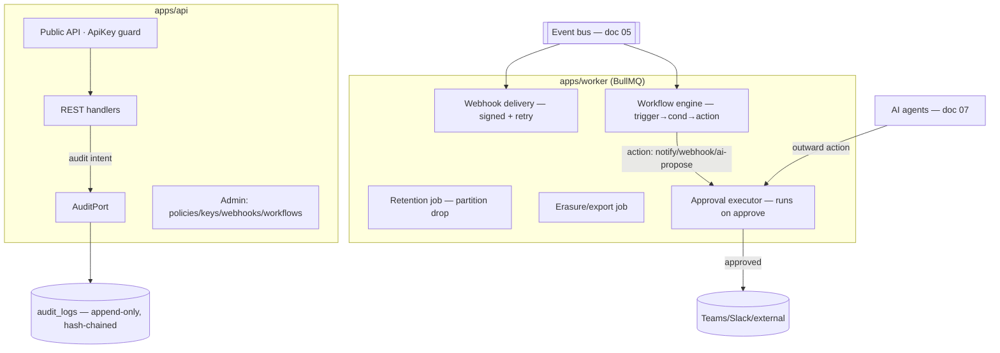

# Plan 19 — Enterprise & Platform

> The trust-and-extensibility layer that makes EngineeringOS enterprise-ready: tamper-evident **audit
> logs**, per-signal **data-retention**, a **privacy/consent management** surface, **signed outbound
> webhooks** and a **scoped public API**, a **plugin SDK** for new sources/agents/channels, **workflow
> automation** (trigger → condition → action), **GDPR** data export + right-to-erasure, and the
> **human-approval gate** every outward AI action must pass. These are engineered features, not
> compliance chores ([06 preamble](../06-security-privacy-consent.md)).

| | |
|---|---|
| **Status** | Draft v1 |
| **Phase** | Phase 4 (Enterprise) — see [Roadmap](./00-roadmap-and-phasing.md); the audit *hook* and consent *model* exist earlier |
| **Owner** | Platform / Security Eng |
| **Satisfies** | `FR-ENT-01`, `FR-ENT-02`, `FR-ENT-03`, `FR-ENT-04`, `FR-ENT-05`, `FR-ENT-06`, `FR-ENT-07`, `FR-ENT-08`; supports `NFR-SEC`, `NFR-PRIVACY`, `NFR-ISO` |
| **Depends on** | [03 — RBAC](./03-rbac.md) (audit hook, `audit:read`, API-key scoping), [05 — Event Pipeline](./05-event-pipeline.md) + [05 — API & Realtime](../05-api-and-realtime.md) (webhooks, partitioned `events`), [13 — AI Agents](./13-ai-agents.md) (approval gate), [06 — Security](../06-security-privacy-consent.md) (consent model, secrets) |
| **Nx projects** | `libs/backend/core` (`@eos/backend-core` — audit port, plugin ports), `libs/backend/database` (`@eos/database` — `audit_logs`, `retention_policies`, `api_keys`, `webhook_endpoints`, `workflows`, `approvals`, `erasure_requests`), `libs/backend/integrations` (`@eos/integrations` — outbound webhook + plugin loading), `libs/shared/contracts` (`@eos/contracts` — admin DTOs), `apps/api` (admin + public API), `apps/worker` (retention jobs, webhook delivery, workflow engine, erasure jobs), `libs/frontend/feature-admin` (settings/privacy/consent UI) |

---

## 1. Goal & scope

- **In scope (one plan per `FR-ENT-*`):**
  - **Audit logs** — append-only, hash-chained, restricted read (`FR-ENT-01`).
  - **Retention** — configurable per signal type, executed as a partition drop (`FR-ENT-02`).
  - **Privacy/consent UI** — org policy + the employee self-view (`FR-ENT-03`).
  - **Outbound webhooks** (signed) + **public API** with **scoped API keys** (`FR-ENT-04`).
  - **Plugin SDK** — stable ports for new sources/agents/channels, no core changes (`FR-ENT-05`).
  - **Workflow automation** — trigger → condition → action (`FR-ENT-06`).
  - **Data export** + **right-to-erasure** (`FR-ENT-07`).
  - **Human-approval gate** for outward AI actions (`FR-ENT-08`).
- **Out of scope:** the RBAC gates themselves ([03](./03-rbac.md)); consent *evaluation at ingest*
  ([06 §4](../06-security-privacy-consent.md#4-consent-model)); the inbound webhook verification path
  ([05 §6.2](../05-api-and-realtime.md#62-inbound-webhooks-github--jira--teams-fr-gh-06)); SSO/SCIM
  (separate Phase-4 plan).
- **Anti-goals:** no mutable audit trail; no un-approved outward AI action; no plugin with an unscoped
  data path (doc 00 §4).

## 2. User stories

- As an **Owner/CTO**, I want a tamper-evident audit log of who accessed whom and every admin action, so
  that I can pass a SOC 2 / GDPR review (`FR-ENT-01`).
- As an **Owner**, I want to set retention to "focus signals: 90 days, PR metadata: 2 years", so that we
  hold data only as long as needed and expiry is cheap (`FR-ENT-02`).
- As an **Employee**, I want a self-view of exactly what is collected about me and one-click revoke, so
  that the tool is transparent, not surveillance (`FR-ENT-03`, doc 06 §4.3).
- As an **integrator**, I want to mint a scoped API key and subscribe an endpoint to signed webhooks, so
  that I can build on the platform without a JWT session (`FR-ENT-04`).
- As a **partner developer**, I want to add a new source/agent/channel via the plugin SDK, so that no
  core rewrite is needed (`FR-ENT-05`).
- As an **Eng Manager**, I want "when a PR waits > 48h, notify the reviewer's lead", so that automation
  handles routine nudges (`FR-ENT-06`).
- As a **departing employee** (or admin on their behalf), I want a full data export and irreversible
  erasure, so that GDPR rights are honored (`FR-ENT-07`).
- As an **Employee**, I want any AI-drafted EOD to be **proposed for my approval**, never auto-posted, so
  that the AI never speaks for me unbidden (`FR-ENT-08`).

## 3. Domain model

Extends [04 §8 (integration & consent tables)](../04-data-model.md#8-integration--consent-tables) and
[04 §11 (retention & deletion)](../04-data-model.md#11-retention--deletion-fr-ent-02-fr-ent-07). All
tenant-scoped via `TenantModel` (doc 04 §9); `audit_logs` and `oauth_tokens`/keys also carry Postgres
RLS (doc 06 §3.1).

| Table | Key columns | Notes |
|-------|-------------|-------|
| `audit_logs` | `id` (uuid v7), `organization_id`, `actor_user_id?`, `action`, `resource`, `resource_id?`, `subject_user_id?`, `metadata` (jsonb), `at`, **`prev_hash`**, **`row_hash`** | **append-only**; hash-chained (§4.1); no `UPDATE`/`DELETE` grant to the app role |
| `retention_policies` | `id`, `organization_id`, `signal_type`, `retention_days`, `updated_by`, `updated_at` | per signal type; drives the partition-drop job (`FR-ENT-02`) |
| `api_keys` | `id`, `organization_id`, `name`, `key_hash` (P4), `prefix` (`eos_live_`), `permission_subset` (jsonb), `ip_allowlist?`, `created_by`, `last_used_at`, `revoked_at?` | only the hash stored; scope ⊆ creator's (doc 05 §4) |
| `webhook_endpoints` | `id`, `organization_id`, `url`, `secret` (P4), `event_types` (jsonb), `status`, `created_by` | outbound; we sign (§7) |
| `webhook_deliveries` | `id`, `endpoint_id`, `event_id`, `attempt`, `status`, `response_code`, `next_retry_at` | delivery ledger, viewable in-app (doc 05 §7) |
| `workflows` | `id`, `organization_id`, `name`, `trigger` (jsonb), `conditions` (jsonb), `actions` (jsonb), `enabled`, `created_by` | trigger → condition → action (`FR-ENT-06`) |
| `approvals` | `id`, `organization_id`, `kind`, `proposed_by_agent`, `subject_user_id?`, `payload` (jsonb), `evidence_ref`, `status` (pending/approved/rejected/expired), `decided_by`, `decided_at` | the human-approval queue (`FR-ENT-08`) |
| `erasure_requests` | `id`, `organization_id`, `subject_user_id`, `requested_by`, `status`, `completed_at`, `tombstone_ref` | GDPR right-to-erasure (`FR-ENT-07`) |

New enum values in **`@eos/shared-enums`** (doc 10 §2.1): extend `EventType` with `workflow.triggered`,
`webhook.delivered`, `ai.action.proposed/approved/rejected`, `data.erased`, `data.exported`; add
`ApprovalStatus`, `WebhookDeliveryStatus`, `WorkflowActionType`.

## 4. Architecture & flow

Enterprise concerns are **cross-cutting**: the audit *port* and plugin *ports* live in
`@eos/backend-core` (leaf-facing infra), the executors live in `apps/worker`, and the admin surface in
`apps/api` + `feature-admin`. Everything routes through the same RBAC gates ([03](./03-rbac.md)) — there
is no privileged path (doc 06 §3).

### 4.1 Audit hash chain (`FR-ENT-01`)

`row_hash = sha256(prev_hash ‖ canonical(id, org, actor, action, resource, resource_id, subject, metadata, at))`.
`prev_hash` is the previous row's `row_hash` **per organization** (a per-tenant chain). Writes go through
a single append path holding a short advisory lock per org so the chain is linear; a periodic verifier
job re-walks the chain and alerts on any break (tamper detection, doc 06 §7, §10 tampering row). The app
DB role has **no `UPDATE`/`DELETE`** on the table (doc 06 §7); retention of audit logs is long and set
independently of signal retention.

### 4.2 Plugin SDK — stable ports (`FR-ENT-05`)

The SDK is **just the existing ports**, published as a thin `@eos/plugin-sdk` surface re-exporting the
contracts a plugin implements — no new coupling (doc 03 §8, doc 10 §3):

| Extension point | Port | Registers via | Downstream change |
|---|---|---|---|
| New **source** | `SourceAdapter` (normalize raw → `Event[]`) | webhook/poller registration | none — projections consume canonical events |
| New **AI agent** | `Agent` ([07 §3](../07-ai-architecture.md#3-the-agent-port-stable-contract)) | `@RegisterAgent()` → `AgentRegistry` | none — routed by capability |
| New **notification channel** | `NotificationChannel` | channel registry | none |
| New **RAG source** | `DocumentSource` | source registry | none — re-index only |

Plugins run **in-process for v1** (trusted, first-party/partner code), loaded by `@eos/integrations` at
boot; they receive only a scoped `TenantContext` and scoped repositories, so a plugin **cannot construct
an unscoped query** (same guarantee as core, doc 04 §5, doc 07 §3). Untrusted third-party plugins (out of
scope) would need a sandbox — noted as a risk (§12).

### 4.3 Workflow engine (`FR-ENT-06`)

A workflow is a declarative `{ trigger, conditions[], actions[] }` doc. The engine subscribes to the
event bus (doc 05 §5 / plan 05): on a matching **trigger** (event type or metric threshold), it evaluates
**conditions** (safe expression over the event/projection — no arbitrary code), then enqueues **actions**
(notify, outbound webhook, create recommendation, or *propose* an AI action). Actions with an outward
side effect route through the **approval gate** (§4 diagram, `FR-ENT-08`). Every run writes
`workflow.triggered` + an audit record. Conditions use a **whitelisted, sandboxed expression evaluator**
(no `eval`), fail-closed on parse error.

**No cross-boundary/cyclic deps:** ports live in `@eos/backend-core`; executors in `apps/worker` compose
concrete adapters; `feature-admin` (frontend) talks only via `@eos/contracts` (doc 10 §3).

## 5. API & realtime surface

All under `/api/v1`, contracts in `@eos/contracts` (doc 05 §8); every route RBAC-guarded ([03](./03-rbac.md)).

| Method + path | Purpose | Permission |
|---|---|---|
| `GET /audit-logs?actorId=&subjectId=&after=` | read audit trail (cursor-paged, doc 05 §2.3) | `audit:read` |
| `GET/PUT /settings/retention` | list/set per-signal retention | `org:settings:write` |
| `GET/POST/DELETE /settings/api-keys` | mint (plaintext shown once)/list/revoke keys | `integration:manage` |
| `GET/POST/DELETE /settings/webhooks` | manage outbound endpoints | `integration:manage` |
| `GET /settings/webhooks/{id}/deliveries` | delivery log | `integration:manage` |
| `GET/POST/PATCH /workflows` | manage automations | `workflow:manage` |
| `GET /me/privacy` · `POST /me/consent/{signalType}` | employee self-view + revoke/grant | `consent:self` (own) |
| `PUT /settings/consent-policy` | org consent policy + version bump | `consent:manage` |
| `GET /approvals` · `POST /approvals/{id}/(approve\|reject)` | human-approval queue | `ai:approve` (scoped) |
| `POST /me/export` · `POST /admin/erasure` | GDPR export / erasure request | `data:export:own` / `data:erase` |

- **Public API (`FR-ENT-04`):** same routes, `Authorization: ApiKey eos_live_…`; the key's
  `permission_subset` is intersected with RBAC — a key can never exceed its creator (doc 05 §4). Every
  key use is audited.
- **Realtime:** `approvals` and `webhook.delivered` push to the actor's notification room (doc 05 §5.1)
  so a pending AI action surfaces live.

## 6. AI involvement

The **human-approval gate is the AI contract point** (`FR-ENT-08`, `FR-AI-04`,
[07 §8](../07-ai-architecture.md#8-guardrails--safety)). Any agent action that reaches **outward** —
posting an EOD to Teams, sending a notification, writing to an external system — is **proposed, not
executed**: the agent writes an `approvals` row (`kind`, `payload`, `evidence_ref` → the stored
`agent_runs`/`recommendations` evidence) with `status = pending`. Only an explicit `POST
/approvals/{id}/approve` by a permitted human triggers the outward call via the approval executor.
**Read-only insight generation needs no gate; anything with an external side effect does.** Rejections
and approvals are audited and fed back as labels (doc 07 §9). Pending approvals expire after a
configurable TTL (default: never auto-approve). Workflow-proposed AI actions use the same queue.

## 7. Security, privacy & consent

- **Signed outbound webhooks (`FR-ENT-04`).** We sign every delivery: `X-EOS-Signature:
  t=<ts>,v1=<hmac>` over `"{ts}.{rawBody}"` with the endpoint secret; receivers MUST verify and reject
  stale timestamps (replay defense, doc 05 §7). Secrets are `P4` (field-encrypted, doc 06 §1); delivery
  retries carry a stable `Idempotency-Key` for receiver dedup. Signing secrets rotate with an overlap
  window (accept N and N-1, doc 06 §6).
- **API keys** are `P4`, hash-only at rest, scope-subset enforced, IP-allowlist optional, revocable, and
  **every use audited** (doc 05 §4, `FR-ENT-01`).
- **Retention (`FR-ENT-02`).** Because `events` is **month-partitioned** on `occurred_at` (doc 04 §5),
  expiry per signal type is a cheap **partition drop**, not a mass `DELETE`. Projections derived from
  dropped partitions are pruned on the same schedule; audit-log retention is separate and longer
  (doc 06 §9.3). Every drop is audited.
- **Privacy/consent UI (`FR-ENT-03`).** The org policy surface and the employee self-view (doc 06 §4.3):
  per signal type — consented/paused/policy-disabled, *what fields* at *what granularity* (e.g. "browser:
  domain only"), recent own-data samples, one-click revoke, and the current `policy_version`. A material
  change bumps the version and **re-solicits consent** (doc 06 §4.2). RBAC ∩ consent still applies —
  most restrictive wins (doc 06 §3.2).
- **Right-to-erasure (`FR-ENT-07`).** A purge job removes the subject's `events`, projections, and PII,
  **drops their vectors from Qdrant**, tombstones dangling references, and records the erasure in
  `audit_logs` (doc 06 §9.1, doc 04 §11). Export produces a machine-readable archive of the subject's
  data. Both are audited; erasure is irreversible and confirmed via a two-step admin action.
- **Audit read** exposes only the *fact and metadata* of access, never the underlying P3/P4 payloads
  (doc 06 §7); restricted to `audit:read` (Owner/CTO).

## 8. Implementation plan (phased tasks)

Small PRs; Nx project bracketed; each ships green.

1. **Audit sink + hash chain** [`@eos/backend-core`, `@eos/database`] — `AuditPort`, append path with
   per-org chaining, migration with revoked `UPDATE`/`DELETE` grants + RLS. *Acceptance:* chain verifies;
   the RBAC drilldown hook ([03 §7](./03-rbac.md)) lands records; tamper flips the verifier.
2. **Audit read API** [`apps/api`, `@eos/contracts`] — `GET /audit-logs`, cursor-paged, `audit:read`.
   *Acceptance:* Owner reads; Eng Mgr → `403`; no P3/P4 leaked.
3. **Retention policies + drop job** [`apps/worker`, `@eos/database`] — per-signal config + scheduled
   partition-drop + projection prune. *Acceptance:* a 90-day focus policy drops the right partitions;
   drop audited; other signals untouched.
4. **API keys** [`apps/api`, `@eos/integrations`] — mint/list/revoke, hash-only, scope-subset guard, key
   guard on public API. *Acceptance:* key can't exceed creator; revoke is immediate; use audited.
5. **Outbound webhooks** [`apps/worker`, `@eos/integrations`] — endpoint CRUD, signed delivery with
   backoff retries + delivery ledger. *Acceptance:* signature verifies with the shared secret; replays
   rejected; failures retried and visible.
6. **Plugin SDK surface** [`@eos/backend-core`, `@eos/integrations`] — publish `@eos/plugin-sdk`
   re-exporting `SourceAdapter`/`Agent`/`NotificationChannel`/`DocumentSource`; boot-time loader passing
   scoped context. *Acceptance:* a sample plugin source registers and ingests without core edits; it
   cannot query cross-tenant.
7. **Workflow engine** [`apps/worker`, `@eos/contracts`] — trigger subscribe, sandboxed condition eval,
   action dispatch (notify/webhook/rec/ai-propose). *Acceptance:* "PR > 48h → notify lead" fires once per
   trigger; malformed condition fails closed; run audited.
8. **Approval gate** [`apps/worker`, `apps/api`] — `approvals` queue, executor on approve, WS push.
   *Acceptance:* an AI EOD is queued not posted; approve triggers the outward call; reject audited; expiry
   works.
9. **Export + erasure** [`apps/worker`] — export archive; purge job across Postgres + Qdrant + projections
   with tombstones. *Acceptance:* erasure removes all subject data incl. vectors; audit record written;
   export is machine-readable.
10. **Privacy/consent + admin UI** [`libs/frontend/feature-admin`] — retention, keys, webhooks, workflows,
    approvals, and the employee self-view. *Acceptance:* self-view matches collected data; revoke stops
    collection ≤ 1 min (doc 06 §4).

## 9. Testing (`unit` / `integration` / `e2e`)

Per [09 — Testing Strategy](../09-testing-strategy.md). Enterprise controls are security-critical —
negative and tamper tests are mandatory.

- **Unit** — hash-chain link/verify (incl. deliberate tamper detection); webhook signature
  (constant-time compare, stale-timestamp reject); workflow condition evaluator (whitelist, fail-closed);
  API-key scope-subset math; retention date → partition selection.
- **Integration (must-have negative/security):**
  - **Audit immutability** — the app DB role cannot `UPDATE`/`DELETE` `audit_logs`; a forged row breaks
    the chain and trips the verifier.
  - **Audit read authZ** — only `audit:read` holders read; payloads carry no P3/P4.
  - **Human-approval gate** — an outward AI action is **never** executed without an approval row flipped
    to `approved`; reject/expire never execute (pinned fixture, `FR-ENT-08`, doc 06 §10).
  - **API-key scope** — a key cannot exceed its creator's permissions; cross-tenant use → `404`.
  - **Webhook signing/replay** — valid signature accepted, tampered body/stale timestamp rejected.
  - **Erasure completeness** — after erasure, no subject data in Postgres **or** Qdrant; tenant isolation
    of the purge (never touches another org).
  - **Retention isolation** — dropping org A's partition never affects org B (`NFR-ISO`).
- **e2e** — Owner sets retention → old data expires; integrator mints a key + receives a signed webhook;
  admin runs export then erasure and confirms both audited; employee revokes consent and collection stops;
  AI proposes an EOD, employee approves, it posts.

## 10. Observability

Per [deployment/03 — Observability](../deployment/03-observability.md).

- **Metrics:** `audit.append_total` + `audit.chain_verify_failures` (must be 0 — page on any),
  `retention.partitions_dropped_total`, `webhook.delivery_total{status}` + `webhook.delivery_latency_ms`,
  `apikey.request_total{key}`, `workflow.run_total{result}`, `approval.pending_gauge` +
  `approval.time_to_decision_ms`, `erasure.completed_total`, `export.generated_total`.
- **Logs:** structured line per admin action (actor + before/after diff), per webhook attempt, per
  approval decision, per erasure/export — never logging P3/P4 (doc 05 §11).
- **Alerts:** any audit chain-verify failure (tamper/integrity → page); webhook delivery-failure rate
  breach; approvals aging past SLA (pending too long); erasure job failure (compliance risk → page);
  API-key use from outside its IP allowlist.

## 11. Acceptance criteria

- [ ] All sensitive reads/writes and admin actions produce **append-only, hash-chained** audit records;
  the app role cannot mutate them; the verifier detects tampering (`FR-ENT-01`).
- [ ] Retention is configurable **per signal type** and expires via partition drop; drops audited
  (`FR-ENT-02`).
- [ ] Org privacy policy + employee self-view exist; revoke stops collection ≤ 1 min (`FR-ENT-03`).
- [ ] Outbound webhooks are **signed** and public API accepts **scoped API keys** that never exceed their
  creator; every key use audited (`FR-ENT-04`).
- [ ] A new source/agent/channel is added via the plugin SDK **without core changes** and cannot query
  cross-tenant (`FR-ENT-05`).
- [ ] Workflow automation fires trigger → condition → action, with outward actions gated by approval
  (`FR-ENT-06`).
- [ ] Data export produces a machine-readable archive; erasure removes all subject data incl. Qdrant
  vectors and is audited (`FR-ENT-07`).
- [ ] No outward AI action executes without an explicit human approval (`FR-ENT-08`).

## 12. Risks & open questions

| Risk / question | Mitigation / decision |
|---|---|
| **Audit chain contention** under high write volume (per-org advisory lock) | Batch appends per org within a short window; the chain is per-org so tenants don't serialize against each other. Revisit with a Merkle-batch if hot. |
| **Retention vs erasure race** — a partition drop mid-erasure | Erasure job coordinates with the retention scheduler (advisory lock per org); both write audit records; erasure is authoritative. |
| **In-process plugins are trusted** — a malicious plugin could misbehave | v1 loads **first-party/partner** plugins only, with scoped context (no unscoped query). Untrusted third-party plugins require a sandbox/OPA policy — **open**, tracked for a later phase. |
| **Webhook endpoint as SSRF vector** (customer URL) | Validate/allowlist schemes, block internal ranges, sign + time-box; deliveries run from the worker with egress controls. |
| **Approval fatigue** — too many gated actions | Only *outward side effects* are gated (read-only insight is not); workflows can pre-approve a **narrow, audited** action class per org policy — **open** whether to allow standing approvals. |
| **GDPR erasure vs audit retention** — do we erase audit rows about the subject? | *Decision (v1):* audit rows are retained (legal-basis evidence, doc 06 §9.1) but the subject reference is pseudonymized on erasure; the access-fact remains, the PII does not. |
| **Open:** workflow condition language expressiveness vs safety | v1 = whitelisted expression grammar (no code); revisit a richer DSL only behind the same sandbox guarantees. |

---

_Template version 1. Previous sibling: [18 — Reports](./18-reports.md)._
</content>
</invoke>
